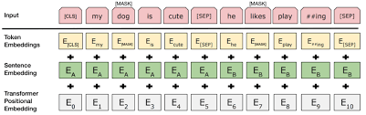
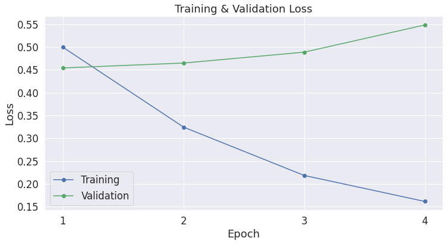

# PyTorch Implementation of BERT

## Usage

### For Pretraining and Classification task in Colab

```python
!pip install transformers  #(for pretrained weights)
!pip install pytorch_pretrained_bert  #(for BERT vocab)
!git clone link-to-repo
%run pretrain.py --savedir 'path to directory where you want to save checkpoint' --corpus 'path to train corpus'
%run classify_cola.py --pretrain_file 'path of pretrain weights' --dataset 'path to COLA dataset in csv format'
```

### For Pretraining and Classification task in Local Machine

```bash
$ pip install transformers 
$ pip install pytorch_pretrained_bert 
$ git clone link-to-repo
$ python3 pretrain.py --savedir 'path to directory where you want to save checkpoint' --corpus 'path to train corpus'
$ python3 classify_cola.py --pretrain_file 'path of pretrain weights' --dataset 'path to COLA dataset in csv format'
```
## Dataset for PreTraining

To replicate the no longer publicly available Toronto BookCorpus Dataset follow the instructions in [this github repository](https://github.com/sgraaf/Replicate-Toronto-BookCorpus)

This relatively small [BookCorpus](https://web.eecs.umich.edu/~lahiri/gutenberg_dataset.html) can also be downloaded direclty as an alternative to the above dataset.

To prepare the corpus from Wikipedia articles follow [this link](https://www.kdnuggets.com/2017/11/building-wikipedia-text-corpus-nlp.html)

## Dataset for classification task

Download the CoLA Dataset from [here](https://nyu-mll.github.io/CoLA/)

## Contributed by:
* [Rishabh Dugaye](https://github.com/rishabhd786)

## References

* **Title**: BERT: Pre-training of Deep Bidirectional Transformers for Language Understanding
* **Authors**: Jacob Devlin,Ming-Wei,Chang Kenton Lee,Kristina Toutanova
* **Link**: https://arxiv.org/pdf/1810.04805.pdf
* **Tags**: Neural Network,NLP,Language Modelling
* **Year**: 2019

# Summary

## Introduction

### Attention

Attention is a concept that helped improve the performance of neural machine translation applications.The Transformer – a model that uses attention to boost the speed with which these models can be trained.The Transformer was proposed in the paper [Attention is All You Need](https://arxiv.org/abs/1706.03762).

### BERT

BERT, which stands for Bidirectional Encoder Representations from Transformers is a language representation model.BERT is designed to pretrain deep bidirectional representations from unlabeled text by jointly conditioning on both left and right context in all layers. As a result, the pre-trained BERT model can be finetuned with just one additional output layer
to create state-of-the-art models for a wide range of tasks, such as question answering and language inference, without substantial taskspecific architecture modifications.

BERT alleviates the unidirectionality constraint by using a “masked language model” (MLM) pre-training objective, inspired by the Cloze task (Taylor, 1953). The masked language model randomly masks some of the tokens from the input, and the objective is topredict the original vocabulary id of the masked word based only on its context. Unlike left-toright language model pre-training, the MLM objective enables the representation to fuse the left and the right context, which allows us to pretrain a deep bidirectional Transformer. In addition to the masked language model, we also use a “next sentence prediction” task that jointly pretrains text-pair representations.

There are two steps in BERT framework: pre-training and fine-tuning. During pre-training, the model is trained on unlabeled
data over different pre-training tasks. For finetuning, the BERT model is first initialized with the pre-trained parameters, and all of the parameters are fine-tuned using labeled data from the downstream tasks.

## Model Architecture

BERT’s model architecture is a multi-layer bidirectional Transformer encoder based on the original implementation described in Vaswani et al. (2017).

The paper presents two model sizes for BERT:

BERT BASE – Comparable in size to the OpenAI Transformer in order to compare performance
BERT LARGE – A ridiculously huge model which achieved the state of the art results reported in the paper

 
 
Both BERT model sizes have a large number of encoder layers (which the paper calls Transformer Blocks) – twelve for the Base version, and twenty four for the Large version. These also have larger feedforward-networks (768 and 1024 hidden units respectively), and more attention heads (12 and 16 respectively) than the default configuration in the reference implementation of the Transformer in the initial paper (6 encoder layers, 512 hidden units, and 8 attention heads).

### Encoder


## Model Inputs

The first token of every sequence is always a special classification token ([CLS]). The final hidden state corresponding to this token is used as the aggregate sequence representation for classification tasks. Sentence pairs are packed together into a single sequence. We differentiate the sentences in two ways. First, we separate them with a special token ([SEP]). Second, we add a learned embedding to every token indicating whether it belongs to sentence A or sentence B.For a given token, its input representation is constructed by summing the corresponding token, segment, and position embeddings.

 
 
 ## Pretraining Data
 
 The pre-training procedure largely follows the existing literature on language model pre-training. For the pre-training corpus we use the BooksCorpus (800M words) (Zhu et al.,2015) and English Wikipedia (2,500M words).
 
 ## My Implementation
 
The Implementation involves code related to pretraining the BERT model from scratch. The pretraining can be done on the Toronto BookCorpus.

The pretrained model can be used for many types of NLP tasks such as:

 
 
 Here I have used the pretrained model for sentence classification task on the COLA Dataset.
 
 ### Results on COLA Dataset
 
 The finetuning is done for 4 epochs with a learning rate of 2e-5. The model achieved 82% accuracy on test set in 4 epochs.
 
 #### Loss vs Epoch 
 
 
 
 


