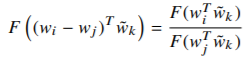

# PyTorch implementation of Glove [*Paper*](https://nlp.stanford.edu/pubs/glove.pdf)
## Requirements
* numpy
* python
* pytorch
* sklearn.manifold
* matplotlib.pyplot
* pickle
* cuda(*highly recommended*)
## Usage 
* Clone the repo to your local system : 
```bash
git clone link-to-repo
```
> ***NOTE** : For Colab, use the command below.*
```bash
!git clone link-to-repo
```
***NOTE** : Download text8 dataset from [here](http://mattmahoney.net/dc/text8.zip). Unzip and place the text8 file in a 'data' folder alongside py files.*
* Load the tensorboard (optional):
```bash
load_ext tensorboard
tensorboard --logdir=runs
```
> ***NOTE** : For Colab, use the command below.*
```bash
%load_ext tensorboard
%tensorboard --logdir=runs
```
* Run the following command :
```bash
python train.py
```
> ***NOTE** : Use python3 instead in case of Linux/Mac . **For Colab, use %run** .*
```bash
usage: train.py [-h] [--num_epoch NUM_EPOCH] [--save_epoch SAVE_EPOCH]
                [--batch_size BATCH_SIZE] [--embedding_dim EMBEDDING_DIM]
                [--lr LR] [--x_max X_MAX] [--alpha ALPHA]
                [--get_TSNE_plot GET_TSNE_PLOT] [--top_k TOP_K]

optional arguments:
  -h, --help            show this help message and exit
  --num_epoch NUM_EPOCH
                        Number of epochs,default: 100
  --save_epoch SAVE_EPOCH
                        Epochs after which model is saved,default: 10
  --batch_size BATCH_SIZE
                        Batch size, default: 2048
  --embedding_dim EMBEDDING_DIM
                        Embedding dimension, default: 512
  --lr LR               Learning rate of Adagrad optimiser, default: 0.05
  --x_max X_MAX         Parameter in computing weighting terms, default: 100
  --alpha ALPHA         Parameter in computing weighting terms, default: 0.75
  --get_TSNE_plot GET_TSNE_PLOT
                        Want to visualise high dimensional data in trained
                        model? default: True
  --top_k TOP_K         Number of words you want to visualise, default: 300
```

## Factual Details
- **Title** : GloVe: Global Vectors for Word Representation
- **Dated** : 2014
- **Authors** : Jeffrey Pennington, Richard Socher, and Christopher D. Manning
- **University** : Computer Science Department, Stanford University, Stanford, CA
- **Field** : Word Embeddings, National Language Processing, Deep Learning

## Contributed by
- [*Gurbaaz Singh Nandra*](https://github.com/gurbaaz27)

# Summary

## Introduction
GloVe, standing for Global Vectors is a powerful word vector learning technique. One of the major revolutionising technique after word2vec. For newbies, word vectors put words to a nice vector space, where similar words cluster together and different words repel. This helps in understanding and grouping words in order of their similarity in various dimensions. The major advantage of GloVe over word2vec is that it not only relies on local statistics(word-context), but also the global statistics(word-coocurence). Word2Vec only focused on the local company.

## Problem with word2vec
Being local learner, its semantics are only affect by surroundings. So, in a sentence like
> The boy plays with the ball.

It would not understand whether 'the' is a special word inh context of boy and ball, or a mere article (enter your school GRAMMAR..lol) for common sentences. This wouldnt be case if it is also gathering global information of all different sentences and words.

## The GloVe approach
GloVe suggests that ***You can derive semantic relationships between words from the co-occurrence matrix.*** Given a corpus having V words, the co-occurrence matrix X will be a V x V matrix, where the i th row and j th column of X, X_ij denotes how many times word i has co-occurred with word j. An example co-occurrence matrix might look as follows.
<p align="center">
  
</p>

To understand how this matrix helps in semantic similarity, the paper provides an example table:

<p align="center">
  
</p>

Consider the entity **P_ik/P_jk** where **P_ik = X_ik/X_i**.

Here P_ik denotes the probability of seeing word i and k together, which is computed by dividing the number of times i and k appeared together (X_ik) by the total number of times word i appeared in the corpus (X_i).
You can see that given two words, i.e. ice and steam, if the third word k (also called the “probe word”),

* is very similar to ice but irrelevant to steam (e.g. k=solid), P_ik/P_jk will be very high (>1),

* is very similar to steam but irrelevant to ice (e.g. k=gas), P_ik/P_jk will be very small (<1),

* is related or unrelated to either words, then P_ik/P_jk will be close to 1.

So, if we can find a way to incorporate P_ik/P_jk to computing word vectors we will be achieving the goal of using global statistics when learning word vectors.

## Mathematics Part & Loss function
Noting that the ratio Pik /Pjk depends on three words i, j, and k,the most general model takes the form,
<p align="center">
  
</p>
But since we are dealing with vectors and want to compare for two entities i and j, their vector difference can serve the purpose as input in function. This can be seen from example that w_king - w_queen + w_girl should be w_boy logically.
<p align="center">
  
</p>
Moreover, the input are vectors but output is scalar, so dot product of the two vectors in the following fashion can serve the purpose whilst not hampering with vector dimenions. 
<p align="center">
  
</p>
The function should be invariant under labelling, hence we can write this like 
<p align="center">
  
</p>
to serve the purpose. This is solved by taking
<p align="center">
  
</p>
Now the solution to F is exponential, hence
<p align="center">
  
</p>
Now adding biases, the target equation becomes
<p align="center">
  
</p>

The proposed **cost function** is weighted mean square error : 
<p align="center">
  
</p>
where V is the size of the vocabulary. The weighting function should obey the following properties:

1. *f(0) = 0. If f is viewed as a continuous function, it should vanish as x → 0 fast enough that the limx→0 f (x) log2 x is finite.*

2. *f(x) should be non-decreasing so that rare co-occurrences are not overweighted.*

3. *f(x) should be relatively small for large values of x, so that frequent co-occurrences are not overweighted.*

Although many f(x) exists for solving the purpose,the one used by GloVe is
<p align="center">
  
</p>

In the paper, ***alpha = 0.75*** and ***x_max = 100*** have been considered.

## Results :
```bash
Namespace(alpha=0.75, batch_size=2048, embedding_dim=300, get_TSNE_plot=True, lr=0.05, num_epoch=3, save_epoch=1, top_k=300, x_max=100)
No. of words: 17005208
Vocabulary length : 253855
2020-07-13 11:36:05.156423: I tensorflow/stream_executor/platform/default/dso_loader.cc:48] Successfully opened dynamic library libcudart.so.10.1
Number of batches : 15876
Training Starts...........!
Epoch[1/3]	Batch[100/15876]	Loss: 0.9336	Time:0.15
Epoch[1/3]	Batch[200/15876]	Loss: 1.2259	Time:0.11
Epoch[1/3]	Batch[300/15876]	Loss: 1.0950	Time:0.11
Epoch[1/3]	Batch[400/15876]	Loss: 1.0565	Time:0.11
Epoch[1/3]	Batch[500/15876]	Loss: 1.0176	Time:0.11
Epoch[1/3]	Batch[600/15876]	Loss: 0.9469	Time:0.11
Epoch[1/3]	Batch[700/15876]	Loss: 0.8383	Time:0.11
Epoch[1/3]	Batch[800/15876]	Loss: 0.8585	Time:0.11
Epoch[1/3]	Batch[900/15876]	Loss: 1.0090	Time:0.11
Epoch[1/3]	Batch[1000/15876]	Loss: 0.9323	Time:0.11
Epoch[1/3]	Batch[1100/15876]	Loss: 0.7498	Time:0.11
Epoch[1/3]	Batch[1200/15876]	Loss: 0.7582	Time:0.11
Epoch[1/3]	Batch[1300/15876]	Loss: 0.7805	Time:0.11
Epoch[1/3]	Batch[1400/15876]	Loss: 0.8787	Time:0.11
Epoch[1/3]	Batch[1500/15876]	Loss: 0.8331	Time:0.11
Epoch[1/3]	Batch[1600/15876]	Loss: 0.7062	Time:0.11
Epoch[1/3]	Batch[1700/15876]	Loss: 0.9646	Time:0.11
Epoch[1/3]	Batch[1800/15876]	Loss: 0.7531	Time:0.11
Epoch[1/3]	Batch[1900/15876]	Loss: 0.7649	Time:0.11
Epoch[1/3]	Batch[2000/15876]	Loss: 0.7399	Time:0.11
Epoch[1/3]	Batch[2100/15876]	Loss: 0.6639	Time:0.11
Epoch[1/3]	Batch[2200/15876]	Loss: 0.7185	Time:0.11
Epoch[1/3]	Batch[2300/15876]	Loss: 0.7568	Time:0.11
Epoch[1/3]	Batch[2400/15876]	Loss: 0.7428	Time:0.11
...................(only a segment shown)
```
#### Training Loss
<p align="center">
  
</p>

#### TSNE plot of top 300 words
<p align="center">
  
</p>

## Acknowledgement
- [Intuitive Guide to Understanding GloVe Embeddings](https://towardsdatascience.com/light-on-math-ml-intuitive-guide-to-understanding-glove-embeddings-b13b4f19c010)
- [NLP Stanford GloVe](https://nlp.stanford.edu/projects/glove/)
