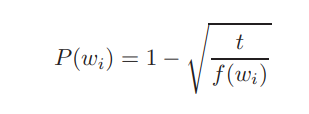
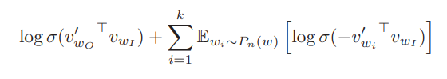
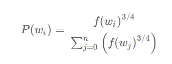
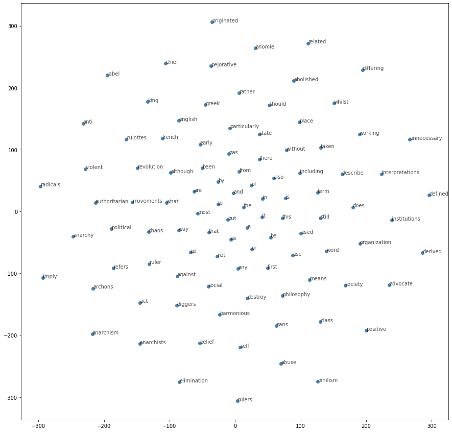

# Distributed representations of words and phrases and their compositionality (word2vec)

## Usage
```
$ python3 main.py --mode train
```

## Get N Similar Words
```
$ python3 main --mode topNsimilar --N_word 10 --word education
```

## Get Score between 2 words
```
$ python3 main --mode GetScore --word1 actor --word2 actress
```

## Get Analogy
```
$ python3 main --mode Analogy --word1 queen --word2 female --word3 male 
```

## Get plot
```
$ python3 main --mode plot 
```

## Help log
```
usage: main.py [-h] [--epochs EPOCHS]
               [--sampling_threshold SAMPLING_THRESHOLD] [--min_freq MIN_FREQ]
               [--batch_size BATCH_SIZE] [--window_size WINDOW_SIZE] [--lr LR]
               [--embed_size EMBED_SIZE] [--mode MODE] [--N_words N_WORDS]
               [--word WORD] [--word1 WORD1] [--word2 WORD2] [--word3 WORD3]

optional arguments:
  -h, --help            show this help message and exit
  --epochs EPOCHS       No of EPOCHS: default 5
  --sampling_threshold SAMPLING_THRESHOLD
                        Subsampling Threshold, default 1e-5
  --min_freq MIN_FREQ   Minimum Frequency of words, default 5
  --batch_size BATCH_SIZE
                        Batch size, default 512
  --window_size WINDOW_SIZE
                        Window size, default 5
  --lr LR               Learning rate for generator optimizer,default 0.003
  --embed_size EMBED_SIZE
                        Embed size, default 300
  --mode MODE           Mode Type, default train
  --N_words N_WORDS     Top N similar words, default 10
  --word WORD           word, default word is woman
  --word1 WORD1         1st word, default king
  --word2 WORD2         2nd word, default male
  --word3 WORD3         3rd word, default female
```

## Contributers
* [Shreya Sharma](https://github.com/shreya0205/)

## References
* [Distributed representations of words and phrases and their compositionality](https://papers.nips.cc/paper/5021-distributed-representations-of-words-and-phrases-and-their-compositionality.pdf)
* [word2vec Tutorial](http://mccormickml.com/2017/01/11/word2vec-tutorial-part-2-negative-sampling/)


## Summary
The continuous Skip-gram model is an efficient method for learning high-quality distributed vector representations that capture a large number of precise syntactic and semantic word relationships, but it requires a huge amount of training time for large dataset because it needs to upadate large number of parameters.

In this paper, authors presented several extensions that improve both the quality of the vectors and the training speed.
 
By subsampling of the frequent words, it obtains significant speedup and also learn more regular word representations and they have also introduced a simple alternative to the hierarchical softmax called negative sampling which causes each training sample to update only a small percentage of the model’s weights.


## Subsampling of frequent words
Frequent words usually provide less information value than the rare words. The vector representations of frequent words do not change significantly after training on several million examples.

To counter the imbalance between the rare and frequent words, a simple subsampling approach is applied: each word wi in the training set is discarded with probability computed by the formula:



where f(wi) is the frequency of word wi and t is a chosen threshold, typically around 10^−5.
It accelerates learning and even significantly improves the accuracy of the learned vectors of the rare words.

## Negative Sampling
NCE approximately maximize the log probability of the softmax, and the Skipgram model is only concerned with learning high-quality vector representations. So the negative Samplinf defined by the following



The “negative samples” are selected using a “unigram distribution”, where more frequent words are more likely to be selected as negative samples. The probability of a word is determined by dividing the frequency of the word raise to the power of 3/4 by the sum of the frequency of entire corpus raise to the power of 3/4. 



Authors found that the unigram distribution U(w) raised to the 3/4rd power (i.e., U(w)3/4/Z) outperformed significantly the unigram and the uniform distributions for NCE.


## Dataset
I've used test8 dataset which doesnt require any preprocessing like removing punctuation marks, dots, etc.


## Results

## Get N Similar Words
```
$ python3 main --mode topNsimilar --N_word 10 --word education
education, schools, educational, universities, school, students, institutions, colleges, literacy, university

$ python3 main --mode topNsimilar --N_word 10 --word government
government, foreign, minister, governments, reforms, parties, democracy, politics, affairs, democratic
```

## Get Score between 2 words
```
$ python3 main --mode GetScore --word1 actor --word2 actor
0.9641899

$ python3 main --mode GetScore --word1 actor --word2 actress
0.6926738

$ python3 main --mode GetScore --word1 actor --word2 doctor
0.12745082
```

## Get Analogy 
```
Not So Good Results
$ python3 main --mode Analogy --word1 queen --word2 female --word3 male 
[{'queen': 0.3423670530319214}, {'male': 0.15937760472297668}, {'elizabeth': 0.15308678150177002}, {'throne': 0.1423056572675705}, {'henry': 0.1410200595855713}]

$ python3 main --mode Analogy --word1 boy --word2 man --word3 lady
[{'lady': 0.35949087142944336}, {'boy': 0.35716012120246887}, {'princess': 0.16987040638923645}, {'girl': 0.16278858482837677}, {'elder': 0.1561393439769745}]
```

## Get plot
```
$ python3 main --mode plot 

```

