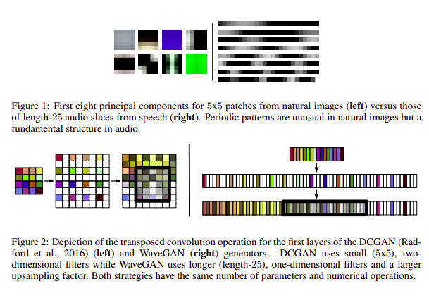
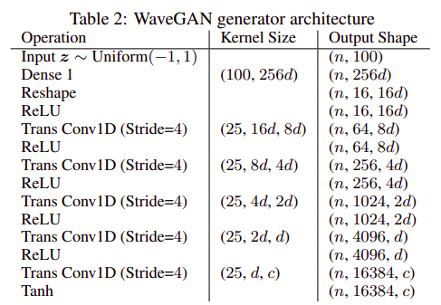
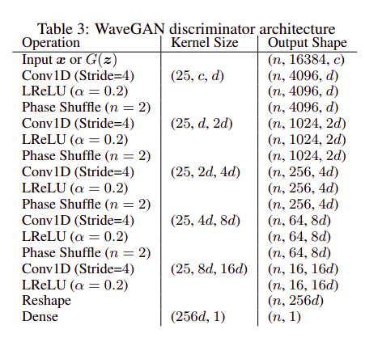
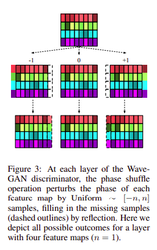
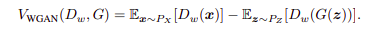
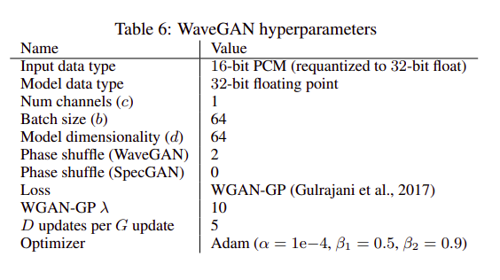

# WaveGAN Tensorflow

## Usage
`$ python3 main.py -h`
```bash
usage: main.py [-h] [--train] [--use_tensorboard] [--print_summary]
               [--save_model] [--generate] [--latent_dim LATENT_DIM]
               [--epochs EPOCHS] [--batch_size BATCH_SIZE] [--lr LR]
               [--beta1 BETA1] [--beta2 BETA2] [--d_per_g D_PER_G]
               [--gp_weight GP_WEIGHT]

optional arguments:
  -h, --help            show this help message and exit
  --train               Train WaveGAN model
  --use_tensorboard     use this to use tensorboard while training
  --print_summary       use this to print model summary before training
  --save_model          use this to save the models after training
  --generate            Generate a random Sample as 'output.wav'
  --latent_dim LATENT_DIM
                        Dimentions of the Latent vector used for generating
                        samples. Default: 100
  --epochs EPOCHS       No of epochs for training: default 50
  --batch_size BATCH_SIZE
                        Batch size to use while training. paper suggests 64.
                        Default: 64
  --lr LR               Learning rate for training,Default: 1e-4
  --beta1 BETA1         We are using Adam optimizer, as suggested in the
                        paper. this is the beta 1 paprameter for the Adam
                        optimizer. Default: 0.5
  --beta2 BETA2         We are using Adam optimizer, as suggested in the
                        paper. this is the beta 2 paprameter for the Adam
                        optimizer. Default: 0.9
  --d_per_g D_PER_G     No. of updates discriminator per generator update.
                        Default: 5
  --gp_weight GP_WEIGHT
                        GP Weight for Wgan-GP (lambda). Default: 10
```
To train the model using the suggested hyperparameters:
`$ python3 main.py --train`

## Contributed By
[Shivanshu Tyagi](https://github.com/spazewalker)

## References
* __Title__: Adversarial Audio Synthesis
* __Authors__: Chris Donahue, Julian McAuley, Miller Puckette
* __Link__: https://arxiv.org/abs/1802.04208
* __Tags__: Sound, Machine Learning
* __Year__: 2018
## Summary
### Introduction
Audio signals are sampled at high temporal resolutions, and learning to synthesize audio requires capturing structure across a range of timescales. Generative
adversarial networks (GANs) have seen wide success at generating images that
are both locally and globally coherent, but they have seen little application to audio generation. Here, this paper introduce the usage of GANs in AUdio Generation.

Using GANs can be very usefull in various ways. If we have a latent sapce mapped with different emotions that the audio repesents, it would be very helpfull to create audio which can be very usefull for creators and other people. This paper presents a way to generate audio clips of approx. 1 sec.
### How does GAN works for 1D data
convolutions work in a similar way as in 2D operations. We take a convolution filter of some size (here, 25), then we compute the convolutions from that filter, after that the filter is moved to the right by some unit(stride) and the process is continued Details:

### Architecture
We are using a architecture of the model inspired from DCGAN. DCGAN outputs 64x64 pixel images — equivalent to just 4096 audio samples — this paper add
one additional layer to the model resulting in 16384 samples, slightly more than one second of audio at 16 kHz. In summary, the modifications to the DCGAN (Radford et al., 2016) method which
result in WaveGAN are:
1. Flatten 2D convolutions into 1D (e.g. 5x5 2D convolution becomes length-25 1D).
2. Increase the stride factor for all convolutions (e.g. stride 2x2 becomes stride 4).
3. Remove batch normalization from the generator and discriminator.
4. Train using the WGAN-GP (Gulrajani et al., 2017) strategy.\
Detailed Model is as follws: \
 \
\
In the paper, the model used Conv1D_trans operation, but tensorflow's keras api doesn't support that. Hence, we have used the Conv2D_trans operation similar to DCGAN. This creats some changes in this model from the official paper.
### Phase Shuffle
Generative image models that upsample by transposed convolution (such as DCGAN) are known to produce characteristic “checkerboard” artifacts in images (Odena et al., 2016). Periodic patterns are less common in images (Section 3.1), and thus the discriminator can learn toreject images that contain them. For audio, analogous artifacts are perceived as pitched noise which may overlapwith frequencies commonplace in the real data, making the discriminator’s objective more challenging. However,the artifact frequencies will always occur at a particular phase, allowing the discriminator to learn a trivial policy to reject generated examples. This may inhibit the overalloptimization problem. To prevent the discriminator from learning such a solution, paper proposes the phase shuffle operation with hyperparameter n. Phase shuffle randomly perturbs the phase of each layer’s activations by −n to n samples before input to the next layer as in the following figure: \

### Training
Dataset is sampled at 16kHz,and trained using WGAN-GP technique using the value function: \
 \
We used Adam optimizer with learning rate 1e-4, beta1 = 0.5 and beta = 0.9 as suggested in the paper. \
All the Hyperparametrs are: \

