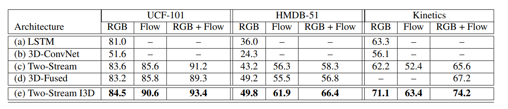
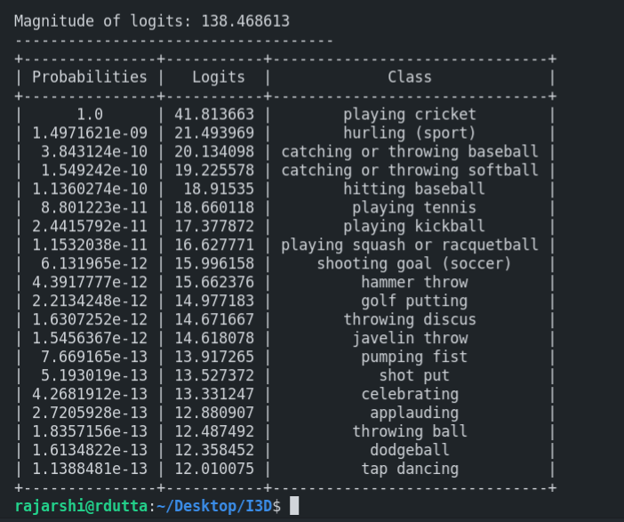

# Action Classification Using Inflated-Inception Model.

### Libraries to be installed via pip3:
```py
 $ pip3 install *
``` 
* `tensorflow`
* `numpy`
* `h5py  (version==2.10.0)`
* `prettytable`
* `tensorflow-silence (to suppress tensorflow-warnings)`

This model has been pre-trained on both `RGB` and `Optical Flow` channels data for Action Classifcation.The I3D-Model has weights already trained on both only kinetics-400 dataset and both kinetics and imagenet datasets.Pass the Arguements in order to train accordingly.

`rgb I3D Model` having weights pre-trained on:

    Kinetics-400 Dataset only
    Kinetics-400 and Imagenet Datasets
`Optical_flow I3D Model` having weights pre-trained on:

    Kinetics-400 Dataset only
    Kinetics-400 and Imagenet Datasets   

### Evaluate the model:

```py
* for RGB I3D model pretrained on kinetics only:
$ python3 evaluate.py --type rgb --pretrain kinetics
* for RGB I3D model pretrained on kinetics and imagenet:
$ python3 evaluate.py --type rgb --pretrain bothsets
```

```py
* for OPTICAL_FLOW pretrained on kinetics only:
$ python3 evaluate.py --type optical_flow --pretrain kinetics
* for OPTICAL_FLOW pretrained on kinetics and imagenet:
$ python3 evaluate.py --type optical_flow --pretrain bothsets
```

```py
* for both RGB AND OPTICAL_FLOW on kinetics only:
$ python3 evaluate.py --type both --pretrain kinetics
* for both RGB AND OPTICAL_FLOW on kinetics and imagenet:
$ python3 evaluate.py --type both --pretrain bothsets
```
## References:

* __Title__: Quo Vadis, Action Recognition? A New Model and the Kinetics Dataset.
* __Paper_Link__: [I3D_Paper on Action Classification](https://arxiv.org/abs/1705.07750)
* __Authors__: Joao Carreira, Andrew Zisserman
* __Topic__: Action Recognition
* __Year__: 2017

## Contributed by: 
* [Rajarshi Dutta](https://github.com/Rajarshi1001)

<u><h2>Model Summary:</h2></u>

<u><h3>Introduction:</h3></u>

This architecture is basically an extension of the state-of-the art image classifier `Inception-V1` model by expanding the convolutional layers ,maxpooling layers from 2D to 3D in order by addition of a `temporal dimension` in order to learn spacio-temporal features.The model also adopts a 2-stream configuration, that is 3D convnets can directly learn spacio-temporal features from a `RGB Stream` but their performance can br increased by the addition of an `Optical flow Stream`. Due to the high dimensionality of their parameterization and the lack of labeled video data, previous 3D ConvNets have been relatively shallow (up to 8 layers). Here we make the observation that very deep image classification networks, suchas Inception, VGG-16 and ResNet can be trivially inflated into `spatio-temporal feature extractors`, and that their pre-trained weights provide a valuable initialization. We also find that a `two-stream configuration` is still useful.Many of these models (all but C3D) have an Imagenet pre-trained model as a subcomponent.

<u><h3>Model Architecture:</h3></u>

A number of very successful image classification architectures have been developed over the years, in part through painstaking trial and error.
Instead of repeating the process for spatio-temporal models
we propose to simply convert successful image (2D) classification models into 3D ConvNets. This can be done by
starting with a 2D architecture, and inflating all the filters
and pooling kernels – endowing them with an additional
temporal dimension. Filters are typically square and we just
make them cubic – N × N filters become N × N × N.

> Bootstraping Parameters from pretrained imagenet models. To do this, we observe that an image can be converted into a (boring) video bycopying it repeatedly into a video sequence. The 3D modelscan then be implicitly pre-trained on ImageNet, by satisfying what we callthe boring-video fixed point: the pooling and activations on a boring video should be the same as on the original single-image input. This can be achieved, thanks to linearity, by repeating the weights of the 2D filters N timesalong the time dimension, and rescaling them by dividingby N. This ensures that the convolutional filter responseis the same.

> The boring video fixed-point leaves ample freedom on how to inflate pooling operators along the time dimension and on how to set convolutional/pooling temporal stride –   the primary factors that shape the sizeof feature receptive fields. A symmetric receptive field is however not necessarily optimal when also considering time – this should depend on frame rate and image dimensions. If it grows too quickly in time relative to space, it may conflate edges from different objects breaking early feature detection, while if it grows too slowly, it may not capture scene dynamics well.

> I3D network trained on RGB inputs, and another on flow inputs which carry optimized, smooth flow information. We trained the two networks separately and averaged their predictions at test time.

<br>


### Results on Famous Datasets:



### Results:
The data used has been pre-processed for the model to fit on it.The sample video(gif) has `79` frames and has a `frame_height` and `frame_width` of `224` pixels.The optical flow version has `2` flow channels and the rgb version has 3 channels.

<h3>OPTICAL_FLOW</h3>


<h3>RGB<h3> 


### Output of the I3D Model(using weights trained on both kinetics-400 and Imagenet Datasets):



## Implementation:

* The Kinetics-400 dataset contains numerous short videos which consists of actions 
like human-object,human-human interactions like washing dishes, moving lawns, opening presents etc.The datasets consists of 400 classes with each class containing more than 400 videos and the videos lasts for not more than 10s.There are no untrimmed videos in the dataset.The test set consists of 100 clips for each class.

* The model couldn't be trained because of the huge size of the datasets and lack of resources(GPUs) so I have decided to use the weights of the model pre-trained on the         kinetics-400 and the imagenet datasets.

