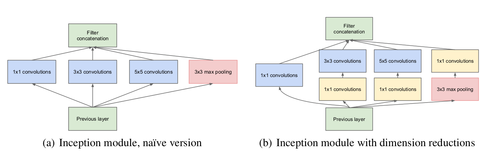
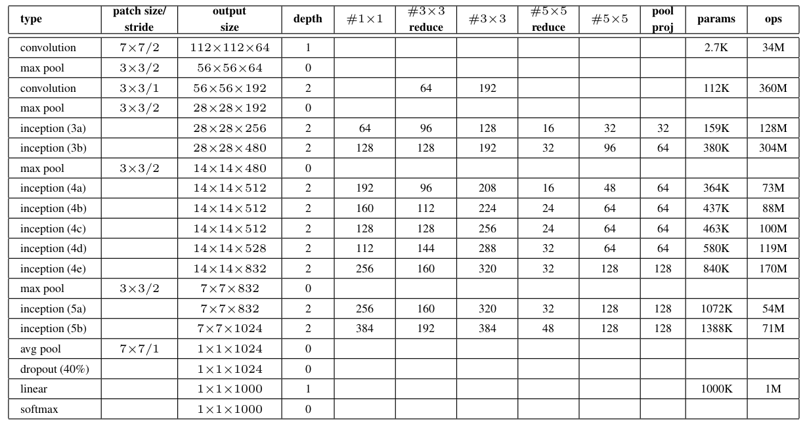
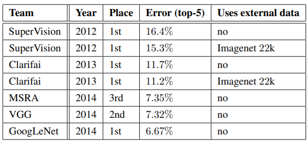
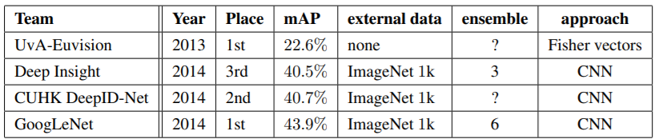
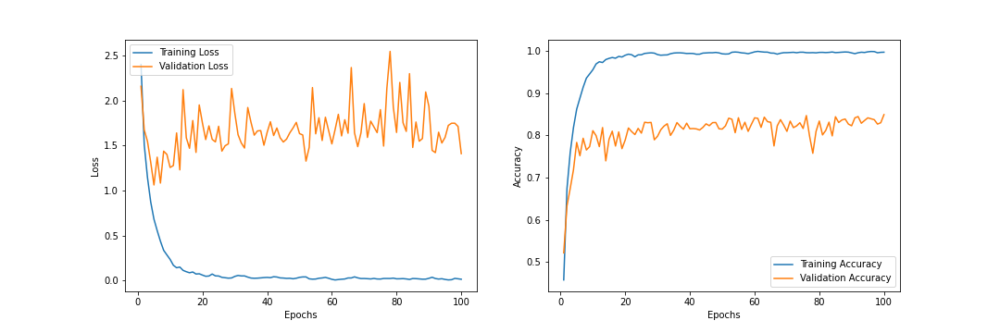

# Pytorch Implementation of Inception-V1 Model (CIFAR-10 Dataset)

## Usage

> $ python3 main.py

 
Note: On Colab Notebook use following command:
  

> !git clone link-to-repo 
> %run main.py

## References

- Szegedy, Christian, et al. “Going Deeper with Convolutions.” 2015 IEEE Conference on Computer Vision and Pattern Recognition (CVPR), 2015, doi:10.1109/cvpr.2015.7298594.

## Contributed by:

- <a href="https://github.com/amanjain252002">Aman Jain</a>

# Summary

## Introduction

 

The above paper focuses on developing an efficient deep neural network architecture for computer vision. The most straightforward way of improving the performance of deep neural networks is by increasing their size. This includes both increasing the depth and width of the network.

However this simple solution comes with two major drawbacks.

- Bigger size typically means a large number of parameters, which makes the enlarged network more prone to overfitting, especially if the number of training examples in the training set is limited. This can become a major bottleneck, since the creation of high quality training sets can be tricky and expansive.
- Uniformly increased network size can dramatically increase use of computational resources. Since the computational budget is always finite, an efficient distribution of computing resources is preferred.

 

## Network-Architecture

Inception architecture mainly consists of “Inception modules” which are stacked on top of each other.
 

|  |
| :----------------------------------------------: |
|               **Inception Module**               |

 
One big problem with the above modules, at least in the naive form, is that even a modest number of 5x5 convolutions can be prohibitively expensive on top of a convolution layer with a large number of filters.

This leads to the second idea where by judiciously applying dimension reductions whenever computational requirements increase too much. 1x1 convolutions are used for dimension reduction before applying the expensive 3x3 and 5x5 convolutions. 1x1 convolutions also include the use ReLU which makes them dual purpose.

### GoogLeNet (The incarnation of the Inception Architecture)

 

|  |
| :-----------------------------------------------------------------------------: |
|             **GoogLeNet incarnation of the Inception architecture**             |

 
The network is 22 layers deep when counting only layers with parameters. The overall number of layers used for the construction of the network is about 100.

Due to the relatively large depth of the network, the ability to propagate gradients back through all the layers in an effective manner was a concern. One interesting insight is that the strong performance of relatively shallow networks on this task suggests that the features produced by the layers in the middle of the network should be very discriminative. By adding auxiliary classifiers to the intermediate layers, we can expect to encourage discrimination in the lower stages in the classifier, increase the gradient signal that gets propagated back, and provide additional regularization. These classifiers were added in the Inception (4a) and (4d) modules. During training, their loss gets added to the total loss of the network with a discount weight (weighted by 0.3). At inference time, these auxiliary networks are discarded.

 

|  |
| :--------------------------------------------------------------------------------: |
|               **GoogLeNet network with all the bells and whistles**                |

 

### Comparisons:

 
Comparison with state of the art methods:
  

|  |
| :-------------------------------------------------------------: |
|                 **Classification performance**                  |

 

|  |
| :---------------------------------------------------: |
|               **Detection performance**               |

## Results

Results after training for 100 epochs.

 

|  |
| :-----------------------------------------------: |
|                                                   |

 

| Training Accuracy | Validation Accuracy | Test Accuracy |
| :---------------: | :-----------------: | :-----------: |
|       0.997       |        0.849        |    0.8506     |

 

## Inference and scope for improvements

Clearly, The model accuracies weren't even close to SOTA (lol). I feel that this can be attributed to several reasons :

- Increasing the amount of data can improve the accuray.
- Dropout functions and regularizers can be implemented to decrease overfitting.
