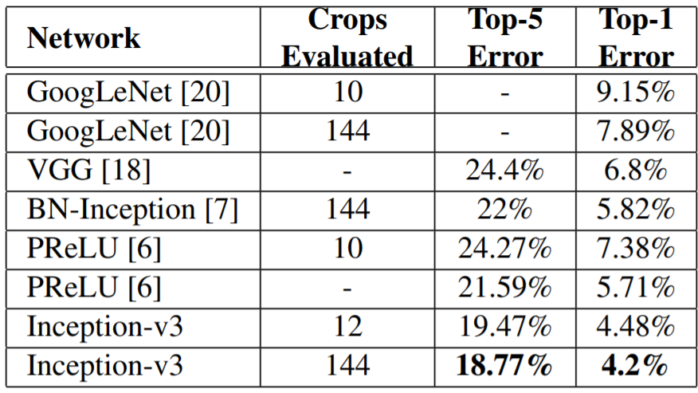
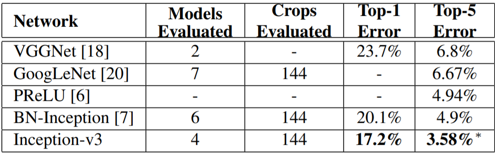
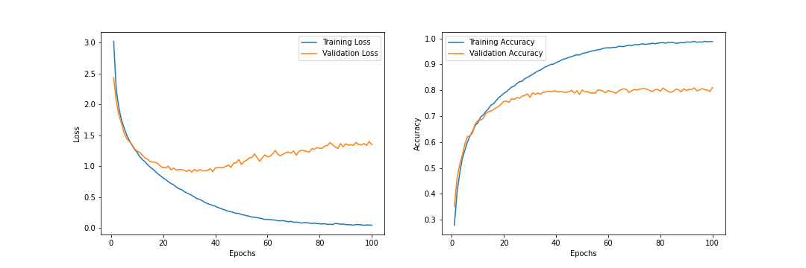

# Pytorch Implementation of Inception-V3 Model (CIFAR-10 Dataset)

## Usage

 

> $ python3 main.py

 
Note: On Colab Notebook use following command:
  

> !git clone link-to-repo 
> %run main.py

## References

- Szegedy, Christian, et al. “Rethinking the Inception Architecture for Computer Vision.” 2016 IEEE Conference on Computer Vision and Pattern Recognition (CVPR), 2016, doi:10.1109/cvpr.2016.308.

## Contributed by:

- <a href="https://github.com/amanjain252002">Aman Jain</a>

# Summary

## Introduction

 

The above paper focuses on exploring ways to scale up networks in ways that aim at utilizing the added computation as efficiently as possible by suitably factorized convolutions and aggressive regularization.

### General Design Principles

- Avoid representational bottlenecks, especially early in the network. In general, the representation size should gently decrease from the inputs to the outputs before reaching the final representation used for the task at hand.
- The optimal performance of the network can be reached by balancing the number of filter per stage and the depth of the network
- Spatial aggregation can be done over lower dimensional embeddings without much or any loss in representational power. For example, before performing a more spread out (e.g. 3 × 3) convolution, one can reduce the dimension of the input representation before the spatial aggregation without expecting serious adverse effects.
- Higher-dimensional representations are easier to process locally within a network. Increasing the activations per tile in a convolutional network allows for more disentangled features. The resulting networks will train faster.

### Factorizing Convolutions with Large Filter Size

- Factorization into smaller convolutions :
  - Convolutions with larger spatial filters (e.g. 5 × 5 or 7 × 7) tend to be disproportionally expensive in terms of computation.
  - To reduce the computational cost, we can replace the convolutions with larger spatial filters with two-layer convolution architecture for eg. replacing 5 x 5 convolution with two 3 x 3 convolution layers.

 

| .png>) |
| :----------------------------------------------------------------------------: |
|               **Mini-network replacing the 5 × 5 convolutions.**               |

 

- Spatial Factorization into Asymmetric Convolutions :
  - To reduce the computational cost, one can go even further and replace any n × n convolution by a 1 × n convolution followed by a n × 1 convolution.

 

| .png>) |
| :----------------------------------------------------------------------------: |
|               **Mini-network replacing the 3 × 3 convolutions**                |

 

## Model Summary

 

 

## Comparisons

 
Comparison with state of the art methods:
  

|                                              |
| :-------------------------------------------------------------------------------------------: |
| **Single-model, multi-crop experimental results on the ILSVRC 2012 classification benchmark** |

 

|                                            |
| :-----------------------------------------------------------------------------------------------------------: |
| **Ensemble evaluation results comparing multi-model, multi-crop on the ILSVRC 2012 classification benchmark** |

## Results

Results after training for 100 epochs.

 

|  |
| :-----------------------------------------------: |
|                                                   |

 

| Training Accuracy | Validation Accuracy | Test Accuracy |
| :---------------: | :-----------------: | :-----------: |
|       0.988       |        0.811        |    0.8227     |

 

## Inference and scope for improvements

Clearly, The model accuracies weren't even close to SOTA (lol). I feel that this can be attributed to several reasons :

- Increasing the amount of data can improve the accuray.
- Dropout functions and regularizers can be implemented to decrease overfitting.
