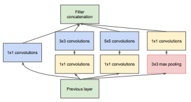
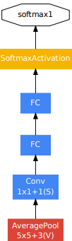
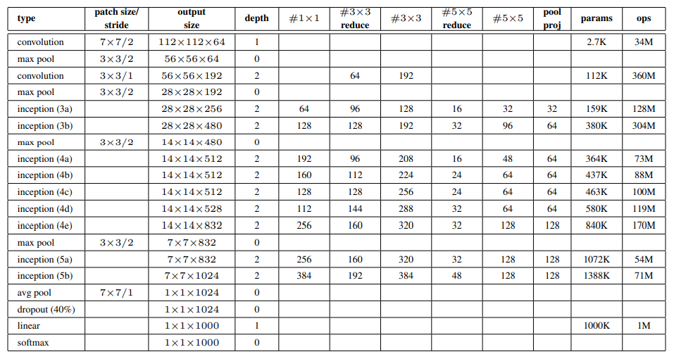
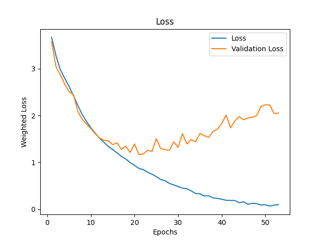
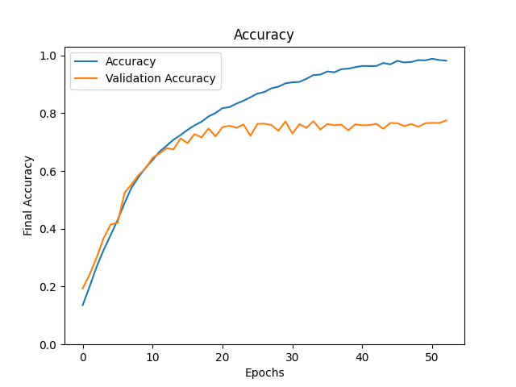

# Inception-v1

### References
* [Going deeper with convolutions](https://arxiv.org/pdf/1409.4842.pdf)
* [Documentation on Learning Rate Schedulers](https://keras.io/api/callbacks/learning_rate_scheduler/)
* [Documentation on Loss weights](https://keras.io/api/models/model_training_apis/#compile-method)
### Contributed by:
* [Aditya Tanwar](https://github.com/cliche-niche/)

## Summary

### Introduction
This paper proposes a deep convolutional neural network, codenamed Inception, which has improved utilization of the computing resources inside the network. This was achieved by a carefully crafted design that allows for increasing the depth and width of the network while keeping the computational budget constant.
The word "deep" has two meanings, one in the context of increased network depth, and the other in the sense that it introduces a new level of organization in the form of `Inception Module`.

### Architecture
The model starts with convolution and max pooling layers which help decrease the input size, and then a lot of inception blocks, finally followed by a pooling layer, dropout layer and a fully connected layer. The model also has auxiliary classifiers (weight 0.3) connected to intermediate layers to encourage discrimination in the lower stages in the classifier, increase gradient propagation, and add additional regularization.

Each inception block has a structure consisting of 1x1 Convolutional layers, 3x3, 5x5 and max pooling 3x3 layers.
To reduce computation burden, the `3x3 Conv` and `5x5 Conv` layers are preceded by `1x1 Conv` layers to decrease the number of filters. The output of these layers is concatenated before passing to the next layer or passing for auxiliary classification.

An auxiliary classifier is applied after `Inception Block 4a` and `Inception Block 4d` each. 

The exact structures of an inception block, an auxiliary classifier, and parameters of the whole model are provided below. The entries in `3x3 Reduce` and `5x5 Reduce` stand respectively for the number of filters in the `1x1 Conv` layer preceding them. The entry in `pool proj` stands for the number of filters in the layer that follows the `Max Pooling` layer.

 

Some `Max Pooling` layers have been commented in this implementation because CIFAR-10 dataset was used to train the model.

### Results
After 53 epochs, the train accuracy was 98.17%, while the test accuracy was 77.49%.

Instance of overfitting is observed with CIFAR-10 which could be improved with the use of less filters or more dropout.

The loss graph contains the weighted loss, while the accuracy graph contains only the accuracy of the final output.

 