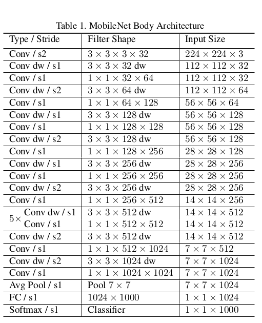

# MobileNet_V1 implementation in Tensorflow for Image Classification

## Train:
```py
   $ python3 main.py --epochs 40 --model mobilenetv1
```
## Test:
### run this code after training the model, the model will be saved as .h5 file in the directory
```py
   $ python3 evaluate.py
```   

## References:

* Andrew G. Howard,Menglong Zhu,Bo Chen,Dmitry Kalenichenko,Weijun Wang, Tobias Weyand, Marco Andreetto, Hartwig Adam,"MobileNets: Efficient Convolutional Neural Networks for Mobile Vision Applications", 2017 [Original MobilenetV1 Paper](https://arxiv.org/pdf/1704.04861.pdf)

* [Review_MobileNet_V1](https://towardsdatascience.com/review-mobilenetv1-depthwise-separable-convolution-light-weight-model-a382df364b69)


## Contributed by:

* Rajarshi1001

# Model Summary:

## Introduction:

MobileNets are built primarily from depthwise separable convolutions initially introduced in  and subsequently
used in Inception models  to reduce the computation in the first few layers. Flattened networks  build a network
out of fully factorized convolutions and showed the potential of extremely factorized networks. The model is bassically efficient in comparison to the extremely dense networks in terms of degree of computations. It is an efficient network architecture with two hyperparameters that can be used in mobile applications due to its small size.There are various versions of MobileNet, this paper rovides the architecture of mobilenet_v1.Although there is a sliht decrease in accuracy but mobilenet proves to be an excellent lightweight deep learning model. There are other networks like Squeezenet which uses a bottleneck approach to prodeucs a smaler networks. Mobilenets are also used in the implementation of SSD, Fast- RCNN  etc. for object detection.

## Model Architecture:

The major reason behind mobilenet being lightweight is the use of depthwise seperable convolutions which is divided into two parts, the first part applies a depthwise convolution to the input feature map.The model essentially consists of alternate depthwise and standard convolutions being applied to the input feature map. This decreases the model size and number of parameters. The first part of the depthwise layer filters the input channel and the 1x1 conv operations is use to combine outputs of first layer. Most of the parameters is present  in pointwise convolutions (apprx 75%).





> In standard Convolution opertaions, a Feature map having M input channels and a dimension of Df x Df is acted upon by filters of size Dk x Dk x M x N. Thus there are M filters which are applied to M input channels and combined to produce a output feature map of size Dg x Dg x 1. Since the total set of filters used is N , this convolution operatio is repeated N times to produce the output feature map of size Dg x Dg x N. The computations performed by each set of M kernels is Dg x Dg x Dk x Dk x M.Thus the overall computations comes out to be Dg x Dg x Dk x Dk x M x N. 

> In Depthwise Convolutions operations, the first stage (filtering stage) , a Feature map having M input channels and a dimension of Df x Df is acted upon by filters of size Dk x Dk x M. Here each filter acts upon a single input channel, so the size of each filter is Dk x Dk x 1 and since there are M input channels hence the total number of filters are M. Th output of the filtering stage is a feature map of size Dg x Dg x M. The second step evaluate the linear combination of the depthwise layers using pointwise convolution where feature map of size Df x Df x M is acted upon 1 x 1 x M x N convolutionS to produce the output of size  Dg x Dg x N. The overall computations in this layer is Dg x Dg x Dk x Dk x M. For the second layer, matri mul with 1 kernel the operatons no are Dg x Dg x Dk x Dk x M foled bu n different filter , for N input kernels the total copuaions in the second layers are Df x M x Df + Dg x Dg x M x M x M.

## Implementation:

* Implemented the MobileNet_V1 ON CIFAR10 dataset which consists of 50,000 training images and 10,000 test images.
* Initially started the training process for 20 epochs using model.fit() method and obtained a training accuracy of 86%
* Obtained an accuracy of 80% on the test data.

## MobileNet_v1 compared to other models

