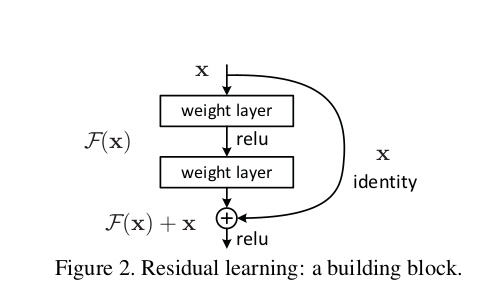
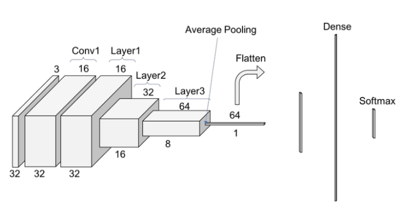
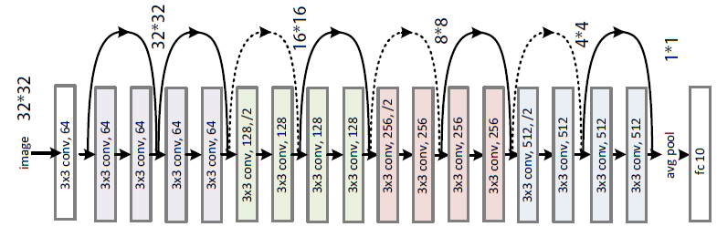
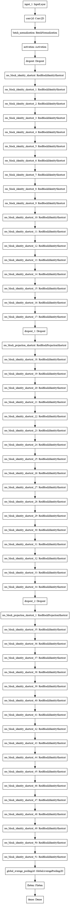
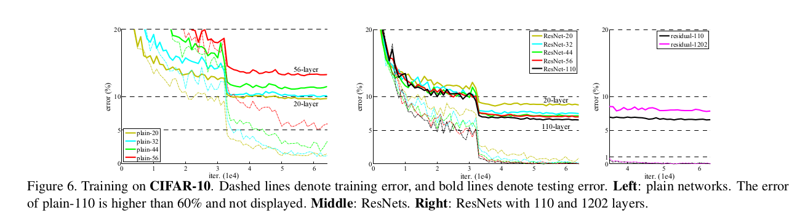
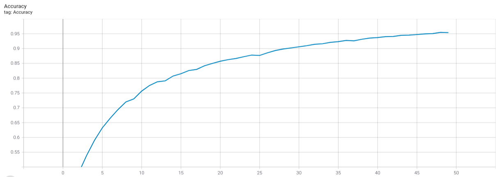
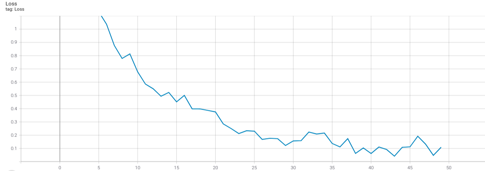

# ResNet-56 #

ResNet - Residual Neural Networks (Deep Residual Learning for Image Recognition)


## Requirements ##

The following implementation is tested on
* Python 3.7.10
* Tensorflow 2.5.0
* Keras 2.5.0

It is recommended that the latest stable releases of the following libraries/scripting langauge be used for stable performance.

* Python
* Tensorflow
* Keras
* Numpy


## Usage ##

In the Bash Shell, run:
```bash
$ python3 main.py --epoch'No of Epochs to train' --lr 'Learning Rate for training'
```

> **_NOTE:_** For running on Colab Notebook use the following command:

```python
!git clone ${link-to-repo}
%run main.py --epoch'No of Epochs to train' --lr 'Learning Rate for training'
```

## Model Summary ##

### Problem at Hand ###

There have been a lot of SoTA models to perform the task of image classification. There has been considerable improvemnent in their performance over the years on different datasets (includng the CIFAR-10). Theoretically speaking, as the depth and thus the complexity of the model increases, it should allow it to learn more complex mappings and thus, its performance shall increase with depth. But, with the Plain model on Image Classification, this happens only uptill a limit. At much larger depths, performance of the model strangely degrades. Authors argue that this problem isn't being caused by "Overfititng" because the Training error itself increases as with increased depth after a threshhold. Authors have also taken care of the problem of "Vanishing Gradients" by Batch Normalization. To address the issues of increased depth on model performance, Residual Blocks are introduced.

The following graph is just for indication purpose and does ot shows the exact layer numbeer for which performance degrades.


### ResNets ###

Resnets or Residual Neural Networks have now become a very common network architecture and the paper on Resnets has set the standards for a lot of future work on Image Classification and Computer Vision. Authors introduced a **Residual Block** for network buildling.


To provide the motivation for architecture, authors argue that it is probably difficult for the layers to learn the "Identity Mapping" otherwise we can manually construct a deeper counterpart of a shallow neural network by just adding one or more layers and making those layers learn the identity mapping. They say that the zero mapping is much easier for a layer to learn than the identity mapping and to change this default natural behaviour of plain nets, they introduce Resnets. 


### Model Architecture ###


Architecture of ResNet for CIFAR-10 is as follows:-



Architecture of Resnet as shown in the official paper is as follows:-



Model Summary of this implementation is as follows:-



### Official Results of the Paper ###

The authors trained the model for 64K epochs and used Learnign Rate scheduling at 32K and 48K iterations by dividing with 10. They started with lr = 0.1, momentum = 0.9, weight decay = 0.0001. Their official results are as follows-



The accuracy and loss plots that this implementation has been able to achieve is following:- 





## References ##

* **Official Paper**: https://arxiv.org/abs/1512.03385
* **Authors**:  Kaiming He, Xiangyu Zhang, Shaoqing Ren and Jian Sun.
* **Official Implementation**: https://github.com/KaimingHe/deep-residual-networks


## Contributed By ##

[Divyanshu Gangwar](https://github.com/Divyanshu23)