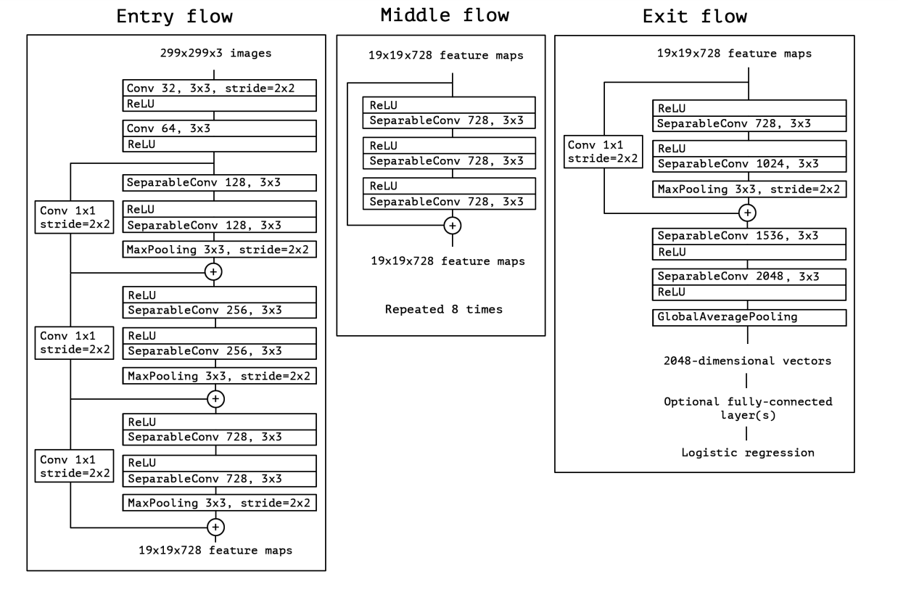
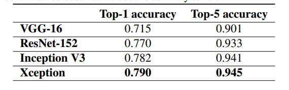
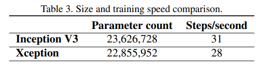

# Xception Implementation in Tensorflow for Image Classification

## Libraries to be installed via pip 
```py
$ pip3 install *
```

* `tensorflow`
* `matplotlib`
* `seaborn`
* `pandas`
* `numpy`


## Train:
```py
   $ python3 main.py --epochs 40 --model xception
```
## Test:
### run this code after training the model, the model will be saved as .h5 file in the directory

```py
   $ python3 evaluate.py
```   

## References:

* __Title__:  Xception:Deep Learning with Depthwise Separable Convolutions.
* __Author__:  François Chollet.
* __Paper_Link__:  [Xception Paper](https://arxiv.org/pdf/1610.02357.pdf).
* __Blog Link__ :  [Review: Xception](https://towardsdatascience.com/review-xception-with-depthwise-separable-convolution-better-than-inception-v3-image-dc967dd42568)
* __Tags__:  Image Classification.
* __Year__: 2016


## Contributed by:-

* [Rajarshi Dutta](https://github.com/Rajarshi1001)


# Model Summary:

##  Introduction:

Convolutional neural networks have emerged as the master algorithm in computer vision in recent years, and developing recipes for designing them has been a subject of considerable attention. The history of convolutional neural network design started with LeNet-style models, which were simple stacks of convolutions for feature extraction and max-pooling operations for spatial sub-sampling. In 2012, these ideas were refined into the AlexNet architecture, where convolution operations were being repeated multiple times in-between max-pooling operations, allowing the network to learn richer features at every spatial scale.

The fundamental building block of Inception-style models is the Inception module, of which several different versions exist.The canonical form of an Inception module, as found in the Inception V3 architecture. An Inception model can be understood as a stack of such modules. This is a departure from earlier VGG-style networks which were stacks of simple convolution layers.

The Xception is the extreme version of the Inception model which basically involves depthwose seperable convolutions and standard convolutions operations.Since
the Xception architecture has the same number of parameters as Inception V3, the performance gains are not due to increased capacity but rather to a more efficient use of
model parameters.
 

## Model Architecture:

The Xception architecture has 36 convolutional layers forming the feature extraction base of the network. In our experimental evaluation we will exclusively investigate image classification and therefore our convolutional base will be followed by a logistic regression layer. Optionally one may insert fully-connected layers before the logistic regression laye. The 36 convolutional layers are structured into 14 modules, all of which have linear residual connections around them, except for the first and last modules.
In short, the Xception architecture is a linear stack of depthwise separable convolution layers with residual connections. This makes the architecture very easy to define and modify; it takes only 30 to 40 lines of code using a highlevel library such as Keras or TensorFlow-Slim , not unlike an architecture such as VGG-1, but rather un-like architectures such as Inception V2 or V3 which are far more complex to define.This model architecture is entirely based on depthwise seperable convolutions. Since the mapping of cross-channels correlations and spatial correlation can be entirely decoupled and this hypothesis is much stronger version of the underlying hypothesis of the Inception Model. Thus `Xception` is knowwn as the `Extreme` version of Inception.

>Compared to Inception V3, Xception shows small gains in classification performance on the ImageNet dataset and large gains on the JFT dataset. We expect depthwise separable >convolutions to become a cornerstone of convolutional neural network architecture design in the future, since they offer similar properties as Inception modules, yet are as >easy to use as regular convolution layers.

Some of the basic features of the Xception model from standard depthwise convs:

>The order of the operations: depthwise separable convolutions as usually implemented perform first channel-wise spatial convolution and then perform 1x1 convolution. Inception  performs the 1x1 convolution first.
>The presence or absence of a non-linearity after the first operation. In Inception, both operations are followed by a ReLU non-linearity, however depthwise separable     convolutions are usually implemented without non-linearities.

<h2><u>The Architecture</u></h2>



<h2><u>Performance</u></h2>



<u>Parameters of the model:</u>



## Implementation:

* Implemented the Xception Model on CIFAR10 dataset which consists of 50,000 training images and 10,000 test images.
* Initially started the training process for 10 epochs using model.fit() method and obtained a training accuracy of 87%.
* Obtained an accuracy of 81% on the test data.

                                                            --------------x---------------


