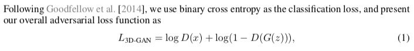
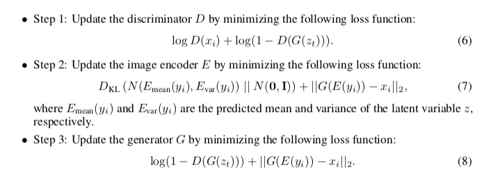
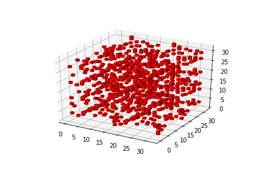
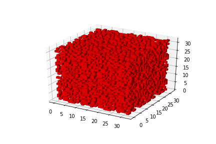
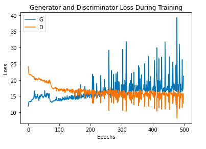

# **PyTorch implementation of 3D-GAN**
## Usage
```bash
> python main.py --arguments
```
## **Contributed by:**
- [Som Tambe](https://github.com/SomTambe)
## **References**
**Learning a Probabilistic Latent Space of Object Shapes via 3D Generative-Adversarial Modeling**
Jiajun Wu*, Chengkai Zhang*, Tianfan Xue, William T. Freeman, and Joshua B. Tenenbaum

**NeurIPS 2016** / **[ArXiv](https://arxiv.org/abs/1610.07584)** / **[MIT CSAIL Research](http://3dgan.csail.mit.edu/)** /

## **Summary**
### **Introduction**
- The paper suggest the use of a VAE-3D-GAN architecture. The VAE consists of an encoder which generates a latent vector **Z** from a distribution **p( X | Z)** of images. 
- The classification of a 3D object is much easier than generation of a 3D model. Training is computationally expensive as well as takes a large time. Therefore, I have decided to only to make a the part without the VAE.

## Generative Adversarial Network
This part consists of two models, a **generator** and a **discriminator**. The generator tries to replicate a probability distribution [of the 3D-models here]. The discriminator is trained with the aim it should be able to diffrentiate between a real instance and a fake instance. As soon as the discriminator fails to do so, We consider our training complete, as the generator has successfully been able to replicate the probability distribution of the sample space [real images], to a latent vector space ~ N(0,0.33).



### Algorithm used for training
This was the algorithm specified in tha paper. Since our part does not consist of the Variational Autoencoder, we can smoothly ignore **Step 2**, and the **3D-reconstruction loss** in **step 3**. It results in a simple minimax function as suggested in the original GAN paper.



## Implementation and Model Architecture

For all the experiments, I use 3D Convolutions and Transpose 3D Convolutions (discriminator and generator repectively), with BatchNorm and ReLU layers in the middle of each layer. In the generator, I have used LeakyReLU with parameter 0.2.

The architecture for the generator follows the following structure-

```python
generator(
  (layer1): Sequential(
    (0): ConvTranspose3d(200, 512, kernel_size=(2, 2, 2), stride=(1, 1, 1), bias=False)
    (1): BatchNorm3d(512, eps=1e-05, momentum=0.1, affine=True, track_running_stats=True)
    (2): ReLU(inplace=True)
  )
  (layer2): Sequential(
    (0): ConvTranspose3d(512, 256, kernel_size=(2, 2, 2), stride=(2, 2, 2), bias=False)
    (1): BatchNorm3d(256, eps=1e-05, momentum=0.1, affine=True, track_running_stats=True)
    (2): ReLU(inplace=True)
  )
  (layer3): Sequential(
    (0): ConvTranspose3d(256, 128, kernel_size=(2, 2, 2), stride=(2, 2, 2), bias=False)
    (1): BatchNorm3d(128, eps=1e-05, momentum=0.1, affine=True, track_running_stats=True)
    (2): ReLU(inplace=True)
  )
  (layer4): Sequential(
    (0): ConvTranspose3d(128, 64, kernel_size=(2, 2, 2), stride=(2, 2, 2), bias=False)
    (1): BatchNorm3d(64, eps=1e-05, momentum=0.1, affine=True, track_running_stats=True)
    (2): ReLU(inplace=True)
  )
  (layer5): Sequential(
    (0): ConvTranspose3d(64, 1, kernel_size=(2, 2, 2), stride=(2, 2, 2), bias=False)
    (1): Sigmoid()
  )
)
```

The discriminator follows the following architecture-
```python
discriminator(
  (layer1): Sequential(
    (0): Conv3d(1, 64, kernel_size=(3, 3, 3), stride=(2, 2, 2), bias=False)
    (1): BatchNorm3d(64, eps=1e-05, momentum=0.1, affine=True, track_running_stats=True)
    (2): LeakyReLU(negative_slope=0.2, inplace=True)
  )
  (layer2): Sequential(
    (0): Conv3d(64, 128, kernel_size=(3, 3, 3), stride=(2, 2, 2), bias=False)
    (1): BatchNorm3d(128, eps=1e-05, momentum=0.1, affine=True, track_running_stats=True)
    (2): LeakyReLU(negative_slope=0.2, inplace=True)
  )
  (layer3): Sequential(
    (0): Conv3d(128, 256, kernel_size=(3, 3, 3), stride=(2, 2, 2), bias=False)
    (1): BatchNorm3d(256, eps=1e-05, momentum=0.1, affine=True, track_running_stats=True)
    (2): LeakyReLU(negative_slope=0.2, inplace=True)
  )
  (layer4): Sequential(
    (0): Conv3d(256, 512, kernel_size=(3, 3, 3), stride=(2, 2, 2), bias=False)
    (1): BatchNorm3d(512, eps=1e-05, momentum=0.1, affine=True, track_running_stats=True)
    (2): LeakyReLU(negative_slope=0.2, inplace=True)
  )
  (layer5): Sequential(
    (0): Conv3d(512, 1, kernel_size=(1, 1, 1), stride=(1, 1, 1), bias=False)
    (1): Sigmoid()
  )
)
```
# Results
Training took place for 2842 epochs.
Only the monitor models were chosen. They can be found **[here](https://github.com/SomTambe/ModelNet10-dataset)** .
## Threshold = 0.8

## Threshold = 0.7


## Losses
Since model was trained in parts due to the large number of epochs, there are many graphs of loss functions.
### Losses [Epochs 0-500]

### Losses [Epochs 500-1000]

### Losses [Epochs 1000-1500]


# Conclusion
The results are not great at all, which repeatedly proves training generators to model 3-dimensional spaces is an extremely difficult task. 

Other sources which were successfull in generating objects had trained for a minimum 10000 epochs (single-category training), and some such as [NVIDIAGameworks Kaolin](https://github.com/NVIDIAGameWorks/kaolin) had trained for 50000 epochs !

I expect the results to get better with training. 

Peace :v: