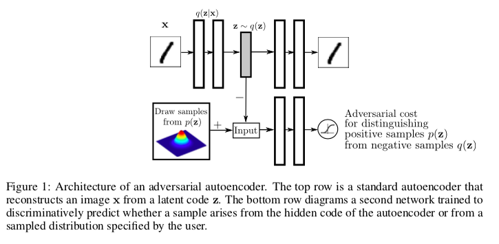
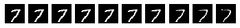
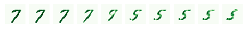
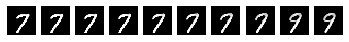

# Adversarial Autoencoder
## Usage
```bash
> python main.py --arguments
```
The arguments are as follows-
```bash
usage: main.py [-h] [--directory DIRECTORY] [--epochs EPOCHS]
               [--batch_size BATCH_SIZE] [--gen_lr GEN_LR] [--dis_lr DIS_LR]
               [--download DOWNLOAD]

optional arguments:
  -h, --help            show this help message and exit
  --directory DIRECTORY
                        directory of dataset
  --epochs EPOCHS       total number of epochs you want to run. Default: 100
  --batch_size BATCH_SIZE
                        Batch size for dataset
  --gen_lr GEN_LR       generator learning rate
  --dis_lr DIS_LR       discriminator learning rate
  --download DOWNLOAD   Argument to download dataset. Set to True.
```

## Contributed by-
[Som Tambe](https://github.com/SomTambe)
## References
**Adversarial Autoencoders** Alireza Makhzani, Jonathon Shlens, Navdeep Jaitly, Ian Goodfellow, Brendan Frey

**ICLR 2016** / [ArXiv](https://arxiv.org/abs/1511.05644)

This blog helped me with a lot with the learning rates for the Adam optimizer, [AAE with PyTorch](https://blog.paperspace.com/adversarial-autoencoders-with-pytorch/), great stuff!!

## Summary
### Introduction
Adversarial Autoencoders help us in mapping the hidden latent space vector to a given prior distribution defined by the user.



There can be several choices for the encoder we take, like-
- **Deterministic** - This is the normal encoder used in a standard autoencoder setup. The only stocasticity lies in the given dataset distribution.
- **Gaussian Posterior** - This is the one taken from the VAE setup, where the encoder network predicts the mean and variance. A sample is then sampled from ). Thus the stochasticity lies in the randomness of the gaussian distribution and the data distribution here.

I have simply used the standard **Deterministic** network, as suggested by the experiments they carried on the MNIST dataset.

### Losses and the objective function
I have taken the losses as defined as in the paper, with help from the forementioned blog.

There are 3 objectives that should come into picture in the Adversarial Autoencoder setup.
- **Reconstruction loss**, follows the same from the standard autoencoder setup, I have used Binary Crossentropy Loss here.
- **Discriminator loss**, which discriminates the real samples(defined by the prior distribution) from the fake samples(generated by the encoder).
- **Generator loss**, we use this to update the generator network (encoder network here), by making sure generated output lies in the given prior distribution.

# Results
I trained for a 100 epochs. I set the prior distribution to ).

I then randomly generated characters from the given posterior, and then linearly interpolated them to find the results.

Here are the results of the interpolation-

**0-4**


**0-6**


**1-4**


**1-5**

.png)

**1-7**


**7-8**


(Sorry for the axes, I did not know how to disable them, this was the first image I took)

**7-7 stroke change**



**7-5**



**7-9**



If you want the weights, they are stored in the same directory. Just load them and utilize the functions in **utils**.

Peace :v:
