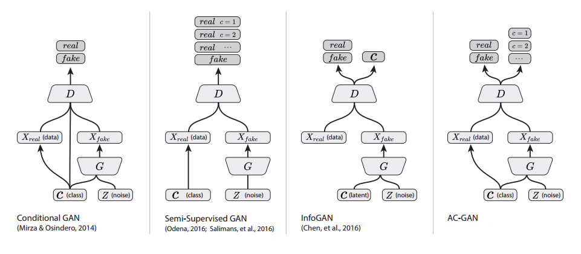
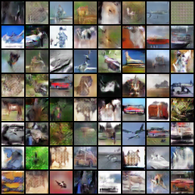
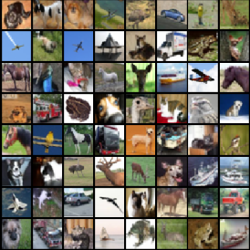
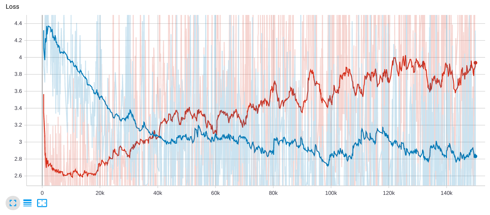
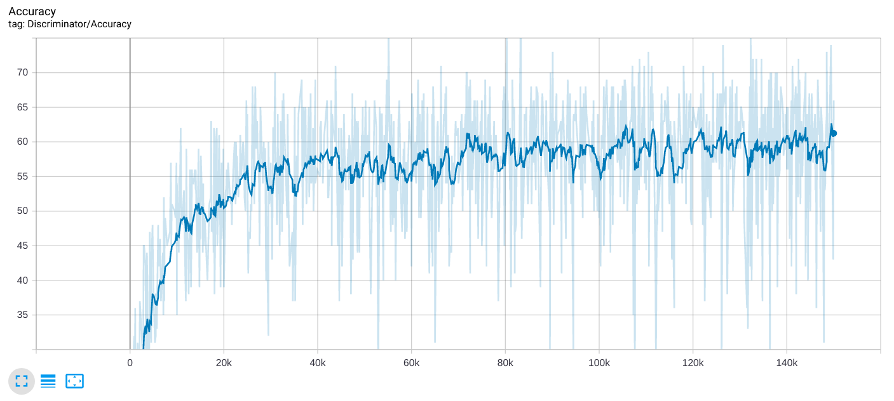
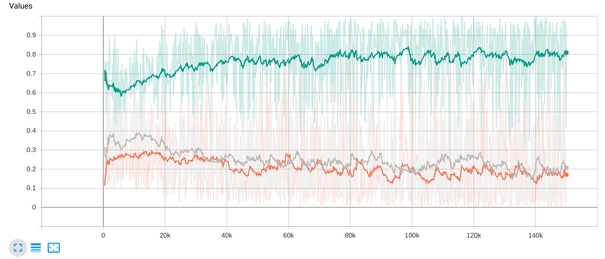

# PyTorch Implementation of ACGAN 
## Usage
```bash
$ python3 main.py
```
> **_NOTE:_** on Colab Notebook use following command:
```python
!git clone link-to-repo
%run main.py
```

## Help Log
```
usage: main.py [-h] [--root_dir ROOT_DIR] [--num_workers NUM_WORKERS] [--batch_size BATCH_SIZE] 
[--nz NZ] [--num_epochs NUM_EPOCHS] [--lr LR] [--beta1 BETA1] [--outdir OUTDIR]

optional arguments:
  -h, --help            show this help message and exit
  --root_dir ROOT_DIR   path to dataset
  --num_workers NUM_WORKERS
                        number of data loading workers
  --batch_size BATCH_SIZE
                        input batch size
  --nz NZ               size of the latent z vector
  --num_epochs NUM_EPOCHS
                        number of epochs to train for
  --lr LR               learning rate, default=0.0002
  --beta1 BETA1         beta1 for adam. default=0.5
  --outdir OUTDIR       folder to output images and model checkpoints
```

## Contributed by:
* [Naman Gupta](https://github.com/namangup)

## References

* **Title**: Conditional Image Synthesis With Auxiliary Classifier GANs
* **Authors**: Augustus Odena, Christopher Olah, Jonathon Shlens
* **Link**: https://arxiv.org/abs/1610.09585
* **Tags**: Neural Networks, Generative Networks, GANs
* **Year**: 2017

# Summary 

## Introduction

Generative adversarial nets were introduced in 2014 by [Goodfellow et al.](https://arxiv.org/abs/1406.2661) as a novel way to train a generative model.
They consist of two ‘adversarial’ models: a generative model  that captures the data distribution, and a discriminative model  that estimates the probability that a sample came from the training data rather than .

GANs can produce convincing image samples on datasets with low variability and low resolution. However, they struggle to generate globally coherent, high resolution samples - particularly from
datasets with high variability. To improve upon this, the authors introduced **Auxiliary Classifier GANs** (ACGAN).


## ACGAN

In the ACGAN, every generated sample has a corresponding class label,  in addition to the noise .  uses both to generate images ). The discriminator gives both a probability distribution over sources and a probability distribution over the class labels, %2C%20P(C%7CX)%20%3D%20D(X)). The objective function has two parts: the loglikelihood of the correct source, , and the log-likelihood of the correct class,  .

![L_S = E\[logP(S = real \ | X_{real})\] + E\[logP(S = fake \ | X_{fake})\] ](https://render.githubusercontent.com/render/math?math=L_S%20%3D%20E%5BlogP(S%20%3D%20real%20%5C%20%7C%20X_%7Breal%7D)%5D%20%2B%20E%5BlogP(S%20%3D%20fake%20%5C%20%7C%20X_%7Bfake%7D)%5D%20)

![L_C = E\[logP(C = c \ | X_{real})\] + E\[logP(C = c \ | X_{fake})\] ](https://render.githubusercontent.com/render/math?math=L_C%20%3D%20E%5BlogP(C%20%3D%20c%20%5C%20%7C%20X_%7Breal%7D)%5D%20%2B%20E%5BlogP(C%20%3D%20c%20%5C%20%7C%20X_%7Bfake%7D)%5D%20)

 is trained to maximize  while  is trained to
maximize . AC-GANs learn a representation for
 that is independent of class label.

## What's the difference ?

The comparision of ACGAN with other GANs is shown below.


## Implementation

In this implementation of ACGAN, we use the CIFAR-10 dataset unlike the ImageNet dataset as used in the paper, due to limited computational resources. 
The Generator takes in a  dimensional noise vector, and generates images of shape ). 
```
----------------------------------------------------------------
        Layer (type)               Output Shape         Param #
================================================================
            Linear-1                  [-1, 384]          42,624
   ConvTranspose2d-2            [-1, 192, 4, 4]       1,179,840
       BatchNorm2d-3            [-1, 192, 4, 4]             384
              ReLU-4            [-1, 192, 4, 4]               0
   ConvTranspose2d-5             [-1, 96, 8, 8]         295,008
       BatchNorm2d-6             [-1, 96, 8, 8]             192
              ReLU-7             [-1, 96, 8, 8]               0
   ConvTranspose2d-8           [-1, 48, 16, 16]          73,776
       BatchNorm2d-9           [-1, 48, 16, 16]              96
             ReLU-10           [-1, 48, 16, 16]               0
  ConvTranspose2d-11            [-1, 3, 32, 32]           2,307
             Tanh-12            [-1, 3, 32, 32]               0
================================================================
Total params: 1,594,227
Trainable params: 1,594,227
Non-trainable params: 0
----------------------------------------------------------------
Input size (MB): 0.00
Forward/backward pass size (MB): 0.54
Params size (MB): 6.08
Estimated Total Size (MB): 6.62
----------------------------------------------------------------
```

The Discriminator takes an image as a input and outputs the predicted source (real / fake) and the class of the input image.
```
----------------------------------------------------------------
        Layer (type)               Output Shape         Param #
================================================================
            Conv2d-1           [-1, 16, 16, 16]             448
         LeakyReLU-2           [-1, 16, 16, 16]               0
            Conv2d-3           [-1, 32, 16, 16]           4,640
       BatchNorm2d-4           [-1, 32, 16, 16]              64
         LeakyReLU-5           [-1, 32, 16, 16]               0
           Dropout-6           [-1, 32, 16, 16]               0
            Conv2d-7             [-1, 64, 8, 8]          18,496
       BatchNorm2d-8             [-1, 64, 8, 8]             128
         LeakyReLU-9             [-1, 64, 8, 8]               0
          Dropout-10             [-1, 64, 8, 8]               0
           Conv2d-11            [-1, 128, 8, 8]          73,856
      BatchNorm2d-12            [-1, 128, 8, 8]             256
        LeakyReLU-13            [-1, 128, 8, 8]               0
          Dropout-14            [-1, 128, 8, 8]               0
           Conv2d-15            [-1, 256, 4, 4]         295,168
      BatchNorm2d-16            [-1, 256, 4, 4]             512
        LeakyReLU-17            [-1, 256, 4, 4]               0
          Dropout-18            [-1, 256, 4, 4]               0
           Conv2d-19            [-1, 512, 4, 4]       1,180,160
      BatchNorm2d-20            [-1, 512, 4, 4]           1,024
        LeakyReLU-21            [-1, 512, 4, 4]               0
          Dropout-22            [-1, 512, 4, 4]               0
           Linear-23                    [-1, 1]           8,193
          Sigmoid-24                    [-1, 1]               0
           Linear-25                   [-1, 10]          81,930
================================================================
Total params: 1,664,875
Trainable params: 1,664,875
Non-trainable params: 0
----------------------------------------------------------------
Input size (MB): 0.01
Forward/backward pass size (MB): 1.06
Params size (MB): 6.35
Estimated Total Size (MB): 7.43
----------------------------------------------------------------
```


We use the following loss functions : 
- Binary Cross Entropy Loss as the source classification criterion.
- Categorical Cross Entropy Loss as the class classification criterion.
- Discriminator Loss  where  , 
- Generator Loss 

Here  and  refer to source and class respectively.

We use the Adam Optimizer with default learning rate as 0.0002 and  as 0.5.
# Results
> **_NOTE:_** All the plots shown below have been smoothened out, the x axis corresponds to number of iterations.

Results after training for 300 epochs.

The image generated for a random noise vector :



Comparing this with the real images from the dataset :



Generator and Discriminator Loss as the training progresses :
> Blue - Discriminator Loss ; Red - Generator Loss



The accuracy of classification by the discriminator :



The values ) , )) and )) which denote the output of the discriminator on real and generated images :

> Green - ) ; Grey - )) ; Orange - ))



The total time taken on a Tesla K80 GPU to train the model was 97 minutes.

The results may not seem very good since the CIFAR-10 images are only 32*32 px in size and this is what a generator can do at best for low resolution images. On the other hand if we train ACGANs on ImageNet/ other datasets having larger images, one can at once see the difference .