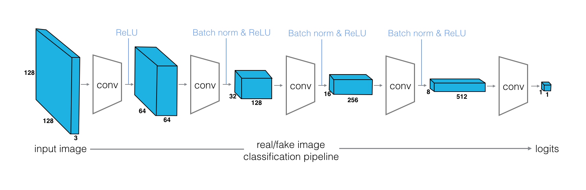
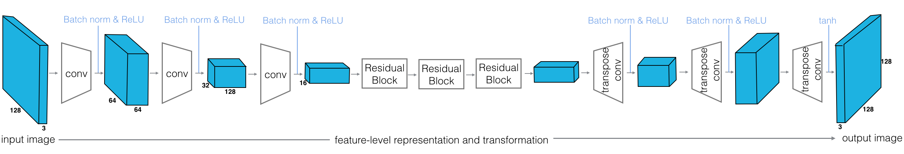
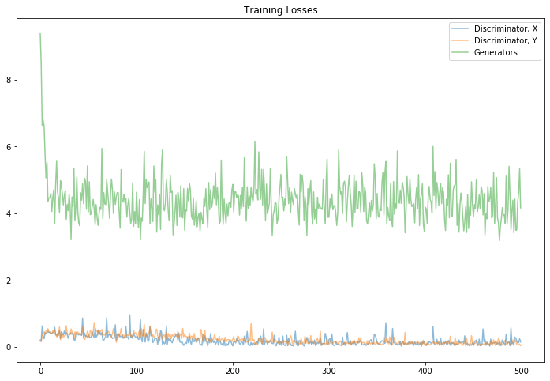
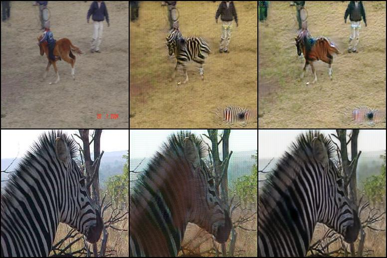
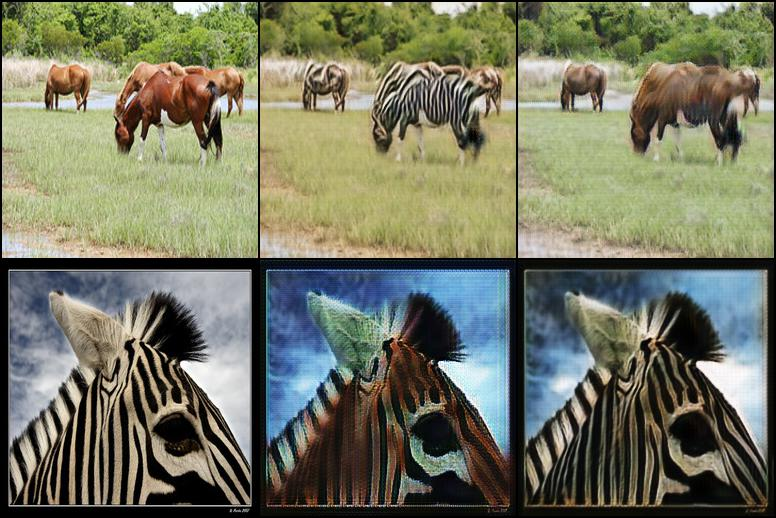

# Pytorch Implementation of CycleGAN
Download Dataset(horse2zebra,summer2winter_yosemite) 
```bash
$ sh ./dataset.sh horse2zebra
```
## Usage
To run training
```bash
$ python main.py --training True --epochs 40 
```
For testing
```bash
$ python main.py --testing True 
```
> **_NOTE:_** on Colab Notebook use following command:
```python
!git clone link-to-repo
%run main.py --training True --epochs 40
%run main.py --testing True
```
## Help log
```
usage: main.py [-h] [--epochs EPOCHS] [--decay_epoch DECAY_EPOCH]
               [--batch_size BATCH_SIZE] [--lr LR] [--load_height LOAD_HEIGHT]
               [--load_width LOAD_WIDTH] [--gpu_ids GPU_IDS]
               [--crop_height CROP_HEIGHT] [--crop_width CROP_WIDTH]
               [--lamda LAMDA] [--idt_coef IDT_COEF] [--training TRAINING]
               [--testing TESTING] [--results_dir RESULTS_DIR]
               [--dataset_dir DATASET_DIR] [--checkpoint_dir CHECKPOINT_DIR]
               [--norm NORM] [--no_dropout] [--ngf NGF] [--ndf NDF]
               [--gen_net GEN_NET] [--dis_net DIS_NET]

cycleGAN PyTorch

optional arguments:
  -h, --help            show this help message and exit
  --epochs EPOCHS
  --decay_epoch DECAY_EPOCH
  --batch_size BATCH_SIZE
  --lr LR
  --load_height LOAD_HEIGHT
  --load_width LOAD_WIDTH
  --gpu_ids GPU_IDS
  --crop_height CROP_HEIGHT
  --crop_width CROP_WIDTH
  --lamda LAMDA
  --idt_coef IDT_COEF
  --training TRAINING
  --testing TESTING
  --results_dir RESULTS_DIR
  --dataset_dir DATASET_DIR
  --checkpoint_dir CHECKPOINT_DIR
  --norm NORM           instance normalization or batch normalization
  --no_dropout          no dropout for the generator
  --ngf NGF             # of gen filters in first conv layer
  --ndf NDF             # of discrim filters in first conv layer
  --gen_net GEN_NET
  --dis_net DIS_NET
                        
  ```
## Contributed by:
* [Mridul Dubey](https://github.com/mridul911)
## References

* **Title**: Unpaired Image-to-Image Translation using Cycle-Consistent Adversarial Networks
* **Authors**: Jun-Yan Zhu, Taesung Park, Phillip Isola, Alexei A. Efros
* **Link**: https://arxiv.org/pdf/1703.10593.pdf
* **Year**: 2017

# Summary

## **Introduction** 
CycleGANs give us a way to learn the mapping between one image domain and another using an unsupervised approach. A CycleGAN is designed for image-to-image translation and it learns from unpaired training data. This means that in order to train a generator to translate images from domain  X  to domain  Y , we do not have to have exact correspondences between individual images in those domains. For example, in the paper that introduced CycleGANs, the authors are able to translate between images of horses and zebras, even though there are no images of a zebra in exactly the same position as a horse or with exactly the same background, etc. Thus, CycleGANs enable learning a mapping from one domain  X  to another domain  Y  without having to find perfectly-matched, training pairs!
## **Model**
CycleGAN is a Generative Adversarial Network (GAN) that uses two generators and two discriminators.We call one generator G, and have it convert images from the X domain to the Y domain. The other generator is called F, and converts images from Y to X.Each generator has a corresponding discriminator, which attempts to tell apart its synthesized images from real ones.
### **Discriminators**
   The discriminators are PatchGANs, fully convolutional neural networks that look at a “patch” of the input image, and output the probability of the patch being “real”. This is both more computationally efficient than trying to look at the entire input image, and is also more effective — it allows the discriminator to focus on more surface-level features, like texture, which is often the sort of thing being changed in an image translation task.
   
   The discriminators,  DX  and  DY , in this CycleGAN are convolutional neural networks that see an image and attempt to classify it as real or fake. In this case, real is indicated by an output close to 1 and fake as close to 0. The discriminators have the following architecture
   
### **Generators**

Each CycleGAN generator has three sections: an encoder, a transformer, and a decoder. The input image is fed directly into the encoder, which shrinks the representation size while increasing the number of channels. The encoder is composed of three convolution layers. The resulting activation is then passed to the transformer, a series of six residual blocks. It is then expanded again by the decoder, which uses two transpose convolutions to enlarge the representation size, and one output layer to produce the final image in RGB.


## **Loss Functions**
Finding the discriminator and the generator losses are key to getting a CycleGAN to train.
* The CycleGAN contains two mapping functions  G:X→Y  and  F:Y→X , and associated adversarial discriminators  DY  and  DX . (a)  DY  encourages  G  to translate  X  into outputs indistinguishable from domain  Y , and vice versa for  DX  and  F .
* To further regularize the mappings, we introduce two cycle consistency losses that capture the intuition that if we translate from one domain to the other and back again we should arrive at where we started. (b) Forward cycle-consistency loss and (c) backward cycle-consistency loss.

### **Discriminator Losses**
The discriminator losses will be mean squared errors between the output of the discriminator, given an image, and the target value, 0 or 1, depending on whether it should classify that image as fake or real. For example, for a real image, x, we can train  DX  by looking at how close it is to recognizing and image x as real using the mean squared error:

out_x = D_X(x)

real_err = torch.mean((out_x-1)**2)
### **Generator Losses**
Calculating the generator losses will look somewhat similar to calculating the discriminator loss; there will still be steps in which you generate fake images that look like they belong to the set of  X  images but are based on real images in set  Y , and vice versa. You'll compute the "real loss" on those generated images by looking at the output of the discriminator as it's applied to these fake images; this time, your generator aims to make the discriminator classify these fake images as real images.
### **Cycle Consistency Loss**
In addition to the adversarial losses, the generator loss terms will also include the cycle consistency loss. This loss is a measure of how good a reconstructed image is, when compared to an original image.

Say you have a fake, generated image, x_hat, and a real image, y. You can get a reconstructed y_hat by applying G_XtoY(x_hat) = y_hat and then check to see if this reconstruction y_hat and the orginal image y match. For this, we recommed calculating the L1 loss, which is an absolute difference, between reconstructed and real images. You may also choose to multiply this loss by some weight value lambda_weight to convey its importance.

The total generator loss will be the sum of the generator losses and the forward and backward cycle consistency losses.

# **Results**

## Images after 40 epochs(horse2zebra)
( Real - Generated - Reconstructed)


## Images after 30 epochs(horse2zebra)
 (Real - Generated - Reconstructed)


**Train for more epochs for better result(default)**
