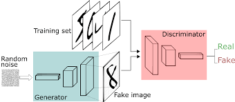
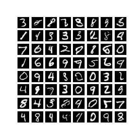
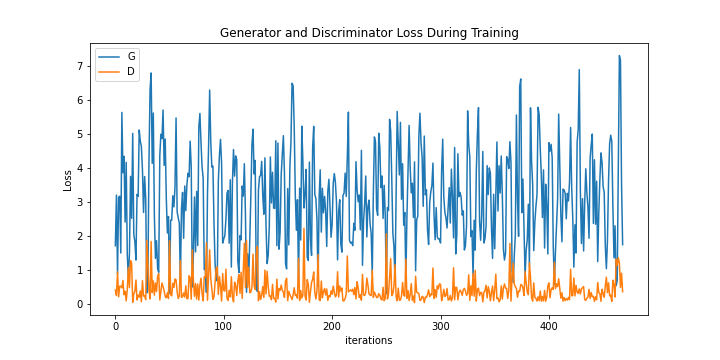

# TensorFlow Implementation of DCGAN 
## Usage
```bash
$ python3 main.py --EPOCHS 50 --noise_dim 100
```
> **_NOTE:_** on Colab Notebook use following command:
```python
!git clone link-to-repo
%run main.py --EPOCHS 50 --noise_dim 100
```

## Help log
```
usage: main.py [-h] [--EPOCHS EPOCHS]
               [--noise_dim NOISE_DIM] 
               [--BATCH_SIZE BATCH_SIZE] [--num_examples_to_generate num_examples_to_generate]
               [--lr_gen lr_gen][--lr_disc lr_disc]
               [--outdir OUTDIR]

optional arguments:
  -h, --help                   show this help message and exit
  --EPOCHS EPOCHS              No of epochs: default 50 
  --noise_dim NOISE_DIM        Dimension of noise vector
  --batch_size BATCH_SIZE      Batch size, default 256
  --num_examples_to_generate   no of images shown after each epoch in output, default 16
  --lr_gen                     learning rate of generator's optimizer,default 0.0002
  --lr_disc                    learning rate of discriminator's optimizer,default 0.0002
  --outdir OUTDIR              Directory in which to store data
                        
  ```

## Contributed by:
* [Shivamshree Gupta](https://github.com/shvmshri)

## References

* **Title**: Unsupervised Representation Learning with Deep Convolutional Generative Adversarial Networks
* **Authors**: Alec Radford, Luke Metz, Soumith Chintala
* **Link**: [https://arxiv.org/pdf/1511.06434.pdf](https://arxiv.org/pdf/1511.06434.pdf)
* **Tags**: Neural Network, Generative Networks, GANs
* **Year**: 2015

## SUMMARY
### *Deep Convolutional Generative Adversarial Networks*
#### Introduction	
One way to build good natural images is by training Generative Adversarial Networks (GANS). ,and we can later even reuse parts of the generator and discriminator networks as feature extractors for supervised tasks .DCGANs is actually one of the class of GANs using CNNs architecture for both of its components i.e.  a generator and a discriminator.
#### Model Architecture	
In general, GANs consist of a generator and a discriminator. These two are separately a CNN architecture and are trained together.

 
##### GENERATOR :
A ANN model which is aimed for the generation of new images. They took in input a random noise z and various convolution transpose layers are applied and it generates a image i.e. a matrices of pixel values (G(z)) .Generator never get to see the real world actual images or the training dataset of images.
##### DISCRIMINATOR:
A CNN classification model used to classify whether an image passed to it is real or fake (generated by the generator).It take image from training examples x and from those generated by generator (G (z)) and predicts the probability of the image to be real (D(x)) or fake (D (G (z))).

Now, while training the model, generator tries to increase the discriminator error as it tries to fool discriminator by improving its generated image so that they resemble real images while discriminator tries to decrease it’s error by trying to judge correctly the real and the fake images. For weights of the model normally initiated ,we first train generator say for y no. of images keeping the discriminator’s weights constant .Then, as generator’s weight are updated ,we train discriminator keeping generator’s weights to be constant for y fake and y real images and this process is then repeated for several epochs using cross entropy loss function.

 

This becomes a __minimax__ type loss function as above illustrated.

#### Architecture guidelines for stable Deep Convolutional GANs
  • Replace any pooling layers with strided convolutions (discriminator) and fractional-strided convolutions (generator).
  • Use batchnorm in both the generator and the discriminator except at the generator’s output layer and discriminator’s input layer. 
  • Remove fully connected hidden layers for deeper architectures. 
  • Use ReLU activation in generator for all layers except for the output, which uses Tanh. 
  • Use LeakyReLU activation in the discriminator for all layers.

#### Implementation and Training details
1.	Pre-processing -: scaling images to [-1 1]. No data augmentation.
2.	Batch size -: 128.
3.	Weights initialization -: using normal distribution.
4.	LeakyReLU -: slope of leak=0.2.
5.	Adam optimizer-: learning rate=0.0002, momentum=0.5.
6.	Epochs -: 50.
7.	Noise dimension -: 100

#### Images generated of MNIST dataset after 50 epochs:

 

#### Plot of generator loss vs. discriminator loss

 

## Sources
1. [Deep Learning Part -II(CS7015),Lec-1](https://www.youtube.com/watch?v=1ju4qmdtRdY&t=142s)
2. [Deep Learning Part -II(CS7015),Lec-2](https://www.youtube.com/watch?v=uyuYfTMHZM0)
