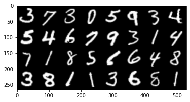
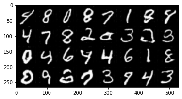
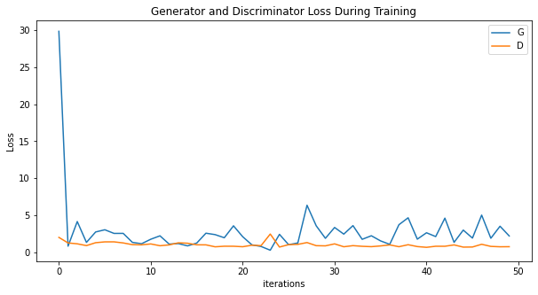

# DCGAN implementation in pytorch on MNIST

## Usage
```bash
$ python3 main.py --num_epochs 10
```
> **_NOTE:_** on Colab Notebook use following command:
```python
!git clone link-to-repo
%run main.py --num_epochs 10
```

## Help log
```
usage: main.py [-h] [--num_epochs NUM_EPOCHS]
               [--batch_size  BATCH_SIZE] 
               [--channels_noise CHANNELS_NOISE] 
               [--lr_g LR_G][--lr_d LR_D]
               [--beta1 BETA1]

optional arguments:
  -h, --help                           show this help message and exit
  --num_epochs NUM_EPOCHS              no. of epochs : default=10
  --batch_size  BATCH_SIZE             batch size : default=128
  --channels_noise CHANNELS_NOISE      size of noise vector : default=100
  --lr_g LR_G                          learning rate generator : default=0.0002
  --lr_d LR_D                          learning rate discriminator : default=0.0002
  --beta1 BETA1                        bet1 value for adam optimizer
                        
  ```

## contributed by : 
* [Nakul Jindal](https://github.com/nakul-jindal)

## References

* **Title**: UNSUPERVISED REPRESENTATION LEARNING WITH DEEP CONVOLUTIONAL GENERATIVE ADVERSARIAL NETWORKS
* **Authors**: Alec Radford, Luke Metz, Soumith Chintala
* **Link**: https://arxiv.org/pdf/1511.06434.pdf
* **Tags**: Neural Network, Generative Networks, GANs
* **Year**: 2015


# summary

## Introduction
* Deep Convolution Generative Adversarial Networks (DCGANs) belong to a set of algorithms called generative models, which are widely used for unupervised learning tasks which aim to learn the underlying structure of the given data. 

* Simple GANs allow you to generate new unseen data that mimic the actual given real data. However, GANs pose problems in training and require carefullly tuned hyperparameters.

* DCGAN aims to solve this problem by explicitly using convolutional and convolutional-transpose layers in the discriminator and generator, respectively. 

* DCGANs basically convert the laplacian pyramid technique (many pairs of G and D to progressively upscale an image) to a single pair of G and D.

## Generator
 
* The generator `G` is designed to map the latent space vector `z` (random noise) to data-space (images same as training images) 
* involves a series of transpose Conv2d layers, each with BatchNorm2d and relu activation.
* The output of the generator is fed through a tanh function to return it to the input data range of `[-1,1]`.

## Discriminator

* The discriminator `D` is a binary classification network that takes an image as input and outputs a scalar probability that the input image is real or fake. 
* `D` involves a series of Conv2d, BatchNorm2d, and LeakyReLU layers.
* outputs the final probability through a Sigmoid activation function.


> The DCGAN paper mentions it is a good practice to use strided convolution rather than pooling to downsample because it lets the network learn its own pooling function. Also batch norm and leaky relu functions promote healthy gradient flow which is critical for the learning process of both `G` and `D`.


## Model Architecture


 
## Network Design of DCGAN:
* Replace all pooling layers with strided convolutions for the downsampling
* Remove all fully connected layers.
* Use transposed convolutions for upsampling. 
* Use Batch Normalization after every layer except after the output layer of the generator and the input layer of the discriminator.
* Use ReLU non-linearity for each layer in the generator except for output layer use tanh.
* Use Leaky-ReLU non-linearity for each layer of the disciminator excpet for output layer use sigmoid.

## Hyperparameters for this Implementation
Hyperparameters are chosen as given in the paper.
* mini-batch size: 128
* learning rate: 0.0002
* momentum term beta1: 0.5
* slope of leak of LeakyReLU: 0.2
* For the optimizer Adam (with beta2 = 0.999) has been used instead of SGD as described in the paper.

## MNIST vs Generated images

<table align='center'>
<tr align='center'>
<td> MNIST </td>
<td> DCGAN after 10 epochs </td>
</tr>
<tr>
<td>
<td>
</tr>
</table>

## Training loss



## contributions of the research paper

* proposes and evaluates Deep Convolutional GANs (DCGAN) which are a set of constraints on the architectural topology of Convolutional
GANs that make them stable to train in most settings.

* use of trained discriminators for image classification tasks, showing competitive performance with other unsupervised algorithms.

* visualize the filters learnt by GANs and empirically show that specific filters have learned to draw specific objects.

* show that the generators have interesting vector arithmetic properties allowing for easy manipulation of many semantic qualities of generated samples.

## Conclusion of research paper

This paper shows how convolutional layers can be used with GANs and provides a series of additional architectural guidelines for doing this. The paper also discusses topics such as Visualizing GAN features, Latent space interpolation, using discriminator features to train classifiers, and evaluating results. The paper contains many examples of images generated by final and intermediate layers of the network.

#### key observations
* Images in the latent space do not show sharp transitions indicating that network did not memorize images.
* DCGAN can learn an interesting hierarchy of features.
* Networks seems to have some success in disentangling image representation from object representation.
* Vector arithmetic can be performed on the Z vectors corresponding to the face samples to get results like `smiling woman - normal woman + normal man = smiling man` visually.
