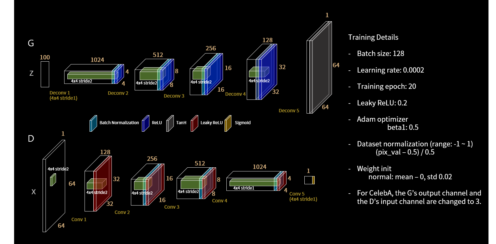

# DCGAN implementation in pytorch on MNIST

## contributed by :

original paper :  [Unsupervised Representation Learning with Deep Convolutional Generative Adversarial Networks](https://arxiv.org/abs/1511.06434)

MNIST dataset: http://yann.lecun.com/exdb/mnist/

## Introduction
Generative Adversarial Networks (GANs) are one of the most popular Machine Learning algorithms developed in recent times. They belong to a set of algorithms called generative models, which are widely used for unupervised learning tasks which aim to learn the uderlying structure of the given data. As the name suggests GANs allow you to generate new unseen data that mimic the actual given real data. However, GANs pose problems in training and require carefullly tuned hyperparameters. This paper aims to solve this problem.

DCGAN is one of the most popular and succesful network design for GAN. A DCGAN is a direct extension of the GAN described except that it explicitly uses convolutional and convolutional-transpose layers in the discriminator and generator, respectively. DCGANs basically convert the laplacian pyramid technique (many pairs of G and D to progressively upscale an image) to a single pair of G and D.

## Generator
 
The generator `G` is designed to map the latent space vector `z` to data-space. Since our data are images, converting `z` to data-space means ultimately creating a RGB image with the same size as the training images (i.e. 3x64x64). In practice, this is accomplished through a series of strided two dimensional convolutional transpose layers, each paired with a 2d batch norm layer and a relu activation. The output of the generator is fed through a tanh function to return it to the input data range of `[-1,1]`. The batch norm functional layers help with the flow of gradients during training.

## Discriminator

The discriminator `D` is a binary classification network that takes an image as input and outputs a scalar probability that the input image is real (as opposed to fake). `D` takes a 3x64x64 input image, processes it through a series of Conv2d, BatchNorm2d, and LeakyReLU layers, and outputs the final probability through a Sigmoid activation function.The DCGAN paper mentions it is a good practice to use strided convolution rather than pooling to downsample because it lets the network learn its own pooling function. Also batch norm and leaky relu functions promote healthy gradient flow which is critical for the learning process of both `G` and `D`.
 

## Network Design of DCGAN:
* Replace all pooling layers with strided convolutions for the downsampling
* Remove all fully connected layers.
* Use transposed convolutions for upsampling. 
* Use Batch Normalization after every layer except after the output layer of the generator and the input layer of the discriminator.
* Use ReLU non-linearity for each layer in the generator except for output layer use tanh.
* Use Leaky-ReLU non-linearity for each layer of the disciminator excpet for output layer use sigmoid.

## Hyperparameters for this Implementation
Hyperparameters are chosen as given in the paper.
* mini-batch size: 128
* learning rate: 0.0002
* momentum term beta1: 0.5
* slope of leak of LeakyReLU: 0.2
* For the optimizer Adam (with beta2 = 0.999) has been used instead of SGD as described in the paper.

## MNIST vs Generated images

<table align='center'>
<tr align='center'>
<td> MNIST </td>
<td> DCGAN after 10 epochs </td>
</tr>
<tr>
<td>
<td>
</tr>
</table>

## Training loss

## Conclusion of research paper

This paper shows how convolutional layers can be used with GANs and provides a series of additional architectural guidelines for doing this. The paper also discusses topics such as Visualizing GAN features, Latent space interpolation, using discriminator features to train classifiers, and evaluating results. The paper contains many examples of images generated by final and intermediate layers of the network.

#### key observations
* Images in the latent space do not show sharp transitions indicating that network did not memorize images.
* DCGAN can learn an interesting hierarchy of features.
* Networks seems to have some success in disentangling image representation from object representation.
* Vector arithmetic can be performed on the Z vectors corresponding to the face samples to get results like `smiling woman - normal woman + normal man = smiling man` visually.
