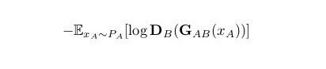
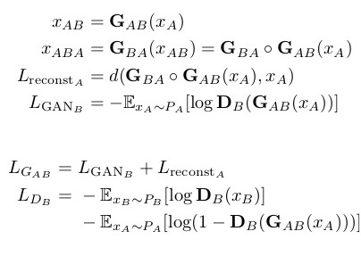
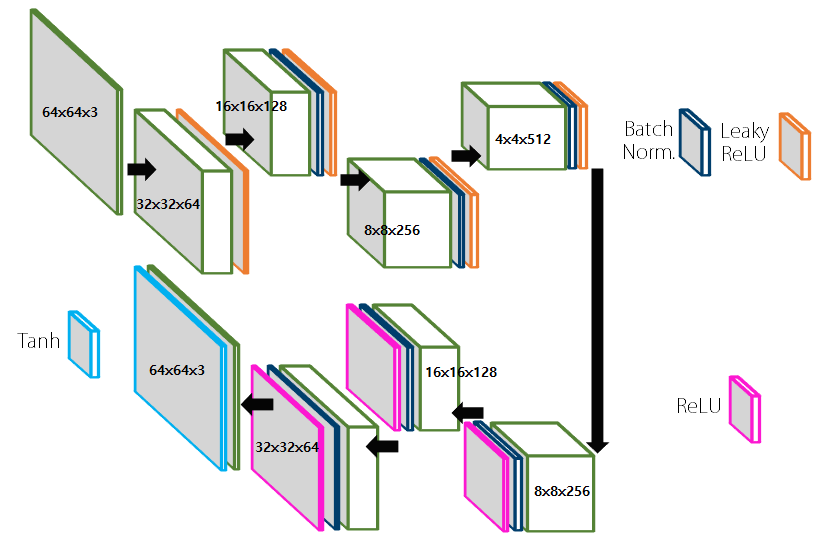
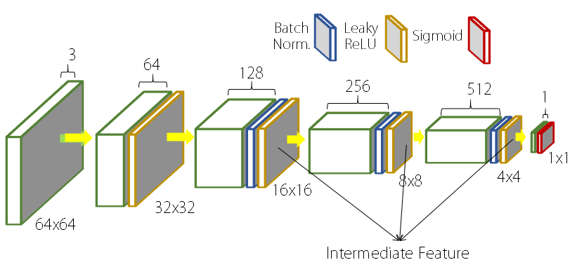
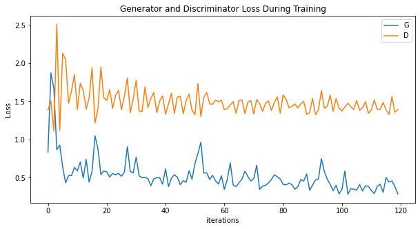
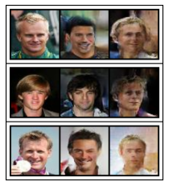

# DiscoGAN implementation in pytorch on celebA

## Usage
```bash
$ python3 main.py --style_A
```
> **_NOTE:_** on Colab Notebook use following command:
```python
!git clone link-to-repo
%run main.py --style_A
```

```bash
usage: main.py [-h] [--cuda CUDA] [--epoch_size EPOCH_SIZE]
                             [--batch_size BATCH_SIZE]
                             [--learning_rate LEARNING_RATE]
                             [--result_path RESULT_PATH]
                             [--model_path MODEL_PATH]
                             [--image_size IMAGE_SIZE]
                             [--gan_curriculum GAN_CURRICULUM]
                             [--starting_rate STARTING_RATE]
                             [--default_rate DEFAULT_RATE] [--style_A STYLE_A]
                             [--style_B STYLE_B] [--constraint CONSTRAINT]
                             [--constraint_type CONSTRAINT_TYPE]
                             [--n_test N_TEST]
                             [--update_interval UPDATE_INTERVAL]
                             [--log_interval LOG_INTERVAL]
                             [--image_save_interval IMAGE_SAVE_INTERVAL]
                             [--model_save_interval MODEL_SAVE_INTERVAL]
                             [--attrs ATTRS [ATTRS ...]]

Use -h,--help to show help message for arguments 
```

## Contributed by:
[Nakul Jindal](https://github.com/nakul-jindal)

## References

* **Title**: UNSUPERVISED REPRESENTATION LEARNING WITH DEEP CONVOLUTIONAL GENERATIVE ADVERSARIAL NETWORKS
* **Authors**: Taeksoo Kim, Moonsu Cha, Hyunsoo Kim, Jung Kwon Lee, Jiwon Kim
* **Link**: https://arxiv.org/abs/1703.05192.pdf
* **Tags**: Computer Vision and Pattern Recognition (cs.CV) , GANs
* **Year**: 2017

# summary

## Introduction

- A DiscoGAN is a generative adversarial network that generates images of products in domain B given an image in domain A and vice-versa. 
- Previous AI could also transfer data from one domain to another, preserving key attributes but require paired data, that is costly and hard to collect 
- DiscoGAN requires training of 2 different data sets without any paired data, and its results shows better performance with robustness to the mode collapse problem 
- Illustrated in the following diagram is an architectural diagram of a DisoGAN network:


* BIJECTIVE : Basically this paper introduced a framework for finding one-to-one mapping between two domains in an unsupervised way by joint training of two GAN model G1 and G2 in parallel (one for A->B and the other one for B->A).  Specifically, we restrict that G2(G1(A)) = A and G1(G2(B)) = B 

* key intuition is to constraint all images in one domain to be representable by images in the other domain. Hence , it learns the bidirectional mapping between two image domains, such as faces, cars, chairs, edges and photos, and successfully apply them in
image translation. Translated images consistently change specified attributes such as hair color, gender and orientation while maintaining all other components.

* BCE loss function for GAN loss : 



* MSE loss function for recontruction loss :



## Model Architecture

### Generator 



- DiscoGAN's generator is a gan with a GAN adversarial loss and reconstruction loss to ensure the consistency.
- Each generator takes an image and feeds it through an encoder-decoder pair .
- GAN loss + reconstruction loss is to be minimized on training processes.
 - Number of layers ranges from 4 to 5 depending on the domain Encoder (convolution layer) Decoder (deconvolution layer) Domain A (resp. B) Domain B (resp. A)

> **_INFO:_**  Reconstruction loss measures how well the original input is reconstructed after a sequence of two generations . GAN loss measures how realistic the generated image is in domain B . 

### Discriminator



- Each discriminator feeds an image through convolution layers.
- Discriminator outputs a scalar output based on sigmoid, telling how real fed image is.


### Hyper-Parameters

- Image Size = 64x64
- Batch Size = 64
- Learning Rate = 0.0002
- Weight Decay = 0.00001
- Adam_beta1 = 0.5
- Loss Weights: See the code
- Scheduling: See the code

## Training loss



## Results of hair color conversion after 2500 epochs

x_A -> G_AB(x_A) -> G_BA(G_AB(x_A))   



Blond -> Black -> Blond

The official implementation uses female celebs for this purpose and got good results . However, for male celebs , hair color conversion becomes a difficult task due to lesser portion of image occupied by the hair.

#### some observations :
* In order to get better results, the generator needs to be smarter than discriminator. 
* greater latent size of generator is required in order to get better generated images.
