# PyTorch implementation of InfoGAN [*Paper*](https://arxiv.org/pdf/1606.03657.pdf)
## Requirements
* numpy
* python
* pytorch
* pytorch-vision
* pickle
* cuda(*highly recommended*)
## Usage 
* Run the following command : 
      <pre><code>python train.py --num_epoch <num_of_epochs> --batch_size <batch_size> --num_workers <num_workers> --lrD <learning_rate_discriminator> --lrG <learning_rate_generator> --beta1 <beta1_adam_param> --beta2 <beta2_adam_param> --recog_weight <recogniser_weight> --save_epoch <model_checkpoints>
      </code></pre>
> ***NOTE** : Use python3 instead in case of Linux/Mac .*
* Arguments
  * -num_epoch : Default: 50, number of epochs.
  * -batch_size : Default: 100.
  * -num_workers : Default : 2.
  * -lrD : Adam optimizer discriminator learning rate, default : 2e-4 (0.0002)
  * -lrG : Adam optimizer generator learning rate, default : 1e-3 (0.001)
  * -beta1 : Default : 0.5
  * -beta2 : Default : 0.99
  * -recog_weight : Default : 0.5, coefficient of information maximising.
  * -model_path : Default : 'trained_model'+ current datetime (*added itself*)
  * -save_epoch : Default : 5.

## Factual Details
- **Title** : Interpretable Representation Learning by Information Maximizing Generative Adversarial Nets 
- **Dated** : 12.06.2016
- **Authors** : Xi Chen, Yan Duan, Rein Houthooft, John Schulman, Ilya Sutskever, Pieter Abbeel
- **University** : UC Berkley
- **Field** : Deep Learning, Generative Adversarial Networks 

## Contributed by
- [*Gurbaaz Singh Nandra*](https://github.com/gurbaaz27)

# Summary

## A Gentle Intoduction : Why ? 
Since the inception of generative adversarial networks, popularly called GANs, they revolutionised the genrative models understanding, as well as the whole Deep Learning in general. GAN is basically a police-forgerer fight between discriminator and generator, where discriminator tries to classify between real and fake, which serves as a constant purpose for generator to come back hard for discriminator the next time. Over course of time, discriminator has a hard time in telling fake ones from real, as the data has been imitated so well, all unsupervisedly. DCGAN used deep convolution layers and a certain architecture to improve this. 

But still, it seemed that all learning was kinda like black box, and model didnt really get know various features of image, for example, sunglasses, curves, angle. The learning seemed, and was indeed, entangled. InfoGAN proposed disentagled representation of data to acquire these features with the help of latent codes and information maximisation. 

> ***Latent :** something existing but hidden, not manifested, concealed .eg. latent heat of fusion*

## Understanding the Theory : What ? 
The main difference is the addition of latent code 'c' to the tranditional noise vector 'z' fed into the Generator. So now G(z) looks like G(z,c). To hope that the network understands these latent codes in an unsupervised manner, an information-theoretic regularisation is proposed: there should be high mutual information between latent codes c and generator distribution G(z,c). Formally, I(c; G(z, c)) should be high. So basically, an additional regularisation term is added to original GAN objective.

  

Now, as the fairyland it seems, practically maximizing this I(c; G(z,c)) is hard as it requires knowledge of the posterior P(c|x), but we can still find a lower bound solution. This consists of introducing an “auxiliary” distribution Q(c|x), which is modeled by a parameterized neural network, and is meant to approximate the real P(c|x). They then use a re-parameterization trick to make it such that you can merely sample from a user-specified prior (i.e. uniform distribution) instead of the unknown posterior.

  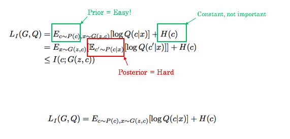

## Implementing the Architecture : How ?
Auxiliary network Q is modelled as a neural network, and shares most of the structure with that of Discriminator except the last layer, since their purpose are different. For MNIST, linear input of 74 variables is fed, consisting of 62 random noise variables, 10 for the categories we hope would match to each of the digit, and 2 latent codes, 1 for width and other for the rotation of digits, random values between -1 and +1. Even though InfoGAN introduces an extra hyperparameter λ, it’s easy to tune and simply setting to 1 is sufficient for discrete latent codes. Knowing the difficult training of GAN, the paper copies the layers from an existing architecture, [DCGAN](https://arxiv.org/abs/1511.06434). So, to ease things out, InfoGAN basically adds a few components to the DCGAN, latent code 'c', an auxiliary network Q and all the training to estimate c unsupervisedly.

  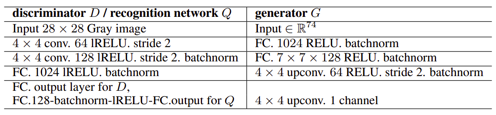

## Results :
### Training on MNIST dataset for 50 epochs :
<pre><code>
Training Started!
Epoch[1/50]	Loss_D: 0.1175	Loss_G: 7.1921	Time:0.27
Epoch[2/50]	Loss_D: 0.1191	Loss_G: 7.2145	Time:0.27
Epoch[3/50]	Loss_D: 0.1186	Loss_G: 6.6265	Time:0.27
Epoch[4/50]	Loss_D: 0.1201	Loss_G: 6.5022	Time:0.27
Epoch[5/50]	Loss_D: 0.1237	Loss_G: 6.7592	Time:0.27
Epoch[6/50]	Loss_D: 0.1197	Loss_G: 7.2505	Time:0.29
Epoch[7/50]	Loss_D: 0.1234	Loss_G: 6.3390	Time:0.27
Epoch[8/50]	Loss_D: 0.1640	Loss_G: 4.8824	Time:0.27
Epoch[9/50]	Loss_D: 0.1219	Loss_G: 6.9811	Time:0.28
Epoch[10/50]	Loss_D: 0.1160	Loss_G: 4.9793	Time:0.27
Epoch[11/50]	Loss_D: 0.1142	Loss_G: 4.7543	Time:0.29
Epoch[12/50]	Loss_D: 0.1172	Loss_G: 4.4431	Time:0.28
Epoch[13/50]	Loss_D: 0.1162	Loss_G: 4.3410	Time:0.27
Epoch[14/50]	Loss_D: 0.1350	Loss_G: 5.6601	Time:0.27
Epoch[15/50]	Loss_D: 0.1222	Loss_G: 4.4171	Time:0.28
Epoch[16/50]	Loss_D: 0.2083	Loss_G: 4.1196	Time:0.29
Epoch[17/50]	Loss_D: 0.2229	Loss_G: 3.6437	Time:0.28
Epoch[18/50]	Loss_D: 0.4226	Loss_G: 2.6176	Time:0.28
Epoch[19/50]	Loss_D: 0.4480	Loss_G: 2.5218	Time:0.27
Epoch[20/50]	Loss_D: 0.4998	Loss_G: 2.5010	Time:0.27
Epoch[21/50]	Loss_D: 0.6554	Loss_G: 2.2479	Time:0.28
Epoch[22/50]	Loss_D: 0.7237	Loss_G: 2.1017	Time:0.28
Epoch[23/50]	Loss_D: 0.7636	Loss_G: 2.5741	Time:0.27
Epoch[24/50]	Loss_D: 0.7692	Loss_G: 2.0070	Time:0.27
Epoch[25/50]	Loss_D: 0.7076	Loss_G: 1.7769	Time:0.28
Epoch[26/50]	Loss_D: 0.7990	Loss_G: 1.8808	Time:0.29
Epoch[27/50]	Loss_D: 0.1518	Loss_G: 4.5639	Time:0.29
Epoch[28/50]	Loss_D: 0.4372	Loss_G: 4.0119	Time:0.27
Epoch[29/50]	Loss_D: 0.3616	Loss_G: 3.2473	Time:0.30
Epoch[30/50]	Loss_D: 0.2219	Loss_G: 4.4581	Time:0.29
Epoch[31/50]	Loss_D: 0.4572	Loss_G: 3.4499	Time:0.30
Epoch[32/50]	Loss_D: 0.5197	Loss_G: 2.5418	Time:0.29
Epoch[33/50]	Loss_D: 0.3907	Loss_G: 2.6922	Time:0.28
Epoch[34/50]	Loss_D: 0.6162	Loss_G: 1.9162	Time:0.28
Epoch[35/50]	Loss_D: 0.4139	Loss_G: 3.0718	Time:0.29
Epoch[36/50]	Loss_D: 0.4458	Loss_G: 3.2686	Time:0.29
Epoch[37/50]	Loss_D: 0.5357	Loss_G: 2.7983	Time:0.28
Epoch[38/50]	Loss_D: 0.5137	Loss_G: 3.2597	Time:0.28
Epoch[39/50]	Loss_D: 0.3200	Loss_G: 3.5945	Time:0.29
Epoch[40/50]	Loss_D: 0.1403	Loss_G: 6.7252	Time:0.30
Epoch[41/50]	Loss_D: 0.1399	Loss_G: 6.5192	Time:0.29
Epoch[42/50]	Loss_D: 0.3973	Loss_G: 5.3002	Time:0.28
Epoch[43/50]	Loss_D: 0.2442	Loss_G: 4.6178	Time:0.28
Epoch[44/50]	Loss_D: 0.2592	Loss_G: 3.9474	Time:0.28
Epoch[45/50]	Loss_D: 0.2502	Loss_G: 4.5859	Time:0.28
Epoch[46/50]	Loss_D: 0.1453	Loss_G: 6.8319	Time:0.29
Epoch[47/50]	Loss_D: 0.2114	Loss_G: 4.1357	Time:0.28
Epoch[48/50]	Loss_D: 0.2629	Loss_G: 3.7725	Time:0.28
Epoch[49/50]	Loss_D: 0.4998	Loss_G: 4.0496	Time:0.28
Epoch[50/50]	Loss_D: 0.2323	Loss_G: 4.0389	Time:0.29
</code></pre>

  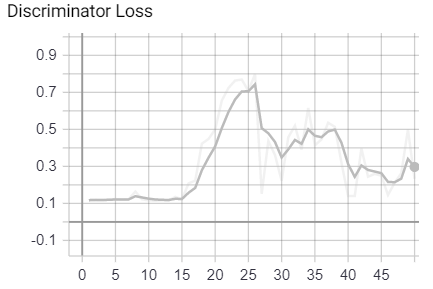
  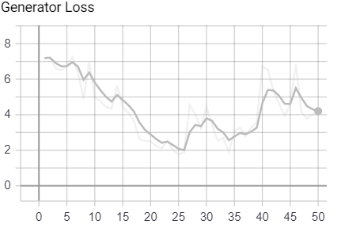 

> ***NOTE** : Images get saved in trained_model directory in png format.*
### Generated Images
* Going down, generated images are at 10,20,30,40 and 50 epochs. ***Im wondering what the hell happened at 40 epochs!***

  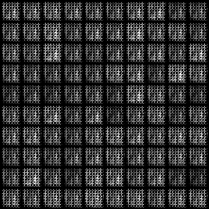
  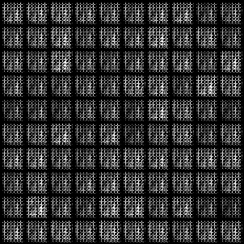 

  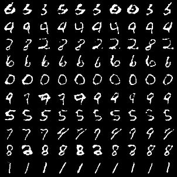
  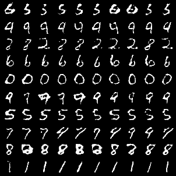 

  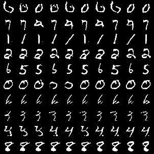
  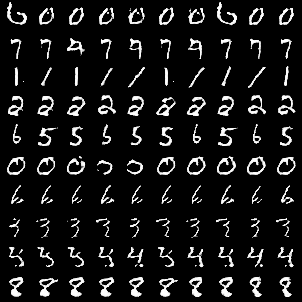 

  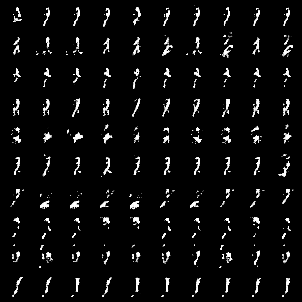
  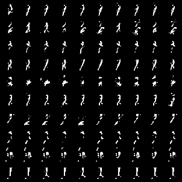 

  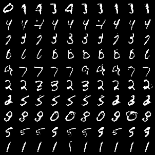
  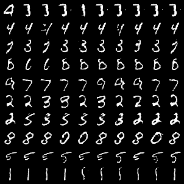 

### GIF of formation

  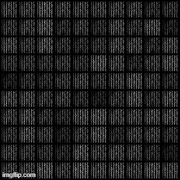
  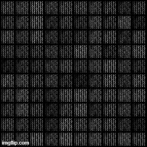 

## Acknowledgement
- [Toward Data Science: InfoGAN : GANs Part III](https://towardsdatascience.com/infogan-generative-adversarial-networks-part-iii-380c0c6712cd)
- [DCGAN Paper](https://arxiv.org/abs/1511.06434)
