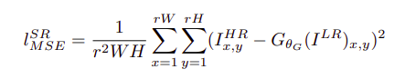
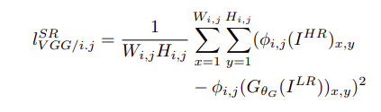
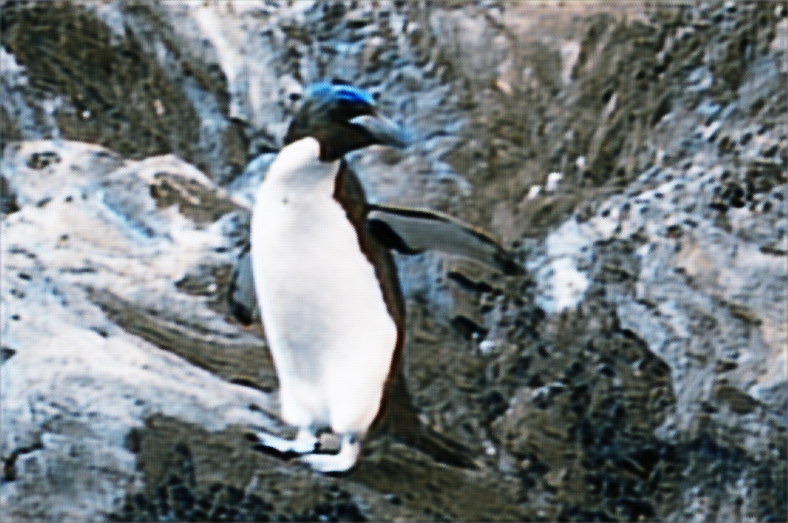
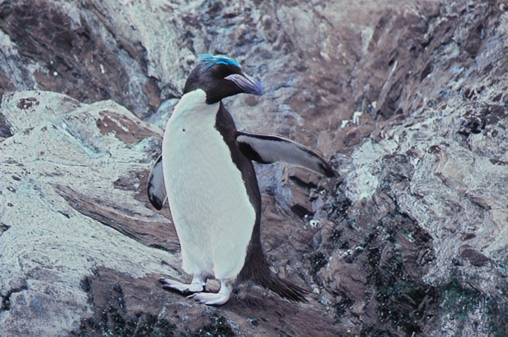
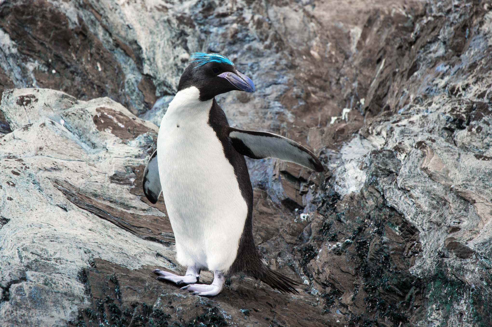
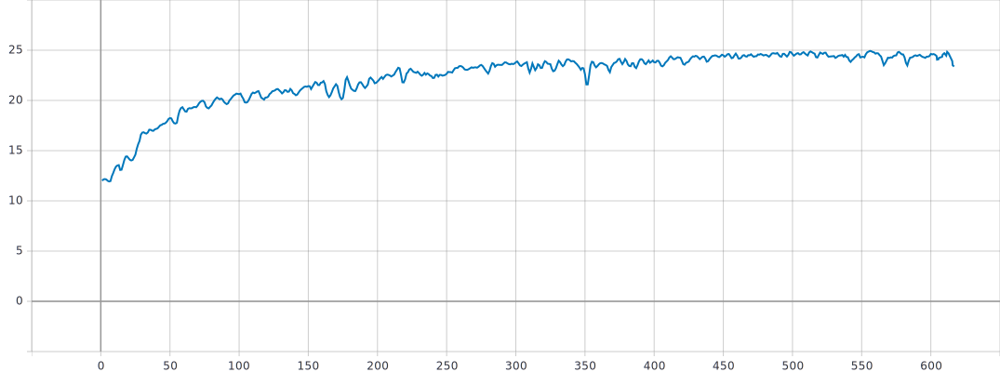
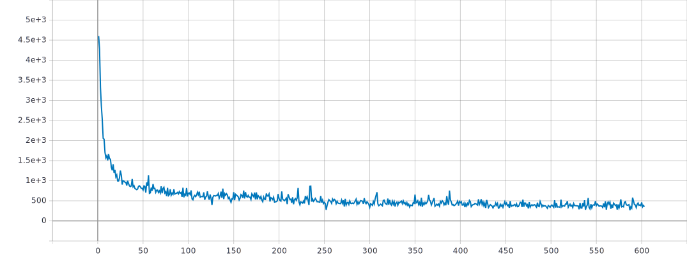
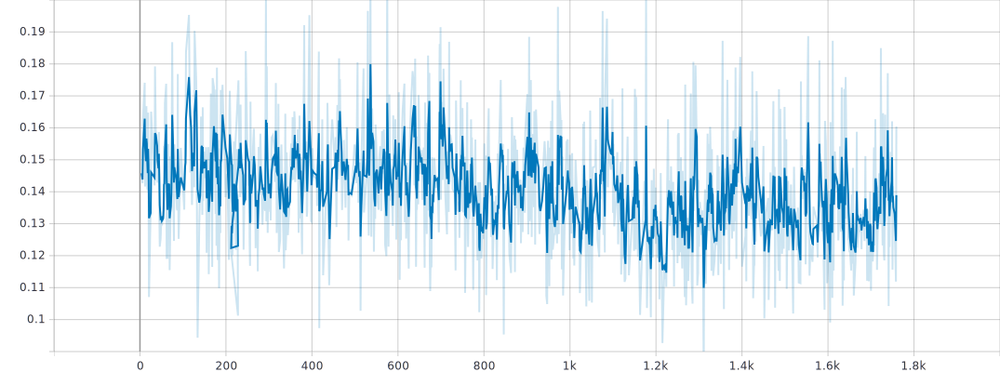
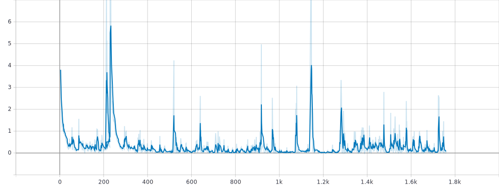

# Tensorflow Implementation of SRGAN

## Usage
```bash
$ python3 main.py -h
```
following are the arguments:
```bash
usage: main.py [-h] [--STEPS STEPS] [--PREGENSTEPS PREGENSTEPS]
               [--BATCH_SIZE BATCH_SIZE] [--lr_pre_gen LR_PRE_GEN]
               [--lr_gen LR_GEN] [--pretrained]

optional arguments:
  -h, --help            show this help message and exit
  --STEPS STEPS         No of steps for training: default 2000
  --PREGENSTEPS PREGENSTEPS
                        No of steps for generator pre training: default 2000
  --BATCH_SIZE BATCH_SIZE
                        Batch size, default 128
  --lr_pre_gen LR_PRE_GEN
                        Learning rate for generator pre training,default 1e-4
  --lr_gen LR_GEN       Learning rate for GAN training,default 1e-4
  --pretrained          converts the input.jpg to output.jpg using the
                        pretrained model makin it 4x larger.
```
## Contributed by:
[Shivanshu Tyagi](https://github.com/spazewalker)

## References
**Photo-Realistic Single Image Super-Resolution Using a Generative Adversarial Network (SRGAN)**
Christian Ledig, Lucas Theis, Ferenc Huszar, Jose Caballero, Andrew Cunningham, ´
Alejandro Acosta, Andrew Aitken, Alykhan Tejani, Johannes Totz, Zehan Wang, Wenzhe Shi
Twitter. \
__Cited as__: [arXiv:1609.04802](https://arxiv.org/abs/1609.04802v5) [cs.CV]

## Summary
### Introduction
SRGAN is the Single Image Super Resolution using a GAN which essentially is a fine tuned version of RResNet. Both are Generative Modes to create a high resolution image from a low resolution image. 
### What's New?
Super Resolution received substantial attention from within the computer
vision research community and has a wide range of
applications. The optimization target of supervised
SR algorithms is commonly the minimization of the mean
squared error (MSE) between the recovered HR image
and the ground truth. This is convenient as minimizing
MSE also maximizes the peak signal-to-noise ratio (PSNR),
which is a common measure used to evaluate and compare
SR algorithms. However, the ability of MSE (and
PSNR) to capture perceptually relevant differences, such
as high texture detail, is very limited as they are defined
based on pixel-wise image difference. Hence, to capure those details, SRGAN define a novel perceptual loss using high-level feature maps of the VGG network
combined with a discriminator that encourages solutions
perceptually hard to distinguish from the HR reference
images.
### Archetecture of the network

### Loss Functions
we have the following loss functions:\
**Perceptual Loss**\
\
**PixelWise MSE Loss**\
\
**Content Loss**\
\
**Adversarial Loss**\
\
### Training Details
Paper uses a generator trained with a SRResNet setup. We pre-train the generator using MSE Loss to replicate that.
After that we use the content loss, Perceptual Loss, and Adersarial Loss to train the GAN. A video showing the training process is provided [here](resources/train_video.avi) or [here is a youtube link](https://youtu.be/q9-AX0yMbzw).
We used DIV2K dataset taking 96x96 sized patchs as high resolution image with 4x scale, taking a batch of 128 patchs.
### Results
A random image was selected from the dataset and was monitered over the process of training.\
__Final Results__:\
**Bicubic Interpolation**:\
\
**SRGAN Generated**:\
\
**High Resolution Image**:\

### Losses over the training.
**Pre-Training**\

The model was pre-trained over the training part of DIV2K dataset for 1000 iterations.(only 600 were recorded properly)

PSNR:\
\
MSE Loss:\
\
**GAN Training**\

The GAN was trained for 1760 steps over the DIV2K dataset.

Perceptual Loss:\
\
Discriminator Loss:\

