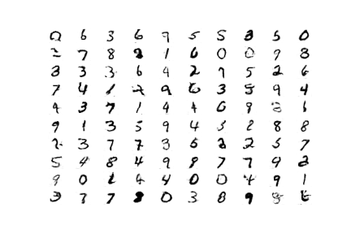
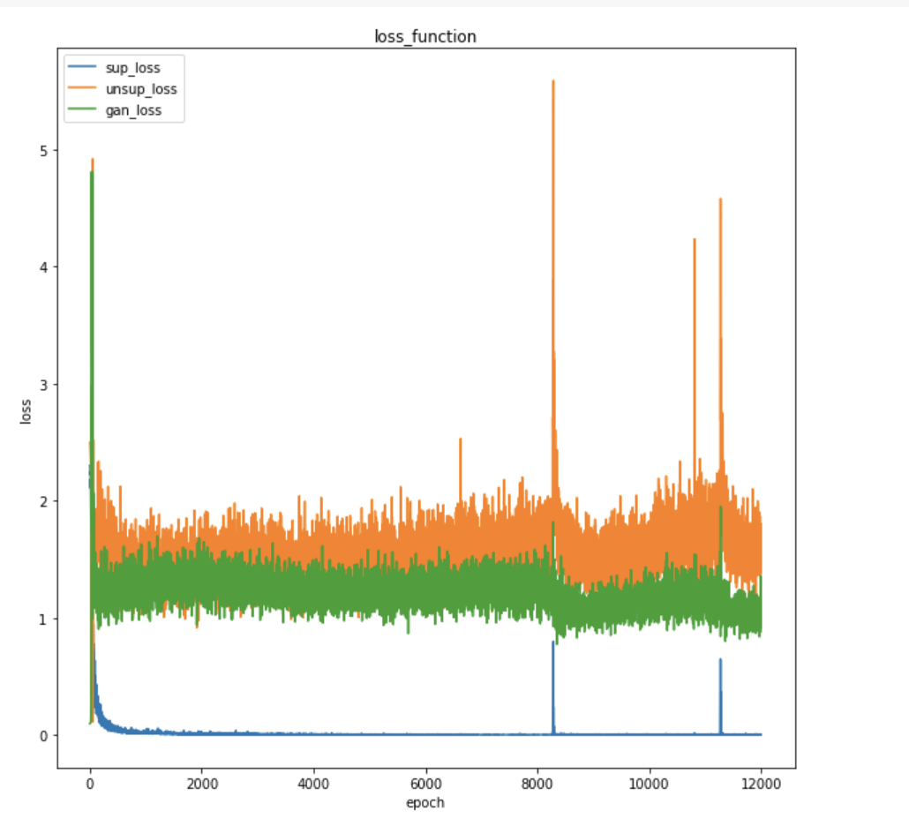
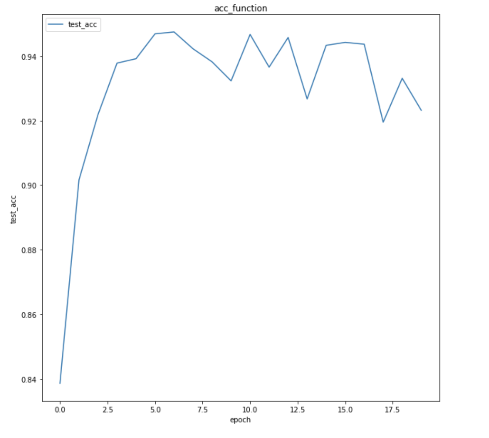
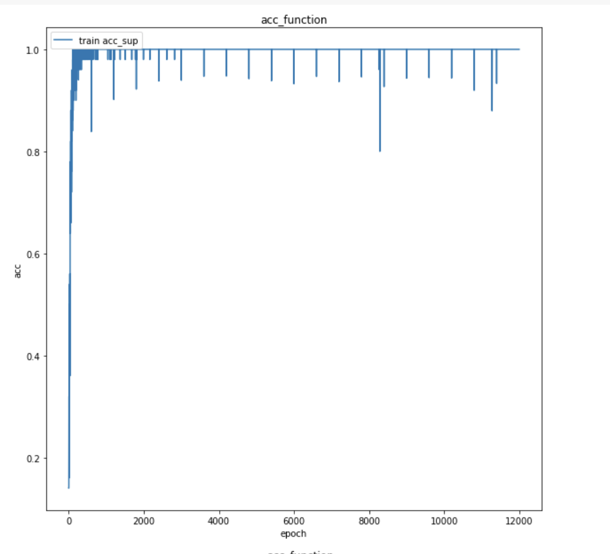

# Tensorflow Implementation of Semi Supervised GAN

## Usage
```bash
$ python3 main.py 
```

> **_NOTE:_** on Colab Notebook use following command:
```python
!git clone --link-to-repo
!python main.py
```
```
usage: main.py [-h] [--epochs EPOCHS] [--latent_dim LATENT_DIM] [--lr LR]
               [--dropout DROPOUT] [--beta_1 BETA_1] [--alpha ALPHA]

optional arguments:
  -h, --help            show this help message and exit
  --epochs EPOCHS       No of epochs: default 20
  --latent_dim LATENT_DIM
                        Dimension of latent vector , default 100
  --lr LR               Learning rate : default 0.0002
  --dropout DROPOUT     Dropout, default 0.4
  --beta_1 BETA_1       beta_1 : default 0.5
  --alpha ALPHA         alpha : default 0.2
```
## Contributed by:
* [Antreev Singh Brar](https://github.com/antreev-brar)
## References

* **Title**: Semi-Supervised Learning with Generative Adversarial Networks
* **Authors**: Augustus Odena
* **Link**: https://arxiv.org/abs/1606.01583
* **Tags**: Neural Network , GAN
* **Year**: 2016

# Summary

## Basic Concept

Since the introduction of GANs from 2016 , they have become a major field of research , primarily because of their ability to generate real-like looking fake data.
 
Basic architecture of GAN consists of two parts :
- A discriminator 
- A generator

Both of them are competing in a non-zero sum game,improving each other.

## General
As the name goes - it is trained on both labelled and unlabelled data. The best feature if that it requires very small dataset of labelled images (in my case : 100) to train the model to perform a classification task with accuracy ~94%.

Leveraging the information in both the labeled and unlabeled data to eventually improve the performance on unseen labeled data is an interesting approach.At the same time, the deep neural network of the discriminator is able to learn powerful and robust abstractions of images by gradually becoming better at discriminating fake from real. Whatever it's learning about unlabeled images will presumably also yield useful feature descriptors of labeled images.

The unlabeled data will be used to merely tell fake from real. The labeled data would be used to optimize the classification performance.

## Implementation
Basically, we take very few samples per class and concatenate the resulting arrays as being our actual supervised subset. The unlabeled dataset consists of all train data (it also includes the labeled data, since we might as well use it anyway). As is customary for training GANs now, the output of the generator uses a hyperbolic tangent function.

Let's do the forward computations now so that we see how all of the above comes together. This consists of setting up the input pipeline, noise vector, generator and discriminator. 

The generator will take :
- A vector in its latent space and output a fake data sample

The discriminator will do a lot more. It will take 
- the 'fake' images coming from the generator
- a batch of unlabeled images and finally 
-  a batch of labeled images (both with and without dropout to also report the train accuracy).

There are three kind of loss functions :
i) sparse_categorical_crossentropy for supervised learning data with softmax activation for Discriminator
ii) binary_crossentropy for unlabelled data with a custom activation for Discriminator
iii) binary_crossentropy for generator

### Model Summary
General architecture of SS-GAN
```
model_3(discriminator)
_________________________________________________________________
Layer (type)                 Output Shape              Param #   
=================================================================
input_2 (InputLayer)         (None, 28, 28, 1)         0         
_________________________________________________________________
conv2d_2 (Conv2D)            (None, 14, 14, 128)       1280      
_________________________________________________________________
leaky_re_lu_4 (LeakyReLU)    (None, 14, 14, 128)       0         
_________________________________________________________________
conv2d_3 (Conv2D)            (None, 7, 7, 128)         147584    
_________________________________________________________________
leaky_re_lu_5 (LeakyReLU)    (None, 7, 7, 128)         0         
_________________________________________________________________
conv2d_4 (Conv2D)            (None, 4, 4, 128)         147584    
_________________________________________________________________
leaky_re_lu_6 (LeakyReLU)    (None, 4, 4, 128)         0         
_________________________________________________________________
flatten_1 (Flatten)          (None, 2048)              0         
_________________________________________________________________
dropout_1 (Dropout)          (None, 2048)              0         
_________________________________________________________________
dense_2 (Dense)              (None, 10)                20490     
_________________________________________________________________
lambda_1 (Lambda)            (None, 1)                 0         
=================================================================
Total params: 316,938
Trainable params: 316,938
Non-trainable params: 0
```
```
_________________________________________________________________
Layer (type)                 Output Shape              Param #   
=================================================================
input_1 (InputLayer)         (None, 100)               0         
_________________________________________________________________
dense_1 (Dense)              (None, 6272)              633472    
_________________________________________________________________
leaky_re_lu_1 (LeakyReLU)    (None, 6272)              0         
_________________________________________________________________
reshape_1 (Reshape)          (None, 7, 7, 128)         0         
_________________________________________________________________
conv2d_transpose_1 (Conv2DTr (None, 14, 14, 128)       262272    
_________________________________________________________________
leaky_re_lu_2 (LeakyReLU)    (None, 14, 14, 128)       0         
_________________________________________________________________
conv2d_transpose_2 (Conv2DTr (None, 28, 28, 128)       262272    
_________________________________________________________________
leaky_re_lu_3 (LeakyReLU)    (None, 28, 28, 128)       0         
_________________________________________________________________
conv2d_1 (Conv2D)            (None, 28, 28, 1)         6273      
_________________________________________________________________
model_3 (Model)              (None, 1)                 316938    
=================================================================
Total params: 1,481,227
Trainable params: 1,164,289
Non-trainable params: 316,938

```

## Result
These are fake digits generated by GAN


Graphs :



