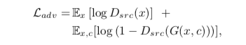
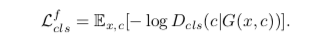
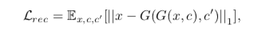
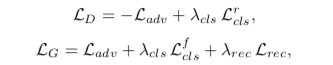
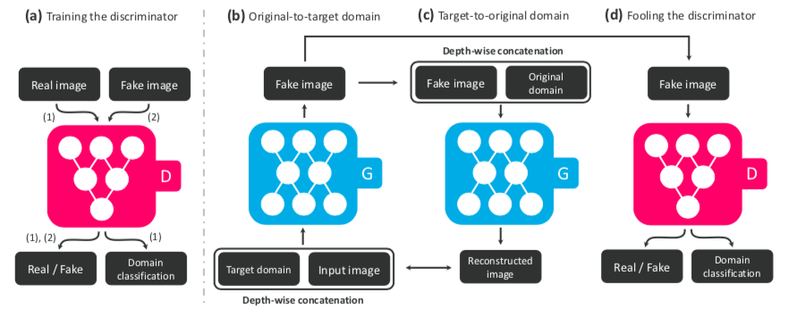
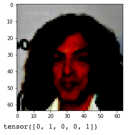
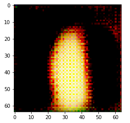
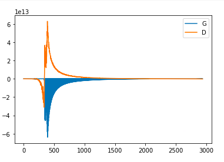

# PyTorch implementation of StarGAN
## Usage
```bash
> python main.py --arguments
```
The arguments are as follows-
```bash
usage: main.py [-h] [--directory DIRECTORY] [--epochs EPOCHS]
               [--batch_size BATCH_SIZE] [--gen_lr GEN_LR] [--dis_lr DIS_LR]
               [--d_times D_TIMES] [--lam_cls LAM_CLS]
               [--lam_recomb LAM_RECOMB] [--image_dim IMAGE_DIM]
               [--download DOWNLOAD] [--eval_idx EVAL_IDX]
               [--attrs ATTRS [ATTRS ...]]

optional arguments:
  -h, --help            show this help message and exit
  --directory DIRECTORY
                        directory of dataset
  --epochs EPOCHS       total number of epochs you want to run. Default: 20
  --batch_size BATCH_SIZE
                        Batch size for dataset
  --gen_lr GEN_LR       generator learning rate
  --dis_lr DIS_LR       discriminator learning rate
  --d_times D_TIMES     No of times you want D to update before updating G
  --lam_cls LAM_CLS     Value of lambda for domain classification loss
  --lam_recomb LAM_RECOMB
                        Value of lambda for image recombination loss
  --image_dim IMAGE_DIM
                        Image dimension you want to resize to.
  --download DOWNLOAD   Argument to download dataset. Set to True.
  --eval_idx EVAL_IDX   Index of image you want to run evaluation on.
  --attrs ATTRS [ATTRS ...], --list ATTRS [ATTRS ...]
                        selected attributes for the CelebA dataset
```

## Contributed by:
[Som Tambe](https://github.com/SomTambe)

## References
**StarGAN: Unified Generative Adversarial Networks for Multi-Domain Image-to-Image Translation** Yunjey Choi, Minje Choi, Munyoung Kim, Jung-Woo Ha, Sunghun Kim, Jaegul Choo

**CVPR 2018** / [ArXiv](https://arxiv.org/abs/1711.09020) /

## Summary
## Introduction
StarGAN is a very versatile example of how one can use Generative Adversarial Networks (Goodfellow. et. al) to learn cross-domain relations, and perform image-to-image translations based on a single discriminator and a generator unit.

## How does it do that ?
Let us define the following terms before going ahead with anything new.

**attribute** - Particular feature inherent in an image. Example: haircolor, age, gender.

**attribute value** - Value of an **attribute**. Example: If chosen attribute is haircolor, its values can be blonde, black, white, grey.

**domain** - Set of images sharing the same attribute value. Example: images of women is one domain. Similarly, images of men is another.

For our experiments, we use the CelebA dataset ([Liu. et. al](http://mmlab.ie.cuhk.edu.hk/projects/CelebA.html)). It contains more than 200K images with over 40 labelled attributes.

The existing models were quite inefficient: for learning mappings among all **K** domains, <sup>K</sup>P<sub>2</sub> generators were required to learn every single mapping among all domains. Also in these models, generator could not make full use of data and could only learn from 2 out of **K** domains at a single time.

StarGAN solves that problem by introducing a single generator which learns mappings between all domains. Generator inputs two things, **image**, as well as the **inference labels**. 

<p style="text-align: center;"> <b>G(x, c) → y </b></p>

<i>Where, y is the generated image, x is the original image, and c is the target label. </i>

We here use an auxillary classifier as our discriminator, which outputs both, the real/fake **D<sub>src</sub>**, and the original labels of the input image **D<sub>cls</sub>**.

<p style="text-align: center;"><b>D</b> : <b>x</b> → {<b>D<sub>src</sub>(x)</b>, <b>D<sub>cls</sub>(x)</b>}</p>

## Loss and Objective Functions

There are three losses.
### Adversarial Loss

### Domain Classification Loss
**Real Domain Classification Loss**


**Fake Domain Classification Loss**



### Image reconstruction loss


### Final Objective function


## Training 
Training has been elaborated in the following figures.



# Results
I selected a random image from the dataset.


 
[Black Hair, Male]

Training a single epoch was taking 9 hours on the Tesla K80 GPU. I trained for about 1500 iterations from 12000 iterations from a single epoch.

This was the translation to [Brown_Hair, Male]-



The generator seems to have recognised the spatial features. Since full training has not been done, we cannot infer anything more other than the fact that the generator has been learning features.

## Losses



Training was continued for 3000 iterations, but the computer crashed, erasing any progress I could have made.
