# Paper

* **Title**: Autoencoding beyond pixels using a learned similarity metric
* **Authors**: Anders Boesen Lindbo Larsen,Søren Kaae Sønderby,Hugo Larochelle,Ole Winther
* **Link**: https://arxiv.org/pdf/1512.09300.pdf
* **Tags**: Neural Network, Generative Networks, GANs
* **Year**: 2016

### Usage
```bash
$ python3 main.py 
```
# Summary

## Introduction

* The paper combine VAEs and GANs into an unsupervised generative model that simultaneously learns to encode, generate and compare dataset samples.

* It shows that generative models trained with learned similarity measures produce better image samples than models trained with element-wise error measures.

* It demonstrate that unsupervised training results in a latent image representation with disentangled factors of variation (Bengio et al., 2013). This is illustrated in experiments on a dataset of face images labelled with visual attribute vectors, where it is shown that simple arithmetic applied in the learned latent space produces images that reflect changes in these attributes.

## Variational Autoencoder

A VAE consists of two networks that encode a data samplex to a latent representation z and decode the latent representation back to data space, respectively:

 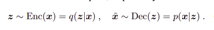                                            
                                              
The VAE regularizes the encoder by imposing a prior over the latent distribution p(z). Typically z ∼ N (0, I) is chosen. The VAE loss is minus the sum of the expected log likelihood (the reconstruction error) and a prior regularization term:

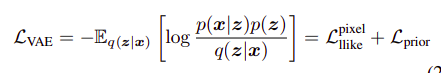 

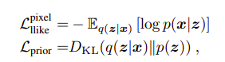 

## Generative Adversarial Network

A GAN consists of two networks: the generator network Gen(z) maps latents z to data space while the discriminator network assigns probability y = Dis(x) ∈ [0, 1] that x is an actual training sample and probability 1 − y that x is generated by our model through x = Gen(z) with z ∼ p(z). The GAN objective is to find the binary classifier that gives the best possible discrimination between true and generated data and simultaneously encouraging Gen to fit the true data distribution. We thus aim to maximize/minimize the binary cross entropy with respect to Dis / Gen with x being a training sample
and z ∼ p(z).


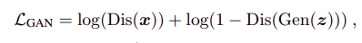

## Beyond element-wise reconstruction error with VAE/GAN

Specifically, since element-wise reconstruction errors are not adequate for images and other signals with invariances,
we propose replacing the VAE reconstruction (expected log likelihood) error term with a reconstruction error expressed in the GAN discriminator.. To achieve this,let Disl(x) denote the hidden representation of the lth layer of the discriminator. We introduce a Gaussian observation model for Disl(x) with mean Disl(x˜) and identity covariance.We train our combined model with the triple criterion:

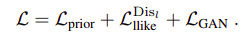

Notably, we optimize the VAE wrt Lgan which we regard as a style error in addition to the reconstruction error which
can be interpreted as a content error using the terminology from Gatys et al. (2015). Moreover, since both Dec and
Gen map from z to x, we share the parameters between the two.


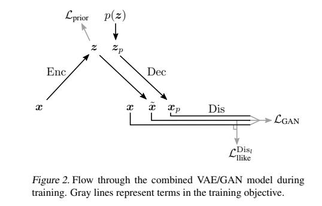

### Algorithm used for training


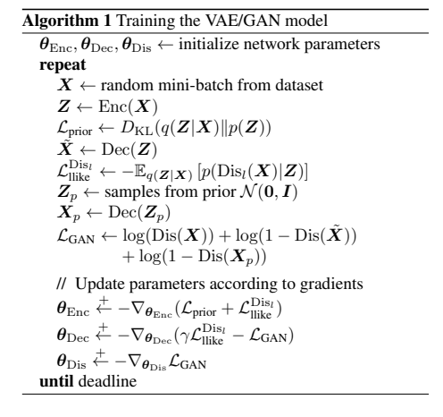


## Implementation and Model Architecture:

For all our experiments, we use convolutional architectures and use backward convolution (aka.fractional striding) with stride 2 to upscale images in Dec. Backward convolution is achieved by flipping the convolution direction such that striding causes upsampling. Our models are trained with RMSProp using a learning rate of 0.0003 and a batch size of 64.

### Encoder

```
----------------------------------------------------------------
        Layer (type)               Output Shape         Param #
================================================================
            Conv2d-1           [64, 64, 32, 32]           1,664
       BatchNorm2d-2           [64, 64, 32, 32]             128
         LeakyReLU-3           [64, 64, 32, 32]               0
            Conv2d-4          [64, 128, 16, 16]         204,928
       BatchNorm2d-5          [64, 128, 16, 16]             256
         LeakyReLU-6          [64, 128, 16, 16]               0
            Conv2d-7            [64, 256, 8, 8]         819,456
       BatchNorm2d-8            [64, 256, 8, 8]             512
         LeakyReLU-9            [64, 256, 8, 8]               0
           Linear-10                 [64, 2048]      33,556,480
      BatchNorm1d-11                 [64, 2048]           4,096
        LeakyReLU-12                 [64, 2048]               0
           Linear-13                  [64, 128]         262,272
           Linear-14                  [64, 128]         262,272
================================================================
Total params: 35,112,064
Trainable params: 35,112,064
Non-trainable params: 0
----------------------------------------------------------------
Input size (MB): 1.00
Forward/backward pass size (MB): 171.12
Params size (MB): 133.94
Estimated Total Size (MB): 306.07
----------------------------------------------------------------
```
### Discriminator

```
----------------------------------------------------------------
        Layer (type)               Output Shape         Param #
================================================================
            Conv2d-1           [64, 32, 64, 64]             832
         LeakyReLU-2           [64, 32, 64, 64]               0
            Conv2d-3          [64, 128, 32, 32]         102,528
       BatchNorm2d-4          [64, 128, 32, 32]             256
         LeakyReLU-5          [64, 128, 32, 32]               0
            Conv2d-6          [64, 256, 16, 16]         819,456
       BatchNorm2d-7          [64, 256, 16, 16]             512
         LeakyReLU-8          [64, 256, 16, 16]               0
            Conv2d-9            [64, 256, 8, 8]       1,638,656
      BatchNorm2d-10            [64, 256, 8, 8]             512
        LeakyReLU-11            [64, 256, 8, 8]               0
           Linear-12                  [64, 512]       8,389,120
      BatchNorm1d-13                  [64, 512]           1,024
        LeakyReLU-14                  [64, 512]               0
           Linear-15                    [64, 1]             513
          Sigmoid-16                    [64, 1]               0
================================================================
Total params: 10,953,409
Trainable params: 10,953,409
Non-trainable params: 0
----------------------------------------------------------------
Input size (MB): 1.00
Forward/backward pass size (MB): 440.75
Params size (MB): 41.78
Estimated Total Size (MB): 483.53
----------------------------------------------------------------

```
## Decoder

```
----------------------------------------------------------------
        Layer (type)               Output Shape         Param #
================================================================
  Linear-16                         [64, 16384]       2,113,536
      BatchNorm1d-17                [64, 16384]          32,768
        LeakyReLU-18                [64, 16384]               0
  ConvTranspose2d-19          [64, 256, 16, 16]       2,359,552
      BatchNorm2d-20          [64, 256, 16, 16]             512
        LeakyReLU-21          [64, 256, 16, 16]               0
  ConvTranspose2d-22          [64, 128, 32, 32]       1,179,776
      BatchNorm2d-23          [64, 128, 32, 32]             256
        LeakyReLU-24          [64, 128, 32, 32]               0
  ConvTranspose2d-25           [64, 32, 64, 64]         147,488
      BatchNorm2d-26           [64, 32, 64, 64]              64
        LeakyReLU-27           [64, 32, 64, 64]               0
  ConvTranspose2d-28            [64, 1, 64, 64]             801
             Tanh-29            [64, 1, 64, 64]               0
```
# Results

## Generated images after 25 epochs(MNIST)

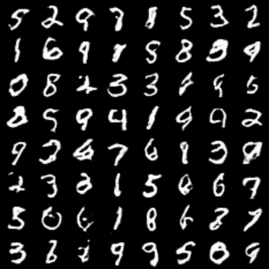

## Reconstructed images after 25 epochs(MNIST)

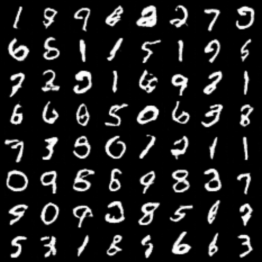

## Generated images after 30 epochs(CIFAR10)

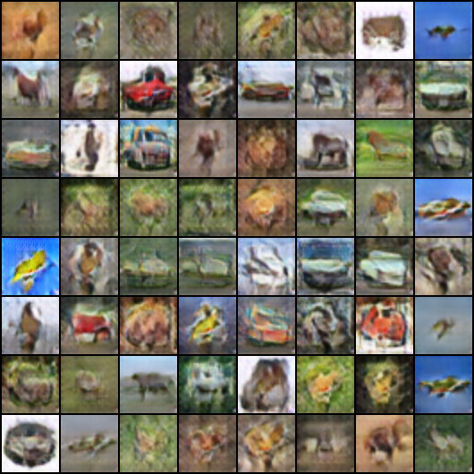

## Reconstructed images after 30 epochs(CIFAR10)

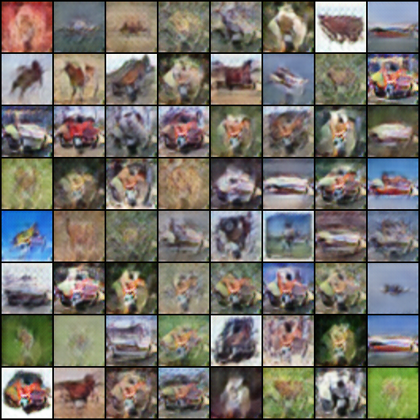

## Plot of Prior Loss vs Iterations

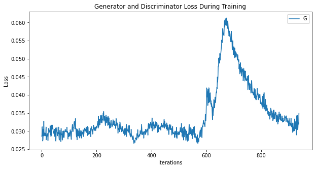

## Plot of GAN Loss vs Iterations

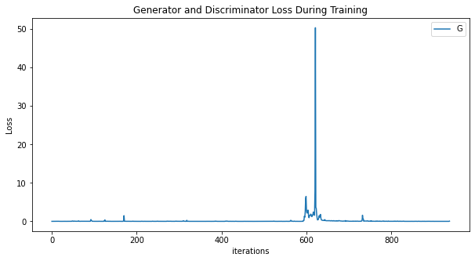

## Plot of Reconstruction Loss vs Iterations

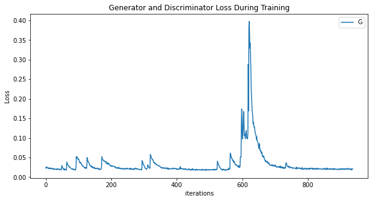


