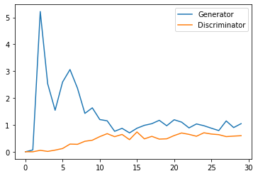
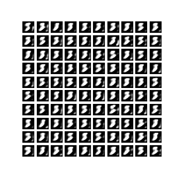

# Conditional GAN _ Tensorflow
## Usage
```bash
$ python3 main.py --dataset 'mnist' --epochs 40
```
> **_NOTE:_** on Colab Notebook use following command:
```python
!git clone link-to-repo
%run main.py --dataset 'mnist' --epochs 40 
```
## Help Log
```
                        
usage: main.py [--epochs EPOCHS] [--batch_size BATCH_SIZE] [--outdir
               OUTDIR] [--lr LEARNING_RATE] [--latent_size LATENT_SIZE]
               [--dataset DATASET]

optional arguments:
  --epochs EPOCHS
  --batch_size BATCH_SIZE
  --outdir OUTDIR
  --lr LEARNING_RATE
  --dataset DATASET
  --latent_size LATENT_SIZE
                        
```

## Contributed by:
* [Vansh Bansal](https://github.com/vanshbansal1505)

## References

* **Title**: Conditional Generative Adversarial Nets
* **Authors**: Mehdi Mirza, Simon Osindero
* **Link**: https://arxiv.org/pdf/1411.1784.pdf
* **Tags**: Neural Network, Generative Networks, GANs
* **Year**: 2014

# Summary 

## Introduction

Conditional generative adversarial network (cGAN) is an extension of the generative adversarial network (GAN) that's used as a machine learning framework for training generative models.
Generator and Discriminator are conditioned during training by using some additional information. This auxiliary information could be, in theory, anything, such as a class label, a set of tags, or even a written description.
A conditional generative adversarial network is a type of GAN that also takes advantage of labels during the training process.
1.	The generator - Given a label and random array as input, this network generates data with the same structure as the training data observations corresponding to the same label.
2.	The discriminator - Given batches of labeled data containing observations from both the training data and generated data from the generator, this network attempts to classify the observations as "real" or "generated".

## Model Theory
The basis of a CGAN is the same as the original GAN principle except that the discriminator and generator inputs are conditioned on one-hot labels, y.


The optimization reduces to the following min max condition:


Occasionally, we'll try to fool the discriminator by pretending that the synthetic data is real with a label 1.0. By maximizing with respect to (𝐷), the optimizer sends gradient updates to the discriminator parameters to consider this synthetic data as real. At the same time, by minimizing with respect to (𝐺), the optimizer will train the generator's parameters on how to trick the discriminator.

## Results on the MNIST dataset
Here is the loss graph
> **_NOTE:_** For this graph we have trained the model for 30 epochs only.Accuracy will improve significantly if the model is trained for more epochs.



This is the final gif generated by the generator for a randomly generated noise and label.



## Conclusion
The results shown in this paper are extremely preliminary, but they demonstrate the potential of conditional adversarial nets and show promise for interesting and useful applications.
CGANs can be used to build a model which can generate an image of an imaginary actor of given class like male or female. It can also use to build Face Aging system, Age synthesis and age progression have many practical industrial and consumer applications like cross-age face recognition, finding lost children, entertainment, visual effects in movies.
