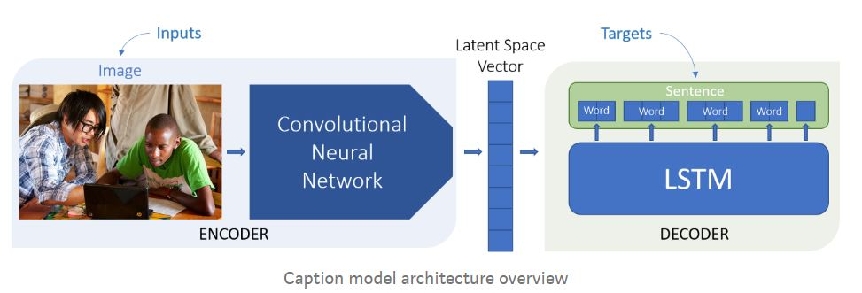
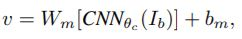
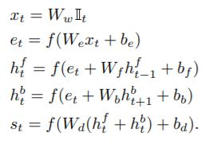
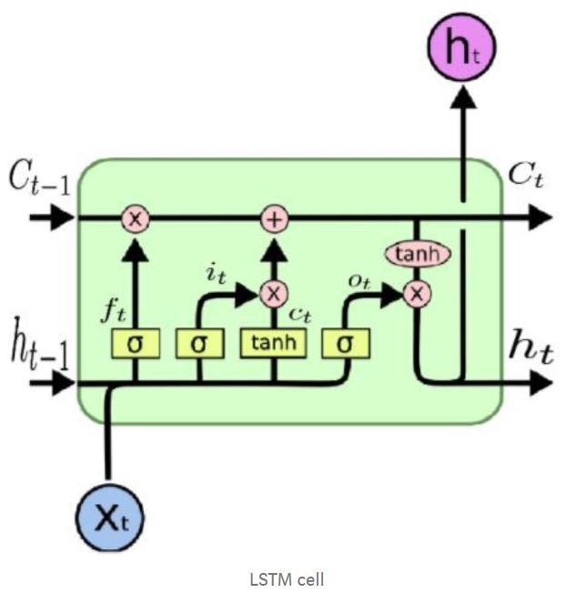
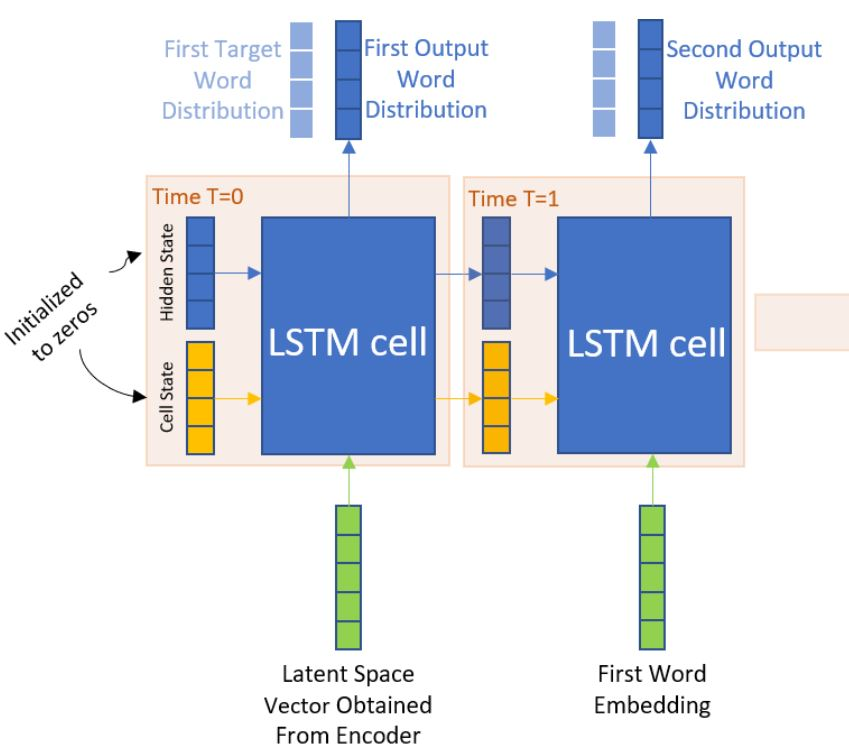
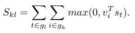
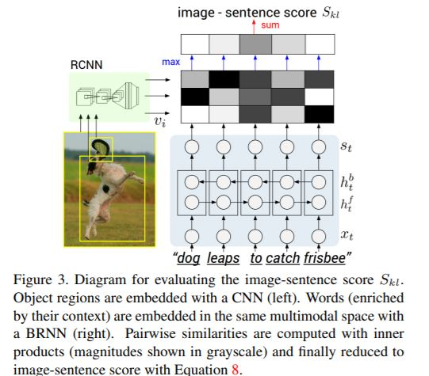
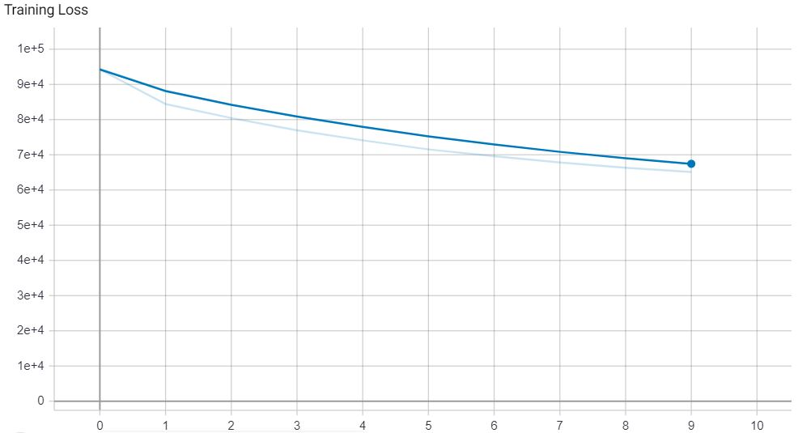
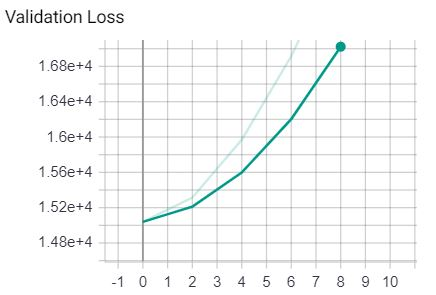

# PyTorch implementation of Image Captioning [*Paper*](https://cs.stanford.edu/people/karpathy/cvpr2015.pdf)
## Requirements
* python
* pytorch
* pytorch-vision
* pillow
* nltk
* pickle
* cuda(*highly recommended*)
## Usage 
### 1. Preprocessing the data
* Dataset used is Flickr8k ([*download here*](https://www.kaggle.com/shadabhussain/flickr8k)). 
* Extract and move images to a folder named : images and text files to folder named : text
> ***NOTE** : Place both folders alongside the python files.*
* Run the following command in Windows : 
      <pre><code>python preprocess.py
      </code></pre>
      If using Linux/Mac use : 
      <pre><code>python3 preprocess.py
      </code></pre>
      
### 2. Training the data
* Run the following command : 
      <pre><code>python train.py --model <encoder_CNN_architecture> --dir <train_dir_path> --save_epoch <model_checkpoint> --learning_rate <learning_rate> --num_epoch <num_epoch> --hidden_dim <lstm_hidden_state_dim> --embedding_dim <encoder_CNN_output>
      </code></pre>
> ***NOTE** : Use python3 instead in case of Linux/Mac .*
* Arguments
  * -model : Default: 'resnet18', other option is 'inception' (Inception_v3). Model dir is automatically saved with name of model + current_datetime. 
  * -dir : Training Directory path, default: 'train'
  * -save_epoch : Epochs after which model saves checkpoint, default : 2
  * -learning_rate : Adam optimizer learning rate, default : 1e-3 (0.001)
  * -num_epoch : Number of epochs, default : 10
  * -hidden_dim : Dimensions in hidden state of LSTM decoder, default : 512
  * -embedding_dim : Dimensions of encoder output, default : 512

### 3. Testing the model
* Run the following command : 
    <pre><code>python test.py --model <encoder_CNN_architecture> --model_dir <model_dir> --test_dir<test_dir> --filename <filename> --epoch <epoch_num></code></pre>
> ***NOTE** : Once again, use python3 instead in case of Linux/Mac .*
* Arguments
  * -model : Default: 'resnet18', other option is 'inception' (Inception_v3).
  * -model_dir : Saved model directory name.
  * -test_dir : Default: 'test'.
  * -filename : Image name.
  * -epoch : Trained model to be used after this many epochs.
  
### 4. Validation 
* Run the following command : 
    <pre><code>python train.py --model <encoder_CNN_architecture> --model_dir <saved_model_dir> --dir <dev_dir_path> --save_epoch <model_checkpoint> --num_epoch <num_epoch></code></pre>
> ***NOTE** : For last time, use python3 instead in case of Linux/Mac :).*
* Arguments
  * -model : Default: 'resnet18', other option is 'inception' (Inception_v3).
  * -model_dir : Saved model directory, which has name of format model + current_datetime.
  * -dir : Development Directory path, default: 'dev'
  * -save_epoch : Epochs after which model saves checkpoint, default : 2
  * -num_epoch : Number of epochs, default : 10
> ***NOTE** : The save_epoch and num_epoch should match with your corresponding training model .*

## Factual Details
- **Title** : Deep Visual-Semantic Alignments for Generating Image Descriptions
- **Dated** : 2015
- **Authors** : Andrej Karpathy, Li Fei-Fei
- **University** : Department of Computer Science, Stanford University
- **Field** : Deep Learning, NLP, CNN, Image Captioning

## Contributed by
- [*Gurbaaz Singh Nandra*](https://github.com/gurbaaz27)

# Summary

## Introduction
The main motivation behind the paper was to design a model capable enough to reason various parts of image and use them to generate a rich description. This is very easy for humans, even for a small child, but machine dosnt relate tokens with image itself. The latter would be great help in CCTV cameras, blind aid or even search engines. Earlier models tackling the same exist but rely on some hard-coded visual concepts and sentence templates, limiting the scope of model. The main two contributions of this model are:

* A deep neural network model that understands the latent alignment or relation between segments of sentences and the region of the image that they describe. Our model associates the two modalities through a common multimodal embedding.
* A multimodal Recurrent Neural Network architecture that takes an input image and generates its description in text, which surpasses retrieval based baselines, and produce sensible qualitative predictions.
## Model architecture
The model consists of encoder and decoder models that communicate through a latent space vector. Basically we map an image to some intractable latent space via encoding and map the latent space representation of the image to the sentence space via decoding.

  

#### Encoder
We need to provide image as fixed size of vector to generate text, hence a convolutional neural network is used to encode our images. Here transfer learning is preferred, pretained on ImageNet dataset, to cater the constratints of resources and computation. Torchvision has many pretrained models, and any model can be used like ResNet, AlexNet, Inception_v3, DenseNet. We have to remove the last softmax layer which is for classification purpose, as we only need an encoded vector, of size 512 or 1024 usually.

  

#### Decoder
This part is a Recurrent Neural Network with LSTM(Long Short Term Memory) cells. A Bidirectional Recurrent Neural Network (BRNN) to compute
the word representations. The BRNN takes a sequence of N words (encoded in a 1-of-k representation) and transforms each one into an h-dimensional vector. However, the representation of each word is enriched by a variably-sized context around that word. Using the index t = 1 . . . N to denote the position of a word in a sentence, the precise form of the BRNN is as follows(*here f is ReLU activation function, hence f(x) = max(0,x)*) : 

  

  
  

#### Loss
Since the supervision is at the level of entire images and sentences, the strategy is to formulate an image-sentence score as a function of the individual regionword scores. Obviously, a sentence-image pair should have a high matching score if its words have a confident support in the image. The dot product between the i-th region and t-th word as a
measure of similarity and use it to define the score between image k and sentence l as:

  

Here, gk is the set of image fragments in image k and gl
is the set of sentence fragments in sentence l. The indices
k, l range over the images and sentences in the training set.

  

## Results :
* Training time (model = resnet18):
<pre><code>Epoch : 0 , Avg_loss = 3.141907, Time = 9.89 mins
Epoch : 1 , Avg_loss = 2.978030, Time = 9.89 mins
Epoch : 2 , Avg_loss = 2.879061, Time = 9.88 mins
Epoch : 3 , Avg_loss = 2.800483, Time = 9.90 mins
Epoch : 4 , Avg_loss = 2.734463, Time = 9.88 mins
Epoch : 5 , Avg_loss = 2.676081, Time = 9.90 mins
Epoch : 6 , Avg_loss = 2.625130, Time = 9.89 mins
Epoch : 7 , Avg_loss = 2.579518, Time = 9.90 mins
Epoch : 8 , Avg_loss = 2.538572, Time = 9.90 mins
Epoch : 9 , Avg_loss = 2.501715, Time = 9.90 mins
      </code></pre>

  

> ***NOTE** : Here loss plotted is total loss of dataset, which is for 6000 X 5 = 30000 captions. Mean loss is loss plotted divided by 30000 .*

* Validation time (model = resnet18):
<pre><code>
0 3.007883
2 3.035437
4 3.088141
6 3.161836
8 3.253206
</code></pre>

  

> ***NOTE** : Train for more than 50 epochs for optimum results . Training is highly GPU intensive!*

## Acknowledgement
- [Medium : Captioning Images with CNN and RNN, using PyTorch](https://medium.com/@stepanulyanin/captioning-images-with-pytorch-bc592e5fd1a3)
- [Word Embeddings](https://pytorch.org/tutorials/beginner/nlp/word_embeddings_tutorial.html)

