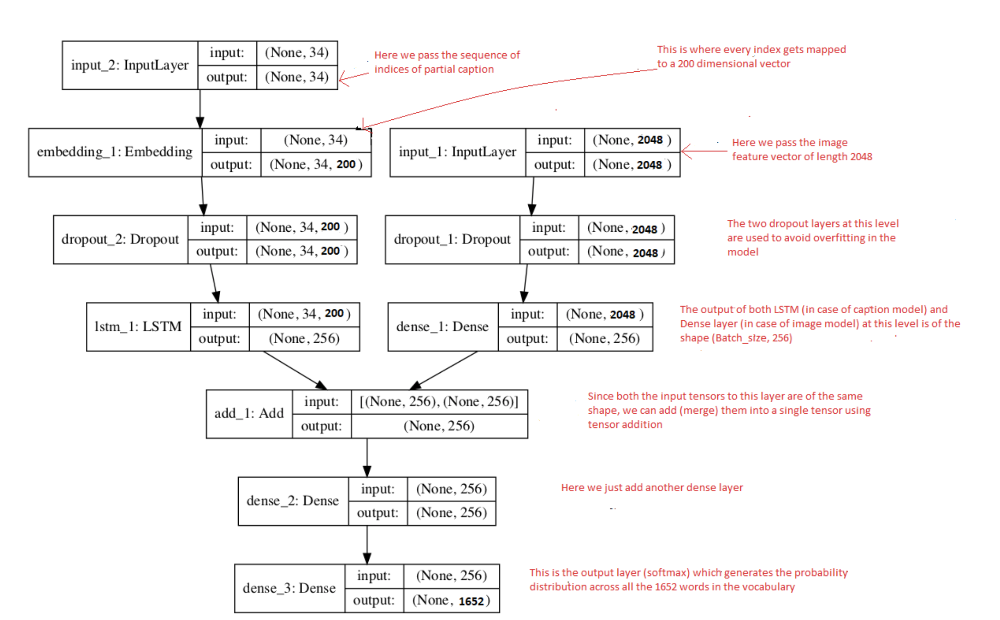
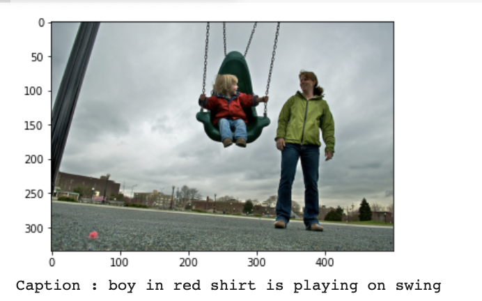

# TensorFlow Implementation of ImageCaption
### Download the dataset 
```
wget https://github.com/jbrownlee/Datasets/releases/download/Flickr8k/Flickr8k_Dataset.zip
wget https://github.com/jbrownlee/Datasets/releases/download/Flickr8k/Flickr8k_text.zip
unzip Flickr8k_Dataset.zip -d all_images
unzip Flickr8k_text.zip -d all_captions
```
### Download pretrained Glove model
```
wget http://nlp.stanford.edu/data/glove.6B.zip
unzip glove.6B.zip -d glove
```
___
## Usage

```bash
$ python3 main.py 
```
> **_NOTE:_** on Colab Notebook use following command:
```python
!git clone link-to-repo
%run main.py
```
___
## Help Log
```
usage: main.py [-h] [--epochs EPOCHS] [--base_dir BASE_DIR]
               [--num_photos_per_batch NUM_PHOTOS_PER_BATCH] [--em_dem EM_DEM]

optional arguments:
  -h, --help            show this help message and exit
  --epochs EPOCHS       No of epochs: default 20
  --base_dir BASE_DIR   Base Directory for storing the dataset
  --num_photos_per_batch NUM_PHOTOS_PER_BATCH
                        Number of photos per batch in training: default 3
  --em_dem EM_DEM       Denote embedding dimension : default 200
Using TensorFlow backend.
```
___
## Contributed by:
* [Antreev Singh Brar](https://github.com/Antreev-brar)

## References

* **Title**: Deep Visual-Semantic Alignments for Generating Image Descriptions
* **Authors**: Andrej Karpathy ,  Li Fei-Fei
* **Link**: https://cs.stanford.edu/people/karpathy/cvpr2015.pdf
* **Tags**: Neural Network, Computer Vision, Natural Language Processing
* **Year**: 2016
___
# Summary 

## Introduction
___
A quick glance at an image is sufficient for a human to point out and describe an immense amount of details about the visual scene. However, this remarkable ability has proven to be an elusive task for our visual recognition models.The primary challenge towards this goal is in the design of a model that is rich enough to simultaneously reason about contents of images and their representation in the domain of natural language. Additionally, the model should be free of assumptions about specific hard-coded templates, rules or categories and instead rely on learning from the training data.

The model used is a combination of Natural Language Processing and Computer Vision, enabling our model to inpterpret the image and give a description of what is happening in it. This alignment model is based on a novel combination of Convolutional Neural Networks over image regions, bidirectional Recurrent Neural Networks over sentences, and a structured objective that aligns the two modalities through a multimodal embedding. We then describe a Multimodal Recurrent Neural Network architec- ture that uses the inferred alignments to learn to generate novel descriptions of image regions. 

An excellent dscription of the method and functioning is given here:
[https://towardsdatascience.com/image-captioning-with-keras-teaching-computers-to-describe-pictures-c88a46a311b8]

While seemingly an easy task for humans, extracting Visual-Semantic Alignments affords several challenges to AI systems spanning the fields of natural language processing, computer vision, knowledge representation and reasoning.Just prior to the recent development of Deep Neural Networks this problem was inconceivable even by the most advanced researchers in Computer Vision. But with the advent of Deep Learning this problem can be solved very easily if we have the required dataset.

Let’s see few applications where a solution to this problem can be very useful.
* Self driving cars — Automatic driving is one of the biggest challenges and if we can properly caption the scene around the car, it can give a boost to the self driving system
* Aid to the blind — We can create a product for the blind which will guide them travelling on the roads without the support of anyone else. 
* CCTV cameras are everywhere today, but along with viewing the world, if we can also generate relevant captions, then we can raise alarms as soon as there is some malicious activity going on somewhere. 
* Automatic Captioning can help, make Google Image Search as good as Google Search.


## Implementation
___

Our implementation, which is the standard and best implementation described by the authors of the VGQ paper uses Image embeddings from a pretrained VGG net and using the word encodings by passing the GloVe word embeddings of the input words through 2 layers of LSTM In contrast to averaging, using an LSTM preserves information regarding the order of the words in the question and leads to an improved VQA accuracy.  
### Data Preprocessing - Images
We need to convert every image into a fixed sized vector which can then be fed as input to the neural network. For this purpose, we opt for transfer learning by using the InceptionV3 model (Convolutional Neural Network) created by Google Research.
### Data Preprocessing - Captioning
We will predict the caption word by word. Thus, we need to encode each word into a fixed sized vector. Stating simply, we will represent every unique word in the vocabulary by an integer (index). Then we will map the every word (index) to a 200-long vector and for this purpose,using Glove Pretrained Embeddings
### Model architecture
General High Level architectecture of Model:


Flowchart involving hidden layers for entire neural Net

The LSTM (Long Short Term Memory) layer is specialized Recurrent Neural Network to process the sequence input.

We use **categorical_crossentropy** for loss calculation and **Adam** optimizer

## Training 
___
The accuracy graph over epochs:


The accuracy graph over epochs:

## Results


##### Here are some of the best results: 
  
  
 

##### But sometimes it may show some bad outputs  

  
  
  


