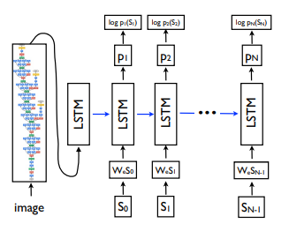
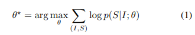
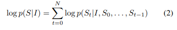
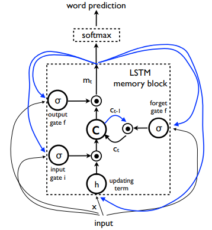
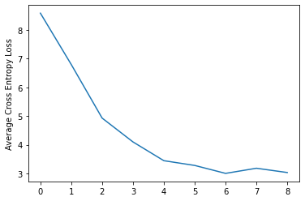
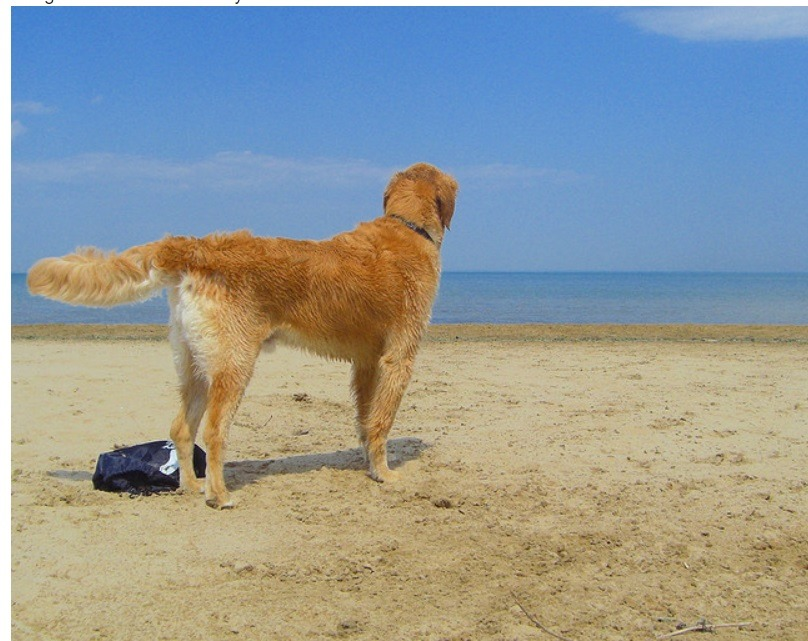

# PyTorch Implementation of Show and Tell : Neural Image Caption Generation
## Pre-requisites
* PyTorch
* Convolutional Neural Networks
* Long Short Term Memory Cells 
* Spacy
* Cuda

## Usage 
Clone the repo to your local system :
```bash
git clone link-to-repo
```
> ***NOTE**: If you are using Colab, use* **!git** instead.

### 1. Flickr8k Dataset 
* Dataset used is Flickr8k ([*download here*](https://www.kaggle.com/shadabhussain/flickr8k)). 
* Extract and move images to a folder named **Images** and text to **captions.txt**. 
* Put the folder containing **Images** and **captions.txt** in a folder named **flickr8k** 
> ***NOTE** : Place the **flickr8k** folder alongside the python files.*

### 2. Training the data
* Run the following command : 
```bash
python train.py
```

### 3. Generating the caption from an image 
* Save the image in the project folder with the title **img.jpg**. 
* Run the following command : 
```bash
python generate.py
```

# Summary

## Contributed by:
* [Anirudha Brahma](https://github.com/anirbrhm)
___

## References

* **Title**: Show and Tell: A Neural Image Caption Generator
* **Authors**: Oriol Vinyals, Alexander Toshev, Samy Bengio, Dumitru Erhan
* **Link**: https://arxiv.org/abs/1411.4555
* **Tags**: Neural Network, Computer Vision, Natural Language Processing, Image Captioning 
* **Year**: 2014
___

## Introduction
Being able to automatically describe the content of an image using properly formed English sentences is a very challenging task, but it could have great impact, for instance by helping visually impaired people better understand the content of images on the web.
<p align="center">
  
</p>

This task is significantly harder, for example, than the well-studied image classification or object recognition tasks, which have been a main focus in the computer vision community. 

Indeed, a description must capture not only the objects contained in an image, but it also must express how these objects relateto each other as well as their attributes and the activities they are involved in. Moreover, the above semantic knowledge has to be expressed in a natural language like English, which means that a language model is needed in addition to visual understanding.

Most previous attempts have proposed to stitch together existing solutions of the above sub-problems, in order to go from an image to its description. In contrast, this model presents a single joint model that takes an image I as input, and is trained to maximize the likelihood p(S|I) of producing a target sequence of words S = {S1, S2, . . .} where each word S(t) comes from a given dictionary, that describes the image adequately. 

## Inspiration 
The main inspiration of this work comes from recent advances in machine translation, where the task is to transform a sentence S written in a source language, into its translation T in the target language, by maximizing p(T|S). For many years, machine translation was also achieved by a series of separate tasks (translating words individually, aligning words, reordering, etc), but recent work has shown that translation can be done in a much simpler way using Recurrent Neural Networks (RNNs) and still reach state-of the-art performance. An “encoder” RNN reads the source sentence and transforms it into a rich fixed-length vector representation, which in turn in used as the initial
hidden state of a “decoder” RNN that generates the target sentence.


## Contribution of the Paper 
The contributions of the paper are as follows. 
First, we present an end-to-end system for the problem. It is a neural net which is fully trainable using stochastic gradient descent. Second, our model combines state-of-art sub-networks for vision and language models. These can be pre-trained on larger corpora and thus can take advantage of additional data. Finally, it yields significantly better performance compared to state-of-the-art approaches. 

## Model architecture
<p align="center">
  
</p>
The model proposes to directly maximize the probability of the correct description given the image by using the following formulation:
<p align="left">
  
</p>
where θ are the parameters of our model, I is an image, and S its correct transcription. Since S represents any sentence, its length is unbounded. Thus, it is common to apply the chain rule to model the joint probability over S0, . . . , SN , where N is the length of this particular example as : 
<p align="left">
  
</p>


### Encoder 
For the representation of images, the paper uses a Convolutional Neural Network (CNN). They have been widely used and studied for image tasks, and are currently state-of-the art
for object recognition and detection. The particular choice of CNN uses a novel approach to batch normalization and yields the current best performance on the ILSVRC 2014
classification competition which is popularly known as the GooLeNet CNN Model. 

### Decoder 
For producing the caption from the latent representation of the image from the CNN, the paper uses the LSTM Recurrent Neural Networks, which has been applied with great success
to translation and sequence generation and handles the problem of exploding and vanishing gradients very well. 
<p align="center">
  
</p>

## Training :
* Training time (model = GoogLenet + LSTM):
<pre><code>Epoch : 0 , Avg_loss = 8.577890, Time = 2 hour 5 mins 
Epoch : 1 , Avg_loss = 6.792030, Time = 1 hour 45 mins 
Epoch : 2 , Avg_loss = 4.928389, Time = 1 hour 37 mins 
Epoch : 3 , Avg_loss = 4.098989, Time = 1 hour 16 mins 
Epoch : 4 , Avg_loss = 3.446215, Time = 1 hour 57 mins 
Epoch : 5 , Avg_loss = 3.281112, Time = 1 hour 42 mins 
Epoch : 6 , Avg_loss = 3.004768, Time = 1 hour 35 mins 
Epoch : 7 , Avg_loss = 3.183291, Time = 1 hour 31 mins 
Epoch : 8 , Avg_loss = 3.034213, Time = 1 hour 25 mins  </code></pre>
<p align="center">
  
</p>

## Results : 
The model does pretty well on some of the examples : 
<p align="center">
  
</p>
<pre><code> Caption : a dog is running through the water. </code></pre> 

Does partially well in some of the examples : Here the model misidentifies the man as a woman although gets the dog and action of dog correct. 
<p align="center">
  
</p>
<pre><code> Caption : a woman holds a ball while a dog leaps for it. </code></pre> 

There were certain images for which the model does poorly : 
<p align="center">
  
</p>
<pre><code> Caption : a man in a red shirt is standing on a swing. </code></pre> 

## Some pointers on How To Improve : 
1. Training for large number of epochs.  
2. Try experimenting with number of layers of LSTM 
4. Using attention mechanism to improve as done in the paper - [Show Attend and Tell](https://arxiv.org/abs/1502.03044) 

## Acknowledgement
- [Medium : Captioning Images with CNN and RNN, using PyTorch](https://medium.com/@stepanulyanin/captioning-images-with-pytorch-bc592e5fd1a3)
- [Word Embeddings](https://pytorch.org/tutorials/beginner/nlp/word_embeddings_tutorial.html)
