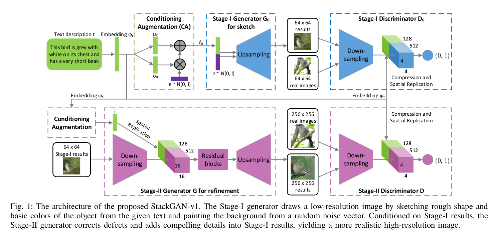
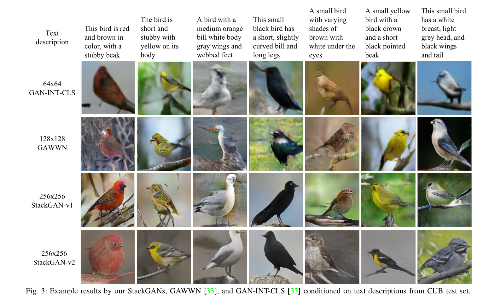

# Tensorflow implementation of StackGAN-v1 #

StackGAN++: Realistic Image Synthesis
with Stacked Generative Adversarial Networks

## Requirements ##

The following implementation is tested on
* Python 3.7.10
* Tensorflow 2.5.0
* Keras 2.5.0

It is recommended that the latest stable releases of the following libraries/scripting langauge be used for stable performance.

* Python
* Tensorflow
* Keras
* PIL
* pickle
* Numpy
* Pandas
* Matplotlib

## Usage ##

In the Bash Shell, run:
```bash
$ python3 main.py --epoch1 'No of Epochs for stage 1' --epoch2 'No of Epochs for stage 2'
```

> **_NOTE:_** For running on Colab Notebook use the following command:

```python
!git clone link-to-repo
%run main.py --epoch1 'No of Epochs for stage 1' --epoch2 'No of Epochs for stage 2
```

## Model Summary ##

### Problem at Hand ###

Generative Adversarial Networks (GANs) have been there ever since Goodfellow et al introduced it in  [Generative Adversarial Networks](https://arxiv.org/abs/1406.2661) in 2014. But their training had been a challenging task. The training process is usually unstable and sensitive to the choices of hyper-parameters.  Moreover,a common failure phenomenon for GANs training is mode collapse, where many of the generated samples contain the same color or texture pattern. To stabilize the trainin of GANs and generate high resolution photo-realistic images, Han Zhang et al. introduced [Stacked Generative Adversarial Networks](https://arxiv.org/abs/1612.03242) in 2016. This work is an implementation of StackGAN-v1 (Version 1 of the StackGAN introduced by authors) in the research paper which aims to **generate photo-realistic images from text description.**

### Introduction to StackGAN ###

In the paper, a two-stage generative adversarial network, StackGAN-v1, to generate images from text descriptions Low-resolution is proposed. Images are first generated by Stage-I GAN. On top of
this, Stage-II GAN is stacked to generate high-
resolution (e.g., 256×256) images. By conditioning on the Stage-I result and the text again, Stage-II GAN learns to capture the text information that is omitted by Stage-I GAN and draws more details. Further, a novel Conditioning Augmentation (CA) technique to encourage smoothness in
the latent conditioning manifold [here](https://openaccess.thecvf.com/content_ICCV_2017/papers/Zhang_StackGAN_Text_to_ICCV_2017_paper.pdf) is given. It allows small random perturbations in the conditioning manifold and increases the diversity of synthesized images.

### Model Architecture ###

The whole GAN is divided into two stacked models.

- Stage-I GAN: It sketches the primitive shape and basic colors of the object conditioned on the given text description, and draws the background layout from a random noise vector, yielding a low-resolution (64*64) image.
- Stage-II GAN: It corrects defects in the low-resolution image from Stage-I and completes details of the object by reading the text description again, producing a highresolution (256*256) photo-realistic image.



### Official Results of the Paper ###

The authors trained the model for 600 epochs on stage 1 GAN and 600 epochs on stage 2 GAN and obtained the following results.



## References ##

* **Official Paper**: https://arxiv.org/pdf/1612.03242.pdf
* **Authors**: Han Zhang,Tao Xu,Hongsheng Li,Shaoting Zhang,Xiaogang Wang,Xiaolei Huang,Dimitris Metaxas

Other References of work in this project are following:-
* Official Github Code: (https://github.com/hanzhanggit/StackGAN)

* Medium Blog: (https://medium.com/@mrgarg.rajat/implementing-stackgan-using-keras-a0a1b381125e)

## Contributed By ##

[Divyanshu Gangwar](https://github.com/Divyanshu23)