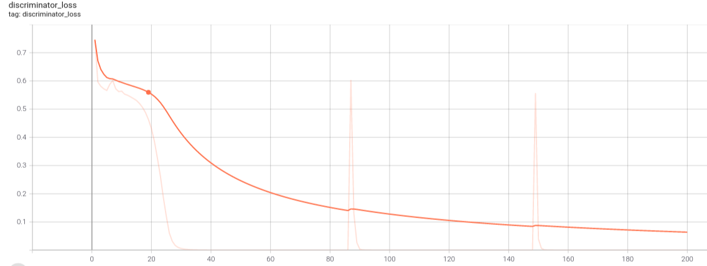
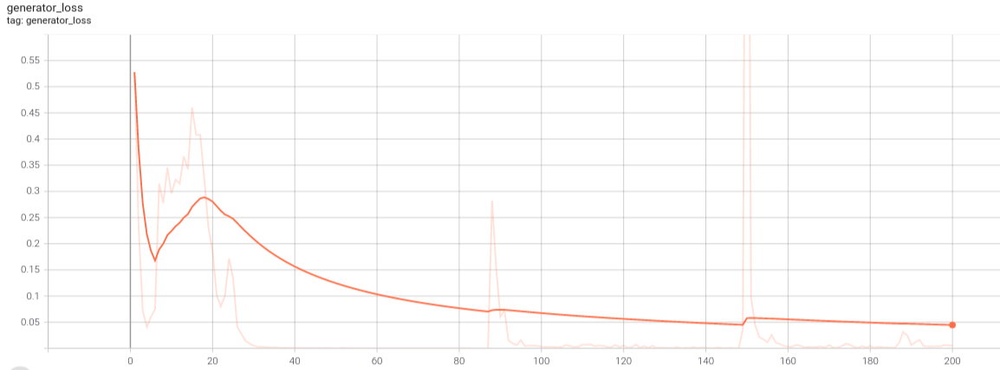
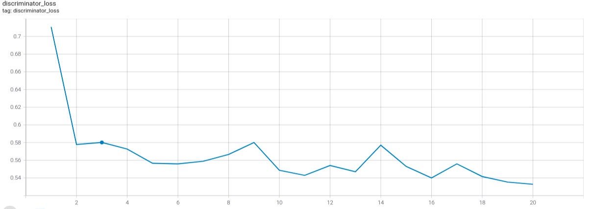
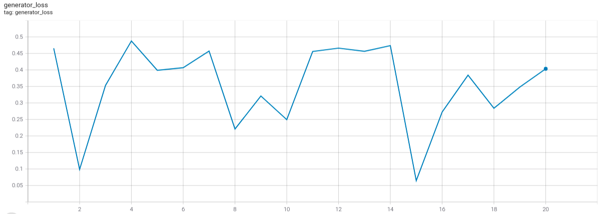

# Tensorflow implementation of StackGAN-v1 #

StackGAN++: Realistic Image Synthesis
with Stacked Generative Adversarial Networks

## Requirements ##

The following implementation is tested on
* Python 3.7.10
* Tensorflow 2.5.0
* Keras 2.5.0

It is recommended that the latest stable releases of the following libraries/scripting langauge be used for stable performance.

* Python
* Tensorflow
* Keras
* PIL
* pickle
* Numpy
* Pandas
* Matplotlib

## Usage ##

In the Bash Shell, run:
```bash
$ python3 main.py --epoch1 'No of Epochs for stage 1' --epoch2 'No of Epochs for stage 2'
```

> **_NOTE:_** For running on Colab Notebook use the following command:

```python
!git clone link-to-repo
%run main.py --epoch1 'No of Epochs for stage 1' --epoch2 'No of Epochs for stage 2
```

## Model Summary ##

### Problem at Hand ###

Generative Adversarial Networks (GANs) have been there ever since Goodfellow et al introduced it in  [Generative Adversarial Networks](https://arxiv.org/abs/1406.2661) in 2014. But their training had been a challenging task. The training process is usually unstable and sensitive to the choices of hyper-parameters.  Moreover,a common failure phenomenon for GANs training is mode collapse, where many of the generated samples contain the same color or texture pattern. To stabilize the trainin of GANs and generate high resolution photo-realistic images, Han Zhang et al. introduced [Stacked Generative Adversarial Networks](https://arxiv.org/abs/1612.03242) in 2016. This work is an implementation of StackGAN-v1 (Version 1 of the StackGAN introduced by authors) in the research paper which aims to **generate photo-realistic images from text description.**

### Introduction to StackGAN ###

In the paper, a two-stage generative adversarial network, StackGAN-v1, to generate images from text descriptions Low-resolution is proposed. Images are first generated by Stage-I GAN. On top of
this, Stage-II GAN is stacked to generate high-
resolution (e.g., 256×256) images. By conditioning on the Stage-I result and the text again, Stage-II GAN learns to capture the text information that is omitted by Stage-I GAN and draws more details. Further, a novel Conditioning Augmentation (CA) technique to encourage smoothness in
the latent conditioning manifold [here](https://openaccess.thecvf.com/content_ICCV_2017/papers/Zhang_StackGAN_Text_to_ICCV_2017_paper.pdf) is given. It allows small random perturbations in the conditioning manifold and increases the diversity of synthesized images.

### Model Architecture ###

The whole GAN is divided into two stacked models.

- Stage-I GAN: It sketches the primitive shape and basic colors of the object conditioned on the given text description, and draws the background layout from a random noise vector, yielding a low-resolution (64*64) image.
- Stage-II GAN: It corrects defects in the low-resolution image from Stage-I and completes details of the object by reading the text description again, producing a highresolution (256*256) photo-realistic image.


### Official Results of the Paper ###

The authors trained the model for 600 epochs on stage 1 GAN and 600 epochs on stage 2 GAN and obtained the following results.


## References ##

* **Official Paper**: https://arxiv.org/pdf/1612.03242.pdf
* **Authors**: Han Zhang,Tao Xu,Hongsheng Li,Shaoting Zhang,Xiaogang Wang,Xiaolei Huang,Dimitris Metaxas

Other References of work in this project are following:-
* Official Github Code: (https://github.com/hanzhanggit/StackGAN)

* Medium Blog: (https://medium.com/@mrgarg.rajat/implementing-stackgan-using-keras-a0a1b381125e)


## Model Summary ##

### Stage 1 DISCRIMINATOR

```
Model: "dis_stage1"
__________________________________________________________________________________________________
Layer (type)                    Output Shape         Param #     Connected to                     
==================================================================================================
input_1 (InputLayer)            [(None, 64, 64, 3)]  0                                            
__________________________________________________________________________________________________
zero_padding2d (ZeroPadding2D)  (None, 66, 66, 3)    0           input_1[0][0]                    
__________________________________________________________________________________________________
conv2d (Conv2D)                 (None, 32, 32, 64)   3136        zero_padding2d[0][0]             
__________________________________________________________________________________________________
leaky_re_lu (LeakyReLU)         (None, 32, 32, 64)   0           conv2d[0][0]                     
__________________________________________________________________________________________________
zero_padding2d_1 (ZeroPadding2D (None, 34, 34, 64)   0           leaky_re_lu[0][0]                
__________________________________________________________________________________________________
conv2d_1 (Conv2D)               (None, 16, 16, 128)  131200      zero_padding2d_1[0][0]           
__________________________________________________________________________________________________
batch_normalization (BatchNorma (None, 16, 16, 128)  512         conv2d_1[0][0]                   
__________________________________________________________________________________________________
leaky_re_lu_1 (LeakyReLU)       (None, 16, 16, 128)  0           batch_normalization[0][0]        
__________________________________________________________________________________________________
zero_padding2d_2 (ZeroPadding2D (None, 18, 18, 128)  0           leaky_re_lu_1[0][0]              
__________________________________________________________________________________________________
conv2d_2 (Conv2D)               (None, 8, 8, 256)    524544      zero_padding2d_2[0][0]           
__________________________________________________________________________________________________
batch_normalization_1 (BatchNor (None, 8, 8, 256)    1024        conv2d_2[0][0]                   
__________________________________________________________________________________________________
leaky_re_lu_2 (LeakyReLU)       (None, 8, 8, 256)    0           batch_normalization_1[0][0]      
__________________________________________________________________________________________________
input_2 (InputLayer)            [(None, 1024)]       0                                            
__________________________________________________________________________________________________
zero_padding2d_3 (ZeroPadding2D (None, 10, 10, 256)  0           leaky_re_lu_2[0][0]              
__________________________________________________________________________________________________
dense (Dense)                   (None, 128)          131200      input_2[0][0]                    
__________________________________________________________________________________________________
conv2d_3 (Conv2D)               (None, 4, 4, 512)    2097664     zero_padding2d_3[0][0]           
__________________________________________________________________________________________________
re_lu (ReLU)                    (None, 128)          0           dense[0][0]                      
__________________________________________________________________________________________________
batch_normalization_2 (BatchNor (None, 4, 4, 512)    2048        conv2d_3[0][0]                   
__________________________________________________________________________________________________
tf.reshape (TFOpLambda)         (None, 1, 1, 128)    0           re_lu[0][0]                      
__________________________________________________________________________________________________
leaky_re_lu_3 (LeakyReLU)       (None, 4, 4, 512)    0           batch_normalization_2[0][0]      
__________________________________________________________________________________________________
tf.tile (TFOpLambda)            (None, 4, 4, 128)    0           tf.reshape[0][0]                 
__________________________________________________________________________________________________
concatenate (Concatenate)       (None, 4, 4, 640)    0           leaky_re_lu_3[0][0]              
                                                                 tf.tile[0][0]                    
__________________________________________________________________________________________________
conv2d_4 (Conv2D)               (None, 4, 4, 512)    328192      concatenate[0][0]                
__________________________________________________________________________________________________
batch_normalization_3 (BatchNor (None, 4, 4, 512)    2048        conv2d_4[0][0]                   
__________________________________________________________________________________________________
leaky_re_lu_4 (LeakyReLU)       (None, 4, 4, 512)    0           batch_normalization_3[0][0]      
__________________________________________________________________________________________________
flatten (Flatten)               (None, 8192)         0           leaky_re_lu_4[0][0]              
__________________________________________________________________________________________________
dense_1 (Dense)                 (None, 1)            8193        flatten[0][0]                    
__________________________________________________________________________________________________
activation (Activation)         (None, 1)            0           dense_1[0][0]                    
==================================================================================================
Total params: 3,229,761
Trainable params: 0
Non-trainable params: 3,229,761
__________________________________________________________________________________________________

```

### Stage 1 GENERATOR ###

```
Model: "gen_stage1"
__________________________________________________________________________________________________
Layer (type)                    Output Shape         Param #     Connected to                     
==================================================================================================
input_3 (InputLayer)            [(None, 1024)]       0                                            
__________________________________________________________________________________________________
dense_2 (Dense)                 (None, 256)          262400      input_3[0][0]                    
__________________________________________________________________________________________________
leaky_re_lu_5 (LeakyReLU)       (None, 256)          0           dense_2[0][0]                    
__________________________________________________________________________________________________
lambda (Lambda)                 (None, 128)          0           leaky_re_lu_5[0][0]              
__________________________________________________________________________________________________
input_4 (InputLayer)            [(None, 100)]        0                                            
__________________________________________________________________________________________________
concatenate_1 (Concatenate)     (None, 228)          0           lambda[0][0]                     
                                                                 input_4[0][0]                    
__________________________________________________________________________________________________
dense_3 (Dense)                 (None, 16384)        3751936     concatenate_1[0][0]              
__________________________________________________________________________________________________
re_lu_1 (ReLU)                  (None, 16384)        0           dense_3[0][0]                    
__________________________________________________________________________________________________
reshape (Reshape)               (None, 4, 4, 1024)   0           re_lu_1[0][0]                    
__________________________________________________________________________________________________
up_sampling2d (UpSampling2D)    (None, 8, 8, 1024)   0           reshape[0][0]                    
__________________________________________________________________________________________________
conv2d_5 (Conv2D)               (None, 8, 8, 512)    4719104     up_sampling2d[0][0]              
__________________________________________________________________________________________________
batch_normalization_4 (BatchNor (None, 8, 8, 512)    2048        conv2d_5[0][0]                   
__________________________________________________________________________________________________
re_lu_2 (ReLU)                  (None, 8, 8, 512)    0           batch_normalization_4[0][0]      
__________________________________________________________________________________________________
up_sampling2d_1 (UpSampling2D)  (None, 16, 16, 512)  0           re_lu_2[0][0]                    
__________________________________________________________________________________________________
conv2d_6 (Conv2D)               (None, 16, 16, 256)  1179904     up_sampling2d_1[0][0]            
__________________________________________________________________________________________________
batch_normalization_5 (BatchNor (None, 16, 16, 256)  1024        conv2d_6[0][0]                   
__________________________________________________________________________________________________
re_lu_3 (ReLU)                  (None, 16, 16, 256)  0           batch_normalization_5[0][0]      
__________________________________________________________________________________________________
up_sampling2d_2 (UpSampling2D)  (None, 32, 32, 256)  0           re_lu_3[0][0]                    
__________________________________________________________________________________________________
conv2d_7 (Conv2D)               (None, 32, 32, 128)  295040      up_sampling2d_2[0][0]            
__________________________________________________________________________________________________
batch_normalization_6 (BatchNor (None, 32, 32, 128)  512         conv2d_7[0][0]                   
__________________________________________________________________________________________________
re_lu_4 (ReLU)                  (None, 32, 32, 128)  0           batch_normalization_6[0][0]      
__________________________________________________________________________________________________
up_sampling2d_3 (UpSampling2D)  (None, 64, 64, 128)  0           re_lu_4[0][0]                    
__________________________________________________________________________________________________
conv2d_8 (Conv2D)               (None, 64, 64, 64)   73792       up_sampling2d_3[0][0]            
__________________________________________________________________________________________________
batch_normalization_7 (BatchNor (None, 64, 64, 64)   256         conv2d_8[0][0]                   
__________________________________________________________________________________________________
re_lu_5 (ReLU)                  (None, 64, 64, 64)   0           batch_normalization_7[0][0]      
__________________________________________________________________________________________________
conv2d_9 (Conv2D)               (None, 64, 64, 3)    1731        re_lu_5[0][0]                    
__________________________________________________________________________________________________
activation_1 (Activation)       (None, 64, 64, 3)    0           conv2d_9[0][0]                   
==================================================================================================
Total params: 10,287,747
Trainable params: 10,285,827
Non-trainable params: 1,920
__________________________________________________________________________________________________

```

### Stage 2 DISCRIMINATOR
```
Model: "dis_stage2"
__________________________________________________________________________________________________
Layer (type)                    Output Shape         Param #     Connected to                     
==================================================================================================
input_8 (InputLayer)            [(None, 256, 256, 3) 0                                            
__________________________________________________________________________________________________
zero_padding2d_4 (ZeroPadding2D (None, 258, 258, 3)  0           input_8[0][0]                    
__________________________________________________________________________________________________
conv2d_10 (Conv2D)              (None, 128, 128, 64) 3136        zero_padding2d_4[0][0]           
__________________________________________________________________________________________________
leaky_re_lu_6 (LeakyReLU)       (None, 128, 128, 64) 0           conv2d_10[0][0]                  
__________________________________________________________________________________________________
zero_padding2d_5 (ZeroPadding2D (None, 130, 130, 64) 0           leaky_re_lu_6[0][0]              
__________________________________________________________________________________________________
conv2d_11 (Conv2D)              (None, 64, 64, 128)  131200      zero_padding2d_5[0][0]           
__________________________________________________________________________________________________
batch_normalization_8 (BatchNor (None, 64, 64, 128)  512         conv2d_11[0][0]                  
__________________________________________________________________________________________________
leaky_re_lu_7 (LeakyReLU)       (None, 64, 64, 128)  0           batch_normalization_8[0][0]      
__________________________________________________________________________________________________
zero_padding2d_6 (ZeroPadding2D (None, 66, 66, 128)  0           leaky_re_lu_7[0][0]              
__________________________________________________________________________________________________
conv2d_12 (Conv2D)              (None, 32, 32, 256)  524544      zero_padding2d_6[0][0]           
__________________________________________________________________________________________________
batch_normalization_9 (BatchNor (None, 32, 32, 256)  1024        conv2d_12[0][0]                  
__________________________________________________________________________________________________
leaky_re_lu_8 (LeakyReLU)       (None, 32, 32, 256)  0           batch_normalization_9[0][0]      
__________________________________________________________________________________________________
zero_padding2d_7 (ZeroPadding2D (None, 34, 34, 256)  0           leaky_re_lu_8[0][0]              
__________________________________________________________________________________________________
conv2d_13 (Conv2D)              (None, 16, 16, 512)  2097664     zero_padding2d_7[0][0]           
__________________________________________________________________________________________________
batch_normalization_10 (BatchNo (None, 16, 16, 512)  2048        conv2d_13[0][0]                  
__________________________________________________________________________________________________
leaky_re_lu_9 (LeakyReLU)       (None, 16, 16, 512)  0           batch_normalization_10[0][0]     
__________________________________________________________________________________________________
zero_padding2d_8 (ZeroPadding2D (None, 18, 18, 512)  0           leaky_re_lu_9[0][0]              
__________________________________________________________________________________________________
conv2d_14 (Conv2D)              (None, 8, 8, 1024)   8389632     zero_padding2d_8[0][0]           
__________________________________________________________________________________________________
batch_normalization_11 (BatchNo (None, 8, 8, 1024)   4096        conv2d_14[0][0]                  
__________________________________________________________________________________________________
leaky_re_lu_10 (LeakyReLU)      (None, 8, 8, 1024)   0           batch_normalization_11[0][0]     
__________________________________________________________________________________________________
zero_padding2d_9 (ZeroPadding2D (None, 10, 10, 1024) 0           leaky_re_lu_10[0][0]             
__________________________________________________________________________________________________
conv2d_15 (Conv2D)              (None, 4, 4, 2048)   33556480    zero_padding2d_9[0][0]           
__________________________________________________________________________________________________
batch_normalization_12 (BatchNo (None, 4, 4, 2048)   8192        conv2d_15[0][0]                  
__________________________________________________________________________________________________
leaky_re_lu_11 (LeakyReLU)      (None, 4, 4, 2048)   0           batch_normalization_12[0][0]     
__________________________________________________________________________________________________
conv2d_16 (Conv2D)              (None, 4, 4, 1024)   2098176     leaky_re_lu_11[0][0]             
__________________________________________________________________________________________________
batch_normalization_13 (BatchNo (None, 4, 4, 1024)   4096        conv2d_16[0][0]                  
__________________________________________________________________________________________________
input_9 (InputLayer)            [(None, 1024)]       0                                            
__________________________________________________________________________________________________
leaky_re_lu_12 (LeakyReLU)      (None, 4, 4, 1024)   0           batch_normalization_13[0][0]     
__________________________________________________________________________________________________
dense_4 (Dense)                 (None, 128)          131200      input_9[0][0]                    
__________________________________________________________________________________________________
conv2d_17 (Conv2D)              (None, 4, 4, 512)    524800      leaky_re_lu_12[0][0]             
__________________________________________________________________________________________________
re_lu_6 (ReLU)                  (None, 128)          0           dense_4[0][0]                    
__________________________________________________________________________________________________
batch_normalization_14 (BatchNo (None, 4, 4, 512)    2048        conv2d_17[0][0]                  
__________________________________________________________________________________________________
tf.reshape_1 (TFOpLambda)       (None, 1, 1, 128)    0           re_lu_6[0][0]                    
__________________________________________________________________________________________________
leaky_re_lu_13 (LeakyReLU)      (None, 4, 4, 512)    0           batch_normalization_14[0][0]     
__________________________________________________________________________________________________
tf.tile_1 (TFOpLambda)          (None, 4, 4, 128)    0           tf.reshape_1[0][0]               
__________________________________________________________________________________________________
concatenate_2 (Concatenate)     (None, 4, 4, 640)    0           leaky_re_lu_13[0][0]             
                                                                 tf.tile_1[0][0]                  
__________________________________________________________________________________________________
conv2d_18 (Conv2D)              (None, 4, 4, 512)    328192      concatenate_2[0][0]              
__________________________________________________________________________________________________
batch_normalization_15 (BatchNo (None, 4, 4, 512)    2048        conv2d_18[0][0]                  
__________________________________________________________________________________________________
leaky_re_lu_14 (LeakyReLU)      (None, 4, 4, 512)    0           batch_normalization_15[0][0]     
__________________________________________________________________________________________________
flatten_1 (Flatten)             (None, 8192)         0           leaky_re_lu_14[0][0]             
__________________________________________________________________________________________________
dense_5 (Dense)                 (None, 1)            8193        flatten_1[0][0]                  
__________________________________________________________________________________________________
activation_2 (Activation)       (None, 1)            0           dense_5[0][0]                    
==================================================================================================
Total params: 47,817,281
Trainable params: 0
Non-trainable params: 47,817,281
__________________________________________________________________________________________________

```

### Stage 2 GENERATOR ###
```
Model: "gen_stage2"
__________________________________________________________________________________________________
Layer (type)                    Output Shape         Param #     Connected to                     
==================================================================================================
input_11 (InputLayer)           [(None, 64, 64, 3)]  0                                            
__________________________________________________________________________________________________
zero_padding2d_10 (ZeroPadding2 (None, 66, 66, 3)    0           input_11[0][0]                   
__________________________________________________________________________________________________
conv2d_19 (Conv2D)              (None, 64, 64, 128)  3584        zero_padding2d_10[0][0]          
__________________________________________________________________________________________________
re_lu_7 (ReLU)                  (None, 64, 64, 128)  0           conv2d_19[0][0]                  
__________________________________________________________________________________________________
zero_padding2d_11 (ZeroPadding2 (None, 66, 66, 128)  0           re_lu_7[0][0]                    
__________________________________________________________________________________________________
conv2d_20 (Conv2D)              (None, 32, 32, 256)  524544      zero_padding2d_11[0][0]          
__________________________________________________________________________________________________
batch_normalization_16 (BatchNo (None, 32, 32, 256)  1024        conv2d_20[0][0]                  
__________________________________________________________________________________________________
re_lu_8 (ReLU)                  (None, 32, 32, 256)  0           batch_normalization_16[0][0]     
__________________________________________________________________________________________________
input_10 (InputLayer)           [(None, 1024)]       0                                            
__________________________________________________________________________________________________
zero_padding2d_12 (ZeroPadding2 (None, 34, 34, 256)  0           re_lu_8[0][0]                    
__________________________________________________________________________________________________
dense_6 (Dense)                 (None, 256)          262400      input_10[0][0]                   
__________________________________________________________________________________________________
conv2d_21 (Conv2D)              (None, 16, 16, 512)  2097664     zero_padding2d_12[0][0]          
__________________________________________________________________________________________________
leaky_re_lu_15 (LeakyReLU)      (None, 256)          0           dense_6[0][0]                    
__________________________________________________________________________________________________
batch_normalization_17 (BatchNo (None, 16, 16, 512)  2048        conv2d_21[0][0]                  
__________________________________________________________________________________________________
lambda_1 (Lambda)               (None, 128)          0           leaky_re_lu_15[0][0]             
__________________________________________________________________________________________________
re_lu_9 (ReLU)                  (None, 16, 16, 512)  0           batch_normalization_17[0][0]     
__________________________________________________________________________________________________
lambda_2 (Lambda)               (None, 16, 16, 640)  0           lambda_1[0][0]                   
                                                                 re_lu_9[0][0]                    
__________________________________________________________________________________________________
zero_padding2d_13 (ZeroPadding2 (None, 18, 18, 640)  0           lambda_2[0][0]                   
__________________________________________________________________________________________________
conv2d_22 (Conv2D)              (None, 16, 16, 512)  2949632     zero_padding2d_13[0][0]          
__________________________________________________________________________________________________
batch_normalization_18 (BatchNo (None, 16, 16, 512)  2048        conv2d_22[0][0]                  
__________________________________________________________________________________________________
re_lu_10 (ReLU)                 (None, 16, 16, 512)  0           batch_normalization_18[0][0]     
__________________________________________________________________________________________________
conv2d_23 (Conv2D)              (None, 16, 16, 512)  2359808     re_lu_10[0][0]                   
__________________________________________________________________________________________________
batch_normalization_19 (BatchNo (None, 16, 16, 512)  2048        conv2d_23[0][0]                  
__________________________________________________________________________________________________
re_lu_11 (ReLU)                 (None, 16, 16, 512)  0           batch_normalization_19[0][0]     
__________________________________________________________________________________________________
conv2d_24 (Conv2D)              (None, 16, 16, 512)  2359808     re_lu_11[0][0]                   
__________________________________________________________________________________________________
batch_normalization_20 (BatchNo (None, 16, 16, 512)  2048        conv2d_24[0][0]                  
__________________________________________________________________________________________________
add (Add)                       (None, 16, 16, 512)  0           batch_normalization_20[0][0]     
                                                                 re_lu_10[0][0]                   
__________________________________________________________________________________________________
re_lu_12 (ReLU)                 (None, 16, 16, 512)  0           add[0][0]                        
__________________________________________________________________________________________________
conv2d_25 (Conv2D)              (None, 16, 16, 512)  2359808     re_lu_12[0][0]                   
__________________________________________________________________________________________________
batch_normalization_21 (BatchNo (None, 16, 16, 512)  2048        conv2d_25[0][0]                  
__________________________________________________________________________________________________
re_lu_13 (ReLU)                 (None, 16, 16, 512)  0           batch_normalization_21[0][0]     
__________________________________________________________________________________________________
conv2d_26 (Conv2D)              (None, 16, 16, 512)  2359808     re_lu_13[0][0]                   
__________________________________________________________________________________________________
batch_normalization_22 (BatchNo (None, 16, 16, 512)  2048        conv2d_26[0][0]                  
__________________________________________________________________________________________________
add_1 (Add)                     (None, 16, 16, 512)  0           batch_normalization_22[0][0]     
                                                                 re_lu_12[0][0]                   
__________________________________________________________________________________________________
re_lu_14 (ReLU)                 (None, 16, 16, 512)  0           add_1[0][0]                      
__________________________________________________________________________________________________
conv2d_27 (Conv2D)              (None, 16, 16, 512)  2359808     re_lu_14[0][0]                   
__________________________________________________________________________________________________
batch_normalization_23 (BatchNo (None, 16, 16, 512)  2048        conv2d_27[0][0]                  
__________________________________________________________________________________________________
re_lu_15 (ReLU)                 (None, 16, 16, 512)  0           batch_normalization_23[0][0]     
__________________________________________________________________________________________________
conv2d_28 (Conv2D)              (None, 16, 16, 512)  2359808     re_lu_15[0][0]                   
__________________________________________________________________________________________________
batch_normalization_24 (BatchNo (None, 16, 16, 512)  2048        conv2d_28[0][0]                  
__________________________________________________________________________________________________
add_2 (Add)                     (None, 16, 16, 512)  0           batch_normalization_24[0][0]     
                                                                 re_lu_14[0][0]                   
__________________________________________________________________________________________________
re_lu_16 (ReLU)                 (None, 16, 16, 512)  0           add_2[0][0]                      
__________________________________________________________________________________________________
conv2d_29 (Conv2D)              (None, 16, 16, 512)  2359808     re_lu_16[0][0]                   
__________________________________________________________________________________________________
batch_normalization_25 (BatchNo (None, 16, 16, 512)  2048        conv2d_29[0][0]                  
__________________________________________________________________________________________________
re_lu_17 (ReLU)                 (None, 16, 16, 512)  0           batch_normalization_25[0][0]     
__________________________________________________________________________________________________
conv2d_30 (Conv2D)              (None, 16, 16, 512)  2359808     re_lu_17[0][0]                   
__________________________________________________________________________________________________
batch_normalization_26 (BatchNo (None, 16, 16, 512)  2048        conv2d_30[0][0]                  
__________________________________________________________________________________________________
add_3 (Add)                     (None, 16, 16, 512)  0           batch_normalization_26[0][0]     
                                                                 re_lu_16[0][0]                   
__________________________________________________________________________________________________
re_lu_18 (ReLU)                 (None, 16, 16, 512)  0           add_3[0][0]                      
__________________________________________________________________________________________________
up_sampling2d_4 (UpSampling2D)  (None, 32, 32, 512)  0           re_lu_18[0][0]                   
__________________________________________________________________________________________________
conv2d_31 (Conv2D)              (None, 32, 32, 512)  2359808     up_sampling2d_4[0][0]            
__________________________________________________________________________________________________
batch_normalization_27 (BatchNo (None, 32, 32, 512)  2048        conv2d_31[0][0]                  
__________________________________________________________________________________________________
re_lu_19 (ReLU)                 (None, 32, 32, 512)  0           batch_normalization_27[0][0]     
__________________________________________________________________________________________________
up_sampling2d_5 (UpSampling2D)  (None, 64, 64, 512)  0           re_lu_19[0][0]                   
__________________________________________________________________________________________________
conv2d_32 (Conv2D)              (None, 64, 64, 256)  1179904     up_sampling2d_5[0][0]            
__________________________________________________________________________________________________
batch_normalization_28 (BatchNo (None, 64, 64, 256)  1024        conv2d_32[0][0]                  
__________________________________________________________________________________________________
re_lu_20 (ReLU)                 (None, 64, 64, 256)  0           batch_normalization_28[0][0]     
__________________________________________________________________________________________________
up_sampling2d_6 (UpSampling2D)  (None, 128, 128, 256 0           re_lu_20[0][0]                   
__________________________________________________________________________________________________
conv2d_33 (Conv2D)              (None, 128, 128, 128 295040      up_sampling2d_6[0][0]            
__________________________________________________________________________________________________
batch_normalization_29 (BatchNo (None, 128, 128, 128 512         conv2d_33[0][0]                  
__________________________________________________________________________________________________
re_lu_21 (ReLU)                 (None, 128, 128, 128 0           batch_normalization_29[0][0]     
__________________________________________________________________________________________________
up_sampling2d_7 (UpSampling2D)  (None, 256, 256, 128 0           re_lu_21[0][0]                   
__________________________________________________________________________________________________
conv2d_34 (Conv2D)              (None, 256, 256, 64) 73792       up_sampling2d_7[0][0]            
__________________________________________________________________________________________________
batch_normalization_30 (BatchNo (None, 256, 256, 64) 256         conv2d_34[0][0]                  
__________________________________________________________________________________________________
re_lu_22 (ReLU)                 (None, 256, 256, 64) 0           batch_normalization_30[0][0]     
__________________________________________________________________________________________________
conv2d_35 (Conv2D)              (None, 256, 256, 3)  1731        re_lu_22[0][0]                   
__________________________________________________________________________________________________
activation_3 (Activation)       (None, 256, 256, 3)  0           conv2d_35[0][0]                  
==================================================================================================
Total params: 28,651,907
Trainable params: 28,639,235
Non-trainable params: 12,672
__________________________________________________________________________________________________

```

## Results ##

|  |
|:--: |
| *Smoothened Stage 1 Generator Loss* |

|  |
|:--: |
| *Smoothened Stage 1 Discrminator Loss* |

|  |
|:--: |
| *Stage 2 Discrminator Loss* |

|  |
|:--: |
| *Stage 2 Generator Loss* |


## Contributed By ##

[Divyanshu Gangwar](https://github.com/Divyanshu23)