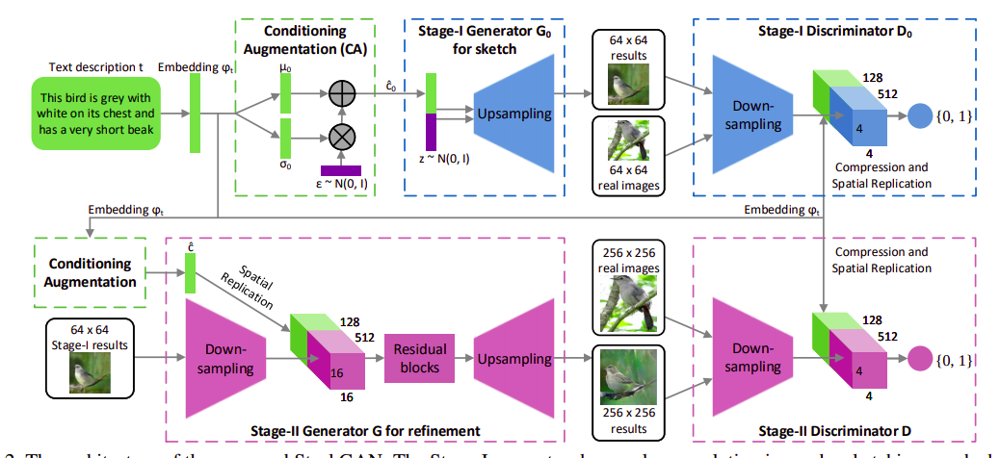
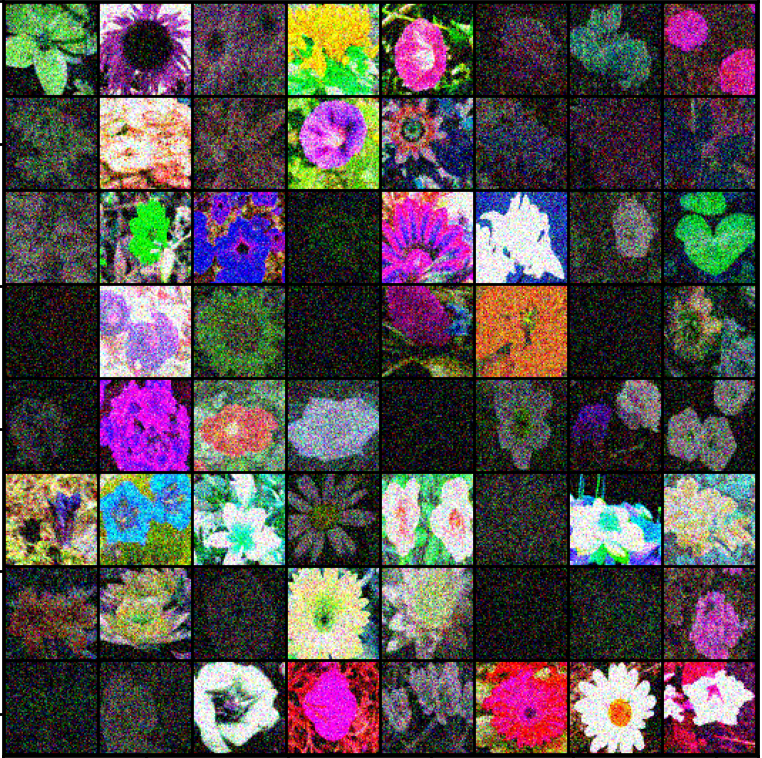
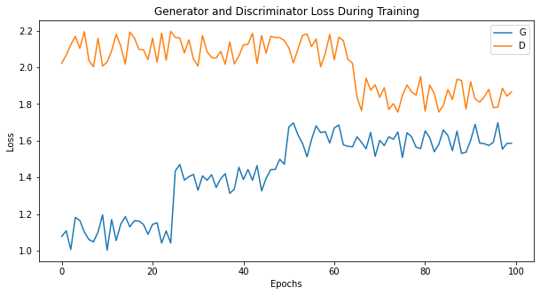
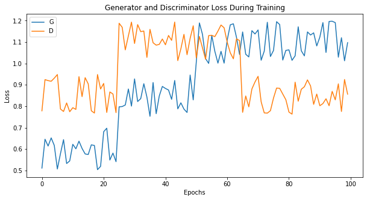

# Pytorch Implementation of StackGAN

## Usage

Download the images from [OXFORD 102 dataset](http://www.robots.ox.ac.uk/~vgg/data/flowers/102/)

Download the preprocessed char-CNN-RNN text embeddings of [flowers](https://drive.google.com/file/d/0B3y_msrWZaXLaUc0UXpmcnhaVmM/view?usp=drive_open)

```bash
$ python3 main.py --data_dir 'path to embeddings data folder' --image_dir 'path to folder of image folder'
```

> **_NOTE:_** on Colab Notebook use following command:
```python
!git clone link-to-repo
%run main.py --data_dir 'path to embeddings data folder' --image_dir 'path to folder of image folder'
```
### Help Log
```
usage: main.py [-h] [--image_size1 IMAGE_SIZE1] [--image_size2 IMAGE_SIZE2]
               [--z_dim Z_DIM] [--embed_dim EMBED_DIM] [--D1_dim D1_DIM]
               [--G2_dim G2_DIM] --data_dir DATA_DIR --image_dir IMAGE_DIR
               [--epochs1 EPOCHS1] [--epochs2 EPOCHS2]
               [--batch_size BATCH_SIZE] [--lrG1 LRG1] [--lrG2 LRG2]
               [--lrD1 LRD1] [--lrD2 LRD2] [--beta1 BETA1] [--beta2 BETA2]

optional arguments:
  -h, --help            show this help message and exit
  --image_size1 IMAGE_SIZE1
                        stage1 image size
  --image_size2 IMAGE_SIZE2
                        stage2 image size
  --z_dim Z_DIM         noise dimension
  --embed_dim EMBED_DIM
                        embedding compressed dim
  --D1_dim D1_DIM
  --G2_dim G2_DIM
  --data_dir DATA_DIR   path to embedding directory containing pickle files
  --image_dir IMAGE_DIR
                        path to folder containing jpg folder which contains
                        images
  --epochs1 EPOCHS1
  --epochs2 EPOCHS2
  --batch_size BATCH_SIZE
  --lrG1 LRG1
  --lrG2 LRG2
  --lrD1 LRD1
  --lrD2 LRD2
  --beta1 BETA1
  --beta2 BETA2
```

## Contributed by:
* [Rishabh Dugaye](https://github.com/rishabhd786)

## References

* **Title**: StackGAN: Text to Photo-realistic Image Synthesis with Stacked Generative Adversarial Networks
* **Authors**: Han Zhang,Tao Xu,Hongsheng Li,Shaoting Zhang,Xiaogang Wang,Xiaolei Huang,Dimitris Metaxas
* **Link**: https://arxiv.org/pdf/1612.03242.pdf
* **Year**: 2017

# Summary 

## Introduction

Generating photo-realistic images from text is an important problem and has tremendous applications, including photo-editing, computer-aided design, etc. Recently,Generative Adversarial Networks (GAN) have
shown promising results in synthesizing real-world images. Conditioned on given text descriptions, conditional GANs are able to generate images that are highly related to the text meanings.
However, it is very difficult to train GAN to generate high-resolution photo-realistic images from text descriptions.

In analogy to how human painters draw, we decompose the problem of text to photo-realistic image synthesis into two more tractable sub-problems with Stacked Generative Adversarial Networks (StackGAN). Low-resolution images are first generated by our Stage-I GAN. On the top of our Stage-I GAN, we stack Stage-II GAN to generate realistic high-resolution (e.g., 256×256) images conditioned on Stage-I results and text descriptions. By conditioning on the Stage-I result and the
text again, Stage-II GAN learns to capture the text information that is omitted by Stage-I GAN and draws more details for the object. The support of model distribution generated from a roughly aligned low-resolution image has better
probability of intersecting with the support of image distribution. This is the underlying reason why Stage-II GAN is able to generate better high-resolution images.

## GANs

Generative adversarial nets were recently introduced as a novel way to train a generative model.
They consists of two ‘adversarial’ models: a generative model G that captures the data distribution, and a discriminative model D that estimates the probability that a sample came from the training
data rather than G. Both G and D could be a non-linear mapping function, such as a multi-layer perceptron.

## Architecture of StackGAN

To generate high-resolution images with photo-realisticdetails, paper propose a simple yet effective Stacked Generative Adversarial Networks. It decomposes the text-to-image
generative process into two stages.
- Stage-I GAN: it sketches the primitive shape and basic colors of the object conditioned on the given text description, and draws the background layout from a
                random noise vector, yielding a low-resolution image.
- Stage-II GAN: it corrects defects in the low-resolution image from Stage-I and completes details of the object 
                by reading the text description again, producing a highresolution photo-realistic image.

 

### Generator Stage1

```

------------------------------------------------------------------------------------------
Layer (type:depth-idx)                   Output Shape              Param #
==========================================================================================
├─CA: 1-1                                [64, 128]                 --
|    └─Linear: 2-1                       [-1, 256]                 262,400
|    └─ReLU: 2-2                         [-1, 256]                 --
├─Linear: 1-2                            [-1, 29184]               6,683,136
├─BatchNorm1d: 1-3                       [-1, 29184]               58,368
├─ReLU: 1-4                              [-1, 29184]               --
├─UpsamplingNearest2d: 1-5               [-1, 1824, 8, 8]          --
├─Conv2d: 1-6                            [-1, 912, 8, 8]           14,972,304
├─BatchNorm2d: 1-7                       [-1, 912, 8, 8]           1,824
├─ReLU: 1-8                              [-1, 912, 8, 8]           --
├─UpsamplingNearest2d: 1-9               [-1, 912, 16, 16]         --
├─Conv2d: 1-10                           [-1, 456, 16, 16]         3,743,304
├─BatchNorm2d: 1-11                      [-1, 456, 16, 16]         912
├─ReLU: 1-12                             [-1, 456, 16, 16]         --
├─UpsamplingNearest2d: 1-13              [-1, 456, 32, 32]         --
├─Conv2d: 1-14                           [-1, 228, 32, 32]         935,940
├─BatchNorm2d: 1-15                      [-1, 228, 32, 32]         456
├─ReLU: 1-16                             [-1, 228, 32, 32]         --
├─UpsamplingNearest2d: 1-17              [-1, 228, 64, 64]         --
├─Conv2d: 1-18                           [-1, 3, 64, 64]           6,159
├─BatchNorm2d: 1-19                      [-1, 3, 64, 64]           6
├─Tanh: 1-20                             [-1, 3, 64, 64]           --
==========================================================================================
Total params: 26,664,809
Trainable params: 26,664,809
Non-trainable params: 0
Total mult-adds (G): 2.91
------------------------------------------------------------------------------------------
Input size (MB): 0.25
Forward/backward pass size (MB): 6.87
Params size (MB): 101.72
Estimated Total Size (MB): 108.84

```

### Discriminator Stage 1

```
------------------------------------------------------------------------------------------
Layer (type:depth-idx)                   Output Shape              Param #
==========================================================================================
├─Conv2d: 1-1                            [-1, 64, 32, 32]          3,136
├─LeakyReLU: 1-2                         [-1, 64, 32, 32]          --
├─Conv2d: 1-3                            [-1, 128, 16, 16]         131,200
├─BatchNorm2d: 1-4                       [-1, 128, 16, 16]         256
├─LeakyReLU: 1-5                         [-1, 128, 16, 16]         --
├─Conv2d: 1-6                            [-1, 256, 8, 8]           524,544
├─BatchNorm2d: 1-7                       [-1, 256, 8, 8]           512
├─LeakyReLU: 1-8                         [-1, 256, 8, 8]           --
├─Conv2d: 1-9                            [-1, 512, 4, 4]           2,097,664
├─BatchNorm2d: 1-10                      [-1, 512, 4, 4]           1,024
├─LeakyReLU: 1-11                        [-1, 512, 4, 4]           --
├─EmbedComp: 1-12                        [-1, 128, 4, 4]           --
|    └─Linear: 2-1                       [-1, 128]                 131,200
├─Conv2d: 1-13                           [-1, 512, 4, 4]           328,192
├─BatchNorm2d: 1-14                      [-1, 512, 4, 4]           1,024
├─LeakyReLU: 1-15                        [-1, 512, 4, 4]           --
├─Conv2d: 1-16                           [-1, 1, 1, 1]             8,193
├─Sigmoid: 1-17                          [-1, 1, 1, 1]             --
==========================================================================================
Total params: 3,226,945
Trainable params: 3,226,945
Non-trainable params: 0
Total mult-adds (M): 109.32
------------------------------------------------------------------------------------------
Input size (MB): 3.00
Forward/backward pass size (MB): 1.50
Params size (MB): 12.31
Estimated Total Size (MB): 16.81
------------------------------------------------------------------------------------------
```

### Generator Stage 2

```
------------------------------------------------------------------------------------------
Layer (type:depth-idx)                   Output Shape              Param #
==========================================================================================
├─CA: 1-1                                [64, 128]                 --
|    └─Linear: 2-1                       [-1, 256]                 262,400
|    └─ReLU: 2-2                         [-1, 256]                 --
├─Conv2d: 1-2                            [-1, 128, 32, 32]         6,272
├─BatchNorm2d: 1-3                       [-1, 128, 32, 32]         256
├─LeakyReLU: 1-4                         [-1, 128, 32, 32]         --
├─Conv2d: 1-5                            [-1, 512, 16, 16]         1,049,088
├─BatchNorm2d: 1-6                       [-1, 512, 16, 16]         1,024
├─LeakyReLU: 1-7                         [-1, 512, 16, 16]         --
├─ResBlock: 1-8                          [-1, 640, 16, 16]         --
|    └─Conv2d: 2-3                       [-1, 640, 16, 16]         3,687,040
|    └─BatchNorm2d: 2-4                  [-1, 640, 16, 16]         1,280
|    └─ReLU: 2-5                         [-1, 640, 16, 16]         --
|    └─Conv2d: 2-6                       [-1, 640, 16, 16]         3,687,040
|    └─BatchNorm2d: 2-7                  [-1, 640, 16, 16]         1,280
|    └─ReLU: 2-8                         [-1, 640, 16, 16]         --
├─ResBlock: 1-9                          [-1, 640, 16, 16]         --
|    └─Conv2d: 2-9                       [-1, 640, 16, 16]         3,687,040
|    └─BatchNorm2d: 2-10                 [-1, 640, 16, 16]         1,280
|    └─ReLU: 2-11                        [-1, 640, 16, 16]         --
|    └─Conv2d: 2-12                      [-1, 640, 16, 16]         3,687,040
|    └─BatchNorm2d: 2-13                 [-1, 640, 16, 16]         1,280
|    └─ReLU: 2-14                        [-1, 640, 16, 16]         --
├─UpsamplingNearest2d: 1-10              [-1, 640, 32, 32]         --
├─Conv2d: 1-11                           [-1, 320, 32, 32]         1,843,520
├─BatchNorm2d: 1-12                      [-1, 320, 32, 32]         640
├─ReLU: 1-13                             [-1, 320, 32, 32]         --
├─UpsamplingNearest2d: 1-14              [-1, 320, 64, 64]         --
├─Conv2d: 1-15                           [-1, 160, 64, 64]         460,960
├─BatchNorm2d: 1-16                      [-1, 160, 64, 64]         320
├─ReLU: 1-17                             [-1, 160, 64, 64]         --
├─UpsamplingNearest2d: 1-18              [-1, 160, 128, 128]       --
├─Conv2d: 1-19                           [-1, 80, 128, 128]        115,280
├─BatchNorm2d: 1-20                      [-1, 80, 128, 128]        160
├─ReLU: 1-21                             [-1, 80, 128, 128]        --
├─UpsamplingNearest2d: 1-22              [-1, 80, 256, 256]        --
├─Conv2d: 1-23                           [-1, 3, 256, 256]         2,163
├─BatchNorm2d: 1-24                      [-1, 3, 256, 256]         6
├─Tanh: 1-25                             [-1, 3, 256, 256]         --
==========================================================================================
Total params: 18,495,369
Trainable params: 18,495,369
Non-trainable params: 0
Total mult-adds (G): 9.87
------------------------------------------------------------------------------------------
Input size (MB): 0.25
Forward/backward pass size (MB): 52.00
Params size (MB): 70.55
Estimated Total Size (MB): 122.81
------------------------------------------------------------------------------------------

```

### Discriminator Stage 2

```
Layer (type:depth-idx)                   Output Shape              Param #
==========================================================================================
├─Conv2d: 1-1                            [-1, 16, 128, 128]        784
├─LeakyReLU: 1-2                         [-1, 16, 128, 128]        --
├─Conv2d: 1-3                            [-1, 32, 64, 64]          8,224
├─BatchNorm2d: 1-4                       [-1, 32, 64, 64]          64
├─LeakyReLU: 1-5                         [-1, 32, 64, 64]          --
├─Conv2d: 1-6                            [-1, 64, 32, 32]          32,832
├─BatchNorm2d: 1-7                       [-1, 64, 32, 32]          128
├─LeakyReLU: 1-8                         [-1, 64, 32, 32]          --
├─Conv2d: 1-9                            [-1, 128, 16, 16]         131,200
├─BatchNorm2d: 1-10                      [-1, 128, 16, 16]         256
├─LeakyReLU: 1-11                        [-1, 128, 16, 16]         --
├─Conv2d: 1-12                           [-1, 256, 8, 8]           524,544
├─BatchNorm2d: 1-13                      [-1, 256, 8, 8]           512
├─LeakyReLU: 1-14                        [-1, 256, 8, 8]           --
├─Conv2d: 1-15                           [-1, 512, 4, 4]           2,097,664
├─BatchNorm2d: 1-16                      [-1, 512, 4, 4]           1,024
├─LeakyReLU: 1-17                        [-1, 512, 4, 4]           --
├─EmbedComp: 1-18                        [-1, 128, 4, 4]           --
|    └─Linear: 2-1                       [-1, 128]                 131,200
├─Conv2d: 1-19                           [-1, 512, 4, 4]           328,192
├─BatchNorm2d: 1-20                      [-1, 512, 4, 4]           1,024
├─LeakyReLU: 1-21                        [-1, 512, 4, 4]           --
├─Conv2d: 1-22                           [-1, 1, 1, 1]             8,193
├─Sigmoid: 1-23                          [-1, 1, 1, 1]             --
==========================================================================================
Total params: 3,265,841
Trainable params: 3,265,841
Non-trainable params: 0
Total mult-adds (M): 185.87
------------------------------------------------------------------------------------------
Input size (MB): 48.00
Forward/backward pass size (MB): 6.00
Params size (MB): 12.46
Estimated Total Size (MB): 66.46

```

## Results

### LR image after 100 epochs

 

### HR image after 100 epochs

 

### Stage 1 Losses

 

### Stage 2 Losses

 
