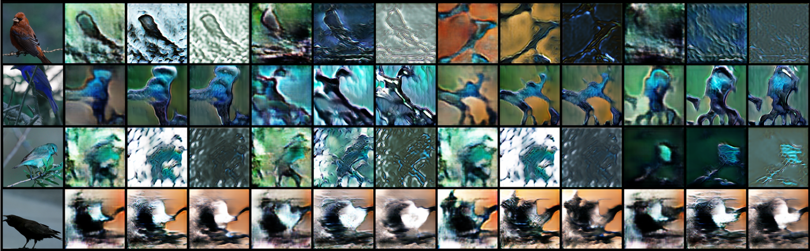
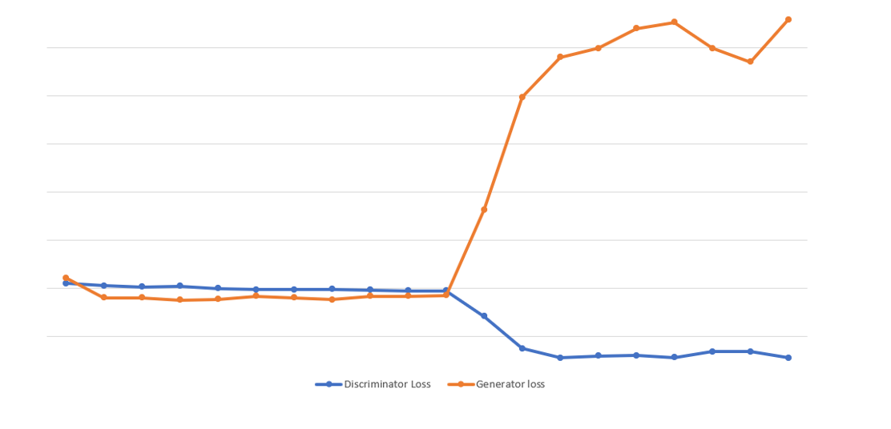

# StackGAN V2 Pytorch Implementation

## Usage

1. Download the images from [CUB_200_2011](https://drive.google.com/file/d/1hbzc_P1FuxMkcabkgn9ZKinBwW683j45/view?usp=sharing)

2. Download the preprocessed char-CNN-RNN text embeddings of [BirdDataset](https://drive.google.com/file/d/1jRaRaZC7rSCtSgiCRlCA9_mBH7avCNpg/view?usp=sharing)
   
- [Optional] Follow the instructions [reedscot/icml2016](https://github.com/reedscot/icml2016) to download the pretrained char-CNN-RNN text encoders and extract text embeddings.

Extract the Images and The Embeddings in the same directory. ('birds' and 'CUB_200_2011' directories would be made on Extraction.)
```bash
$ python3 main.py 
```
### Help Log
```
usage: main.py [--eval_] [--channels] [--epochs]
               [--batchSize] [--saveInterval] [--embeddingsDim]
               [--StageNum]
               [--generatorLR] [--discriminatorLR][--beta1] [--beta2][--zDim ]

optional arguments:
  --eval_              Boolean, whether to evaluate and save images or not
  --channels           Number of input channel of images
  --epochs             EPOCHS
  --batch_size         Batch Size
  --saveInterval       After How many epochs to save the Image
  --embeddingsDim      Embedding compressed dim
  --StageNum           Number Of Stages In StackGAN
  --generatorLR        Generator Learning Rate
  --discriminatorLR    Discriminator Learning Rate
  --beta1 BETA1
  --beta2 BETA2
  --zDim               Noise dimension
```

## References

* **Title**: StackGAN++: Realistic Image Synthesis
with Stacked Generative Adversarial Networks
* **Authors**: Han Zhang, Tao Xu, Hongsheng Li, Shaoting Zhang, Senior Member, IEEE,
Xiaogang Wang, Member, IEEE, Xiaolei Huang, Member, IEEE, Dimitris N. Metaxas, Fellow, IEEE
* **Link**: https://arxiv.org/pdf/1710.10916.pdf
* **Year**: 2017

## Contributed by:
* [Ayush Kumar](https://github.com/kumayu0108)

# Summary 
Generative Adversarial Networks (GANs) were proposed by
Goodfellow et al. In the original setting, GANs are composed
of a generator and a discriminator that are trained with
competing goals.The training process is usually unstable and sensitive to the choices of hyper-parameters.

Several papers argued that the instability is partially due to the disjoint supports of the
data distribution and the implied model distribution. This problem is more severe when training GANs to generate
high-resolution (e.g., 256 x 256) images because the chance is
very low for the image distribution and the model distribution
to share supports in a high-dimensional space. Moreover,
a common failure phenomenon for GANs training is mode
collapse, where many of the generated samples contain the
same color or texture pattern. StackGAN++ expands upon the idea of StackGAN to include more Discriminator and by producing images at different levels of Generators which go through different Discriminators at once generating conditional and unconditional losses. The major idea behind the presence of multiple Generators is to enhance the data collection from the Embeddings by introducing Embeddings at each stage.

## Architecture of StackGAN

StackGAN-v2 consists of
multiple generators (Gs) and discriminators (Ds) in a tree-like
structure. Images from low-resolution to high-resolution are
generated from different branches of the tree. At each branch,
the generator captures the image distribution at that scale and
the discriminator estimates the probability that a sample came
from training images of that scale rather than the generator.
The generators are jointly trained to approximate the multiple distributions, and the generators and discriminators are trained
in an alternating fashion. In this section, we explore two types
of multi-distributions: (1) multi-scale image distributions; and
(2) joint conditional and unconditional image distributions.


## Results

 

### Combined Losses For Generator And Discriminator

