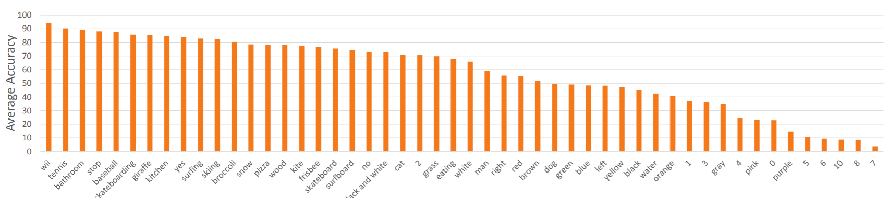
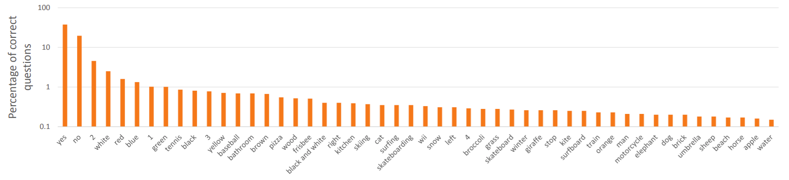

# TensorFlow Implementation of VQA
## Usage
```bash
$ python3 main.py
```
> **_NOTE:_** on Colab Notebook use following command:
```python
!git clone link-to-repo
%run main.py
```

## Help Log
```
usage: main.py [-h] [--type TYPE] [--base_path BASE_PATH] [--epochs EPOCHS]
                [--batch_size BATCH_SIZE] [--data_limit DATA_LIMIT]
                [--weights_load WEIGHTS_LOAD] [--weight_path WEIGHT_PATH]

optional arguments:
  -h, --help            show this help message and exit
  --type TYPE           Whether you want to train or validate, default train
  --base_path BASE_PATH
                        Relative path to location where to download data,
                        default '.'
  --epochs EPOCHS       Number of epochs, default 10
  --batch_size BATCH_SIZE
                        Batch Size, default 256
  --data_limit DATA_LIMIT
                        Number of data points to feed for training, default
                        215359 (size of dataset)
  --weights_load WEIGHTS_LOAD
                        Boolean to say whether to load pretrained model or
                        train new model, default False
  --weight_path WEIGHT_PATH
                        Relative path to location of saved weights, default
                        '.'
```

## Contributed by:
* [Atharv Singh Patlan](https://github.com/AthaSSiN)

## References

* **Title**: VQA: Visual Question Answering
* **Authors**: Aishwarya Agrawal, Jiasen Lu, Stanislaw Antol, Margaret Mitchell, C. Lawrence Zitnick, Dhruv Batra, Devi Parikh
* **Link**: https://arxiv.org/pdf/1505.00468
* **Tags**: Neural Network, Computer Vision, Natural Language Processing
* **Year**: 2015

# Summary 

## Introduction

Visual Question Answering (VQA) is the task of answering questions about a given piece of visual content such as an image, video or infographic. It involves answering questions about visual content requires a variety of skills include recognizing entities and objects, reasoning about their interactions with each other, both spatially and temporally, reading text, parsing audio, interpreting abstract and graphical illustrations as well as using external knowledge not directly present in the given content.

It is a combination of Natural Language Processing and Computer Vision, enabling our model to inpterpret the questions posed by the user and also search for the answers in the input picture.  


While seemingly an easy task for humans, VQA affords several challenges to AI systems spanning the fields of natural language processing, computer vision, audio processing, knowledge representation and reasoning. Over the past few years, the advent of deep learning, availability of large datasets to train VQA models as well as the hosting of a number of benchmarking contests have contributed to a surge of interest in VQA amongst researchers in the above disciplines.

One of the early and popular datasets for this task was the VQA-v1 dataset. The VQA-v1 dataset is a very large dataset consisting of two types of images: natural images (referred to as real images) as well as synthetic images (referred to as abstract scenes) and comes in two answering modalities: multiple choice question answering (the task of selecting the right answer amongst a set of choices) as well as open ended question answering (the task of generating an answer with an open ended vocabulary).  

The real images fraction of the VQA-v1 dataset consists of over 200,000 natural images sourced from the MS-COCO dataset, a large scale dataset of images used to benchmark tasks such as object detection, segmentation and image captioning. Each image is paired with 3 questions written down by crowdsourced annotators.  

The dataset contains a variety of question types such as: What color, What kind, Why, How many, Is the, etc. To account for potential disagreements between humans for some questions, as well as account for crowd sourcing noise, each question is accompanied by 10 answers.  

Given an image and a question, the goal of a VQA system is to produce an answer that matches those provided by human annotators. For the open ended answering modality, the evaluation metric used is:  

__accuracy__ =min(# annotator answers matching the generated answer/3, 1)  

The intuition behind this metric is as follows:  
If a system generated answer matches one produced by at least 3 unique annotators, it gets a maximum score of 1 on account of producing a popular answer. If it generates an answer that isn’t present amongst the 10 candidates, it gets a score of 0, and it is assigned a fractional score if it produces an answer that is deemed rare. If the denominator 3 is lowered, wrong and noisy answers in the dataset (often present due to annotation noise) will receive a high credit. Conversely, if it is raised towards 10, a system producing the right answer may only receive partial credit, if the answer choices consist of synonyms or happen to contain a few noisy answers.

## Implementation

Our implementation, which is the standard and best implementation described by the authors of the VGQ paper uses Image embeddings from a pretrained VGG net and using the word encodings by passing the GloVe word embeddings of the input words through 2 layers of LSTM In contrast to averaging, using an LSTM preserves information regarding the order of the words in the question and leads to an improved VQA accuracy.  
The other possible variants of VQA are  


We use the following default configuration: 
- Pretrained VGG Activations of VQA input images
- 2 Layers of LSTMs which follows pretrained GloVe word embeddings of input texts
- Concatenation of the outputs of the NLP and Vision parts into a single dense layer.

## Results

Here are the results for the above specified SOTA model.  

This figure shows P(model is correct | answer) for 50 most frequent ground truth answers on the VQA validation set (plot is sorted by accuracy, not
frequency).  
  

This figure shows P(answer | model is correct) for 50 most frequently predicted answers on the VQA validation set (plot is sorted by prediction
frequency, not accuracy).  


# Sources

- [Vanilla VQA](https://medium.com/ai2-blog/vanilla-vqa-adcaaaa94336)  

