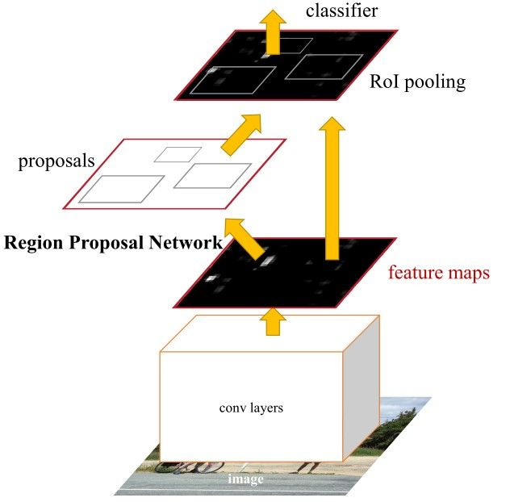
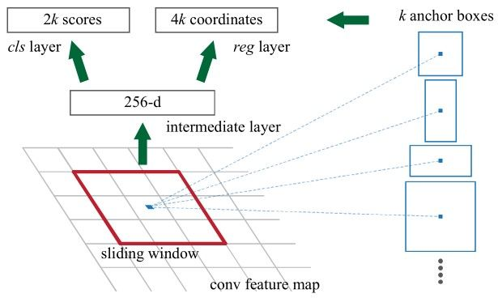
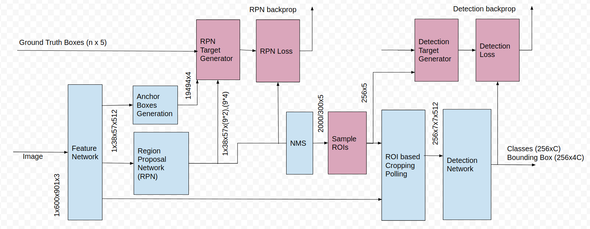
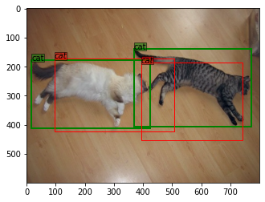
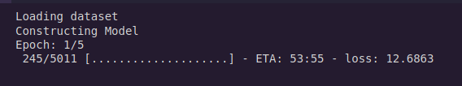

# Implementation of Faster RCNN in Tensorflow

## Downloading  Pascal VOC Dataset

In colab notebook you can download and extract PASCAL VOC 2007 dataset by running following code :

```bash
# Downloading training and validation dataset...
!wget http://pjreddie.com/media/files/VOCtrainval_06-Nov-2007.tar
!wget http://pjreddie.com/media/files/VOCtest_06-Nov-2007.tar
!wget http://pjreddie.com/media/files/VOCdevkit_08-Jun-2007.tar

# Extracting...
!tar xf VOCtrainval_06-Nov-2007.tar
!tar xf VOCtest_06-Nov-2007.tar
!tar xf VOCdevkit_08-Jun-2007.tar
```

## Usage

```bash
python3 train.py
```

> **_NOTE:_** on Colab Notebook use following command:

Install the required package,

```bash
!pip install pkbar
```

Then run following code in the cell which will start training and visualize predictions.

```python
!git clone <link-to-repo>
!mv /content/<cloned-folder-name>/* /content/
%matplotlib inline
%run train.py
```

## Contributed by

* [Padam Sharma](https://github.com/PadamSharma)

## References

* **Title**: Faster R-CNN: Towards Real-Time Object
                          Detection with Region Proposal Networks
* **Authors**: Shaoqing Ren, Kaiming He, Ross Girshick, and Jian Sun
* **Link**: <https://arxiv.org/abs/1506.01497>
* **Tags**: Convolution • Faster R-CNN • Fast R-CNN • RoIPool • RPN • Softmax • VGG-16
* **Year**: 2016

# Summary

## Introduction

Faster-RCNN is one of the most well known object detection neural networks. It is also the basis for many derived networks for segmentation, 3D object detection, fusion of LIDAR point cloud with image ,etc.

Basically Faster RCNN is composed of 3 neural networks —

1. Feature Network that generates features from images.
2. Region Proposal Network ( RPN ) that generate a number of region proposals or bounding boxes called Region of Interests ( ROIs) that has high probability of containing any object
3. Detection Network takes input from both the Feature Network and RPN , and generates the final class and bounding box.

Also, the feature network and the detection network is similar to that of Fast RCNN, thus architecture of Faster R-CNN can be said to consist of RPN and Fast RCNN.


## Drawbacks of Fast RCNN and need for a better model

* As the name of the paper suggests that for real time object detection we need a model which can produce results more quickly ,while Fast RCNN uses selective search as a proposal method to find the Regions of Interest, which is a slow and time consuming process.

* Fast RCNN takes around 2 seconds per image to detect objects thus it is not feasible for real-time object detection task.

* While on the other hand, Faster RCNN benefits from its RPN which takes effective 10ms to generate region proposals. Thus it takes overall 0.2s to generate prediction per image.

## Key Features of Faster RCNN

### 1-Region Proposal Network (RPN)

   This paper proposed a network called region proposal network (RPN) that can produce the region proposals. This has some advantages over the Selective Search Algorithm of Fast RCNN:

   1. The region proposals are now generated using a network that could be trained end to end and can be customized according to the specific detection task.
   2. As the proposals are generated using a network, they can be trained end-to-end for customized detection task. Hence, it produces better region proposals compared to generic methods like Selective Search and EdgeBoxes.
   3. The RPN uses the same convolutional layers as the Fast R-CNN detection network to process the image. As a result, when compared to algorithms like Selective Search, the RPN takes less time to generate proposals.
   4. The RPN and the Fast R-CNN may be combined into a single network since they share the same convolutional layers. As a result, training is only done once.

The RPN uses the output feature map from the final convolutional layer shared with the Fast R-CNN to perform its task. A sliding window moves across the feature map based on a rectangular window of size nxn. A number of candidate region proposals are generated for each window. These are not the final proposals because they will be filtered according to their "objectivity score."

### 2-Concept of Anchor Boxes

The last shared convolution layer's feature map is passed via a rectangular sliding window of size nxn, with n=3 for the VGG-16 net. K region proposals are generated for each window. Each proposal is parametrized based on an anchor box, which is a reference box. Scale and aspect ratio are the parameters of the anchor box.

Generally, there are 3 scales and 3 aspect ratios and thus there is a total of K=9 anchor boxes, while K may vary.



### 3-Objectness Score

For each region proposal, the classification layer generates a two-element vector. The region proposal is classified as background if the first element is 1 and the second element is 0, or as an object if the first element is 1 and the second element is 0.

Each anchor is given a positive or negative objectness score based on the Intersection-over-Union method for training the RPN.

**NOTE**: The IoU is the ratio between the area of intersection between the anchor box and the ground-truth box to the area of union of the 2 boxes and ranges from 0.0 to 1.0.

The IoU is used in the following four conditions to determine whether an anchor receives a positive or negative objectness score:

1. A positive objectness label is assigned to an anchor with an IoU overlap greater than 0.7 and any ground-truth box.
2. If no anchor has an IoU overlap greater than 0.7, use the ground-truth box to apply a positive label to the anchor with the largest IoU overlap.
3. When the IoU overlap for all ground-truth boxes is less than 0, a non-positive anchor is given a negative objectness score. 3. If the anchor has a negative objectness score, it is considered background.
4. Anchors that are neither positive nor negative are irrelevant for training.

### 4-Feature Sharing between RPN and Fast R-CNN

The RPN and Fast R-CNN modules of the Fast R-CNN architecture are separate networks. Each of them may be individually trained. In the case of Faster R-CNN, however, it is feasible to create a unified network in which both the RPN and the Fast R-CNN are trained at the same time.

**NOTE**: The following figure contains the detailed architecture of the model



# Results

## Predictions after 5 epochs(VOC 2007)

As single epoch takes about an hour to complete on all classes in the dataset, model does not generalises well while giving predictions in a single epoch. Hence, one can train the model for multiple epochs on a subset of the dataset containing few classes. This would allow model to generalise on those classes giving some decent predictions.

Here, bounding box predictions are red while the ground truth is green in color.




## Accuracy and speed of Model(VOC 2007)


