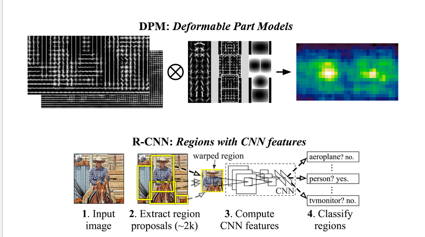
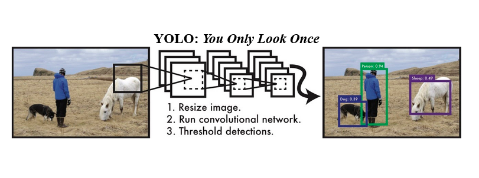
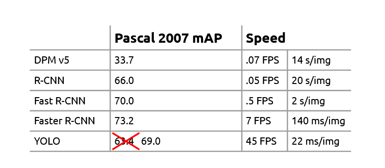
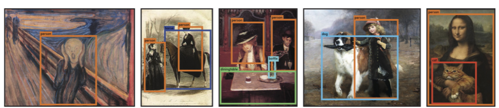
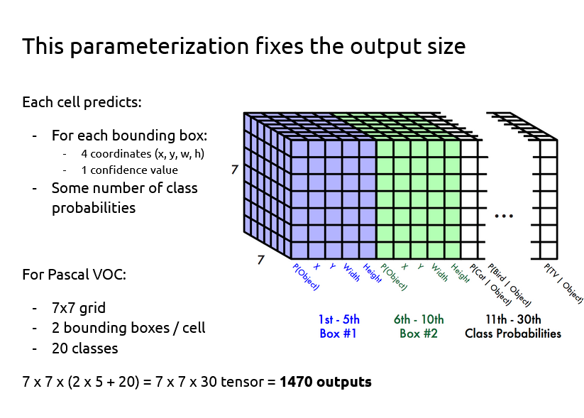
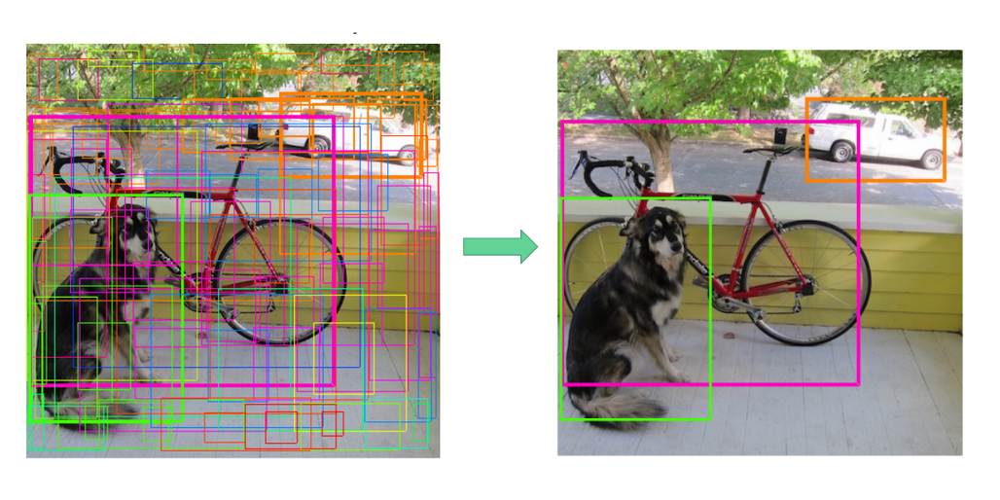
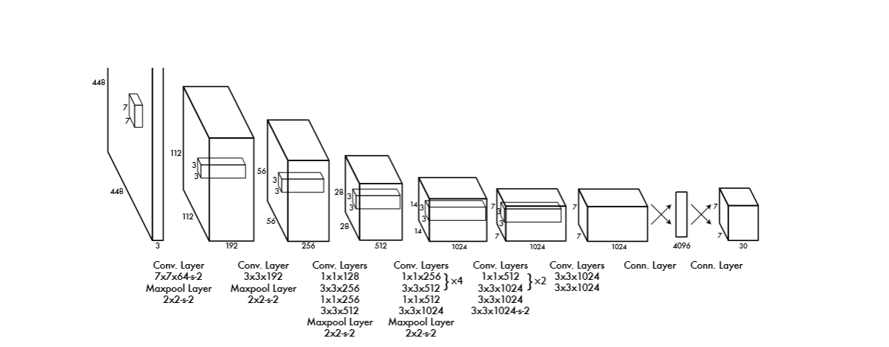

# **Tensorflow implementation of YOLOv1**
---
## Usage 
- You will have to download and extract the voc 2007 dataset :
```
$ wget http://pjreddie.com/media/files/VOCtrainval_06-Nov-2007.tar
$ wget http://pjreddie.com/media/files/VOCtest_06-Nov-2007.tar
$ tar -xvf VOCtrainval_06-Nov-2007.tar
$ tar -xvf VOCtest_06-Nov-2007.tar
```

- Next you will have to update the config.json file with the path to the train and test VOCdevkit that you just extracted.

- Running the main file will train and perform the inference as well

```$ python3 ./main.py```

- The results are stored in the results.npy file 
## Contributed by 
* [Prem Bharwani](https://github.com/prembharwani)
## References 
 Research Paper Referred to : 
- **Title** : You Only Look Once: Unified, Real-Time Object Detection
- **Authors** : Joseph Redmon, Santosh Divvala, Ross Girshick, Ali Farhadi
- **Link** : [Link to the YOLOv1 Paper](https://arxiv.org/abs/1506.02640)
- **Tags** : Neural Network, RCNN
- **Year Published** : 2015

 Other resources referred to : [Blog1](https://hackernoon.com/understanding-yolo-f5a74bbc7967) | [Blog2](https://www.maskaravivek.com/post/yolov1/) 
 ## **Summary**
### Overview of Object Detection models then and how did YOLOv1 improve upon the existing models :

Object detection involves object localisation and classifying object(s) present in the image. 
The already existing models like R-CNN (Region based Convolutional Neural Networks) , DPM(Deformable Parts Model) were making use of classifiers to perform detection ,i.e , they evaluate a particular classifier at different locations of the image.

DPM uses a sliding windows which moves around the image , and a classifier is run on these windows at different locations on the image.
R-CNN first extracts the region using selective search and then classifies the regions using CNN based classifiers.

So the existing models involve processing(looking at) the image a large number of times ! The process is time consuming , thereby cannot perform 'satisfactory' real-time detection.

Below are DPM & R-CNN models :


Below is the YOLO model : 


The proposed model improves drastically in the speed aspect , the YOLO model processes(Looks at) the image only once ! And, that is why the name, You Only Look Once.

### Speed Improvement and Accuracy tradeoff 
As mentioned earlier, the already existing models made use of classifiers to perform detection. But YOLO frames object detection as a regression problem !
Models like R-CNN , DPM involve a complex pipeline , these make the model really slow and difficult to optimize. And you will have to train each part of this pipeline separately.

Yolo model involves a single network which takes the image as the input and outputs the bounding boxes and the class probabilities in one evaluation! And since the whole detection network is a single pipeline , it can be optimized end-to-end directly on detection performance.

Below is the comparison model to prove the facts :


We can see that YOLO does have a small tradeoff when we talk about mAP (Mean Average Precision). As we can observe in the comparision table presented above, it has a lower mAP than the newer versions of R-CNN. YOLO makes more localisation errors , but doesn't predict false positives on background. Also it has a global interpretation of the image , and so it learns a more general representation of the objects. And this generalization learning pattern is the reason why YOLO outperforms DPM and R-CNN in other domains like artwork.

YOLO's performance on artwork:


### Architecture and Working 

The procedure is fairly simple , the image is first divided into a grid , each grid is responsible to produce confidence , bounding box parameters and class probabilities. So for the VOC 2007 dataset , the image is divided into a 7x7 grid. And each grid cell can predict 2 bounding boxes .And each bounding box is given by 4 parameters .

So each grid cell is responsible to predict confidence for objects (#2 since each cell is responsible for two bounding boxes) , further the parameters for the two bounding boxes (#(4*2) , 4 parameters for each bounding box) , and lastly the class probabilities (#20 , since we have 20 classed in VOC 2007) . So the output has the shape 7x7x30

The image below depicts the label structure :


But we could have multiple cells detecting the same object right ? Yes !
To deal with this we use Non Max Suppression(NMS) , to find out the best fitting bounding box . NMS looks for the cell with highest confidence for a particular class of object . Then it discards off any object with IoU>0.6 (Intersection over Union) with the box selected previously. And this way we discard all the duplicate boxes for an object , and the best fitting one stays.

Here is how it would look like :


Coming to the training of the model :

We follow the architecture given in the paper , We have a Convolutional network followed by two fully connected layers . And we have alternating 1x1 layers to reduce the features space between layers. 

Yolo architecture: 


We will be using Leaky Relu linear activation(alpha=0.1) for all the layers, except the final layer which uses Linear Activation. 

The loss function that we have to optimize on is a modification of the sum-squared error loss. To give more importance to the bounding box error than classification error , we multiply both these terms in the function accordingly.
Sum squared error weights equally the errors in large bounding boxes and small bounding boxes , But an error which would not affect the large box much could be really harmful for the smaller bounding box. So we propose to predict the square root of bounding box width and height instead. Finally the loss function looks like :


Yolo predicts multiple bounding boxes per cell , and we want only one bounding box predictor to be responsible for one object. We assign this responsibility to the bounding box that has the highest IoU (Intersection over Union) with the ground truth.

Thank You ! 

---
