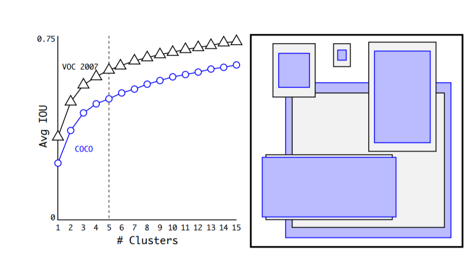
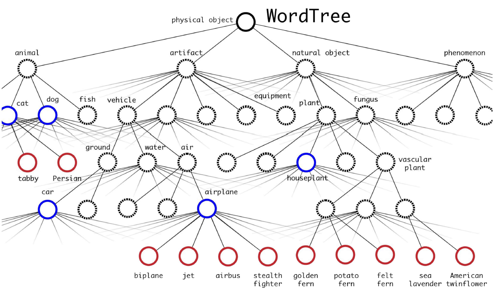
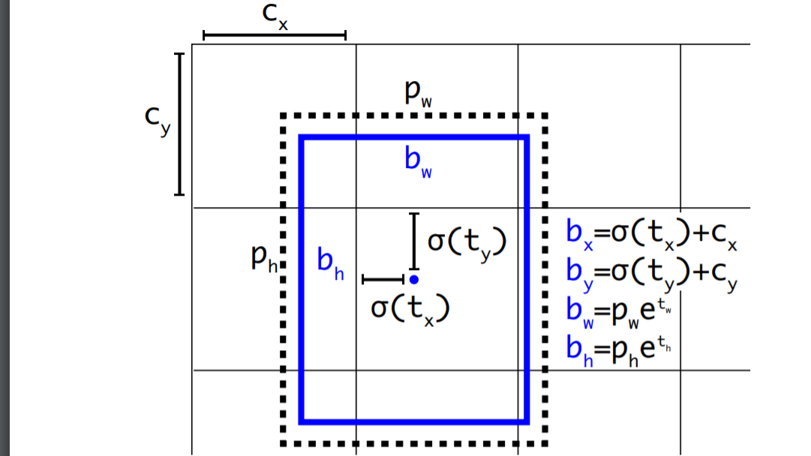
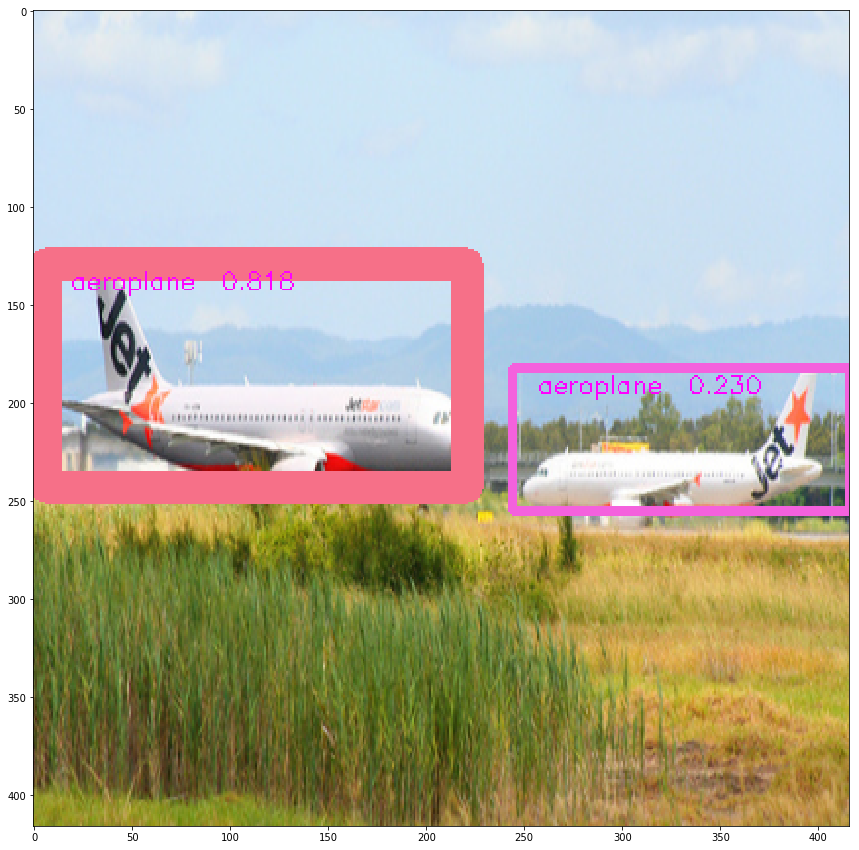
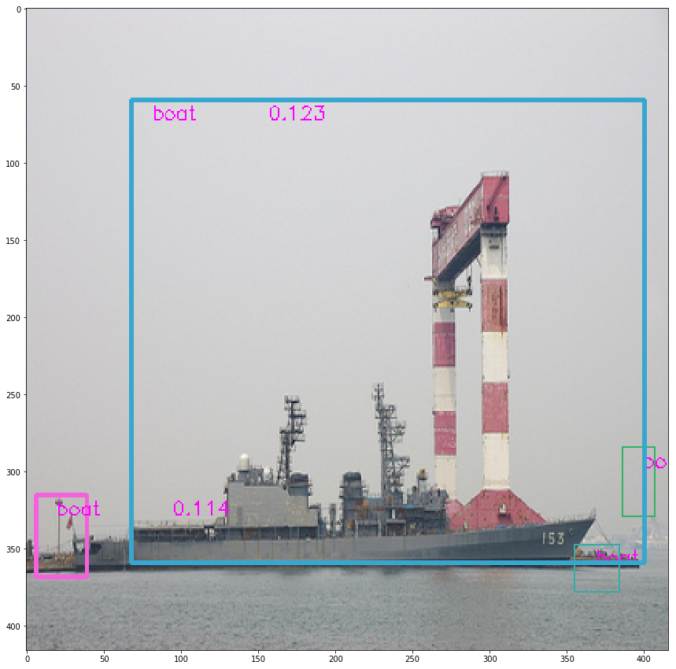
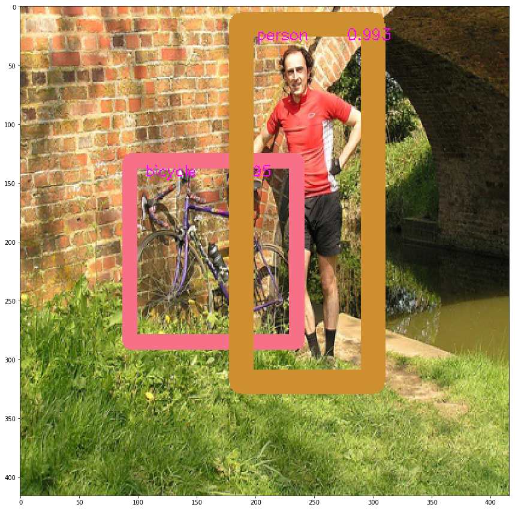
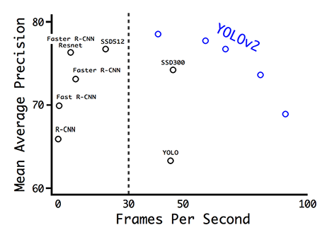

# Tensorflow Implementation of YOLOv2
Download dataset
```bash
$ wget http://host.robots.ox.ac.uk/pascal/VOC/voc2012/VOCtrainval_11-May-2012.tar
$ tar -xvf  'VOCtrainval_11-May-2012.tar'
```
Also download weights
```bash 
$ wget https://pjreddie.com/media/files/yolov2.weights
```
## Usage
```bash
$ python3 main.py --epochs 50 --batch_size 32
```
> **_NOTE:_** on Colab Notebook use following command:
```python
!git clone link-to-repo
%run main.py --epochs 50 --batch_size 32
```
## Contributed by:
* [Mridul Dubey](https://github.com/mridul911)
## References

* **Title**: YOLO9000:Better, Faster, Stronger
* **Authors**: Joseph Redmon, Ali Farhadi
* **Link**: https://arxiv.org/pdf/1612.08242.pdf
* **Tags**: Neural Network, RCNN
* **Year**: 2016

# Summary

## Why new Model(Drawbacks of YOLOv1)

* YOLOv1 imposes strong spatial constraints on bounding box predictions since each grid cell only predicts two boxes and can only have one class. This spatial constraint limits the number of nearby objects that our model can predict. Model struggles with small objects that appear in groups, such as flocks of birds. Since the model learns to predict bounding boxes from data, it struggles to generalize to objects in new or unusual aspect ratios or configurations.  Model also uses relatively coarse features for predicting bounding boxes since their architecture has multiple downsampling layers from the input image. Finally, while  train on a loss function that approximates detection performance, their loss function treats errors the same in small bounding boxes versus large bounding boxes. A small error in a large box is generally benign but a small error in a small box has a much greater effect on IOU. The main source of error is incorrect localizations

## Introduction 
Main purpose of a object detector is to be fast and accurate and able to recognize wide dataset.So they suggest a new model with some features modified as well as added to fulfill its purpose

## Accuracy improvement
### 1-Batch normalization
   Add batch normalization in convolution layers. This removes the need for dropouts and pushes mAP up 2%.
### 2-Convolutional with Anchor Boxes

* As indicated in the YOLO paper, the early training is susceptible to unstable gradients. Initially, YOLO makes arbitrary guesses on the boundary boxes. These guesses may work well for some objects but badly for others resulting in steep gradient changes. In early training, predictions are fighting with each other on what shapes to specialize on.
* YOLO predicts the coordinates of bounding boxes directly using fully connected layers on top of the convolutional feature extractor. Predicting offsets instead of coordinates simplifies the problem and makes it easier for the network to learn. We remove the fully connected layers from YOLO and use anchor boxes to predict bounding boxes. Using anchor boxes we get a small decrease in accuracy.
* Instead of choosing priors by hand, we run k-means clustering on the training set bounding boxes to automatically find good priors. If we use standard k-means with Euclidean distance learger boxes generate more error than smaller boxes. However, what we really want are priros that lead to good IOU scores, which is indepedndent of the size of the box. Thus for our distance metric we use 1 - IOU(box,centroid). This is how they chooses anchor box...

### 3-High-resolution classifier
The YOLO training composes of 2 phases. First, we train a classifier network like VGG16. Then we replace the fully connected layers with a convolution layer and retrain it end-to-end for the object detection. YOLO trains the classifier with 224 × 224 pictures followed by 448 × 448 pictures for the object detection. YOLOv2 starts with 224 × 224 pictures for the classifier training but then retune the classifier again with 448 × 448 pictures using much fewer epochs. This makes the detector training easier and moves mAP up by 4%.

### 4-Capability improvement

They suggest a method to predict bounding boxes of the 9000 most common classes in ImageNet. They add a few more abstract classes to that (e.g. dog for all breeds of dogs) and arrive at over 9000 classes (9418 to be precise).
They train on ImageNet and MSCOCO.

### 5-Direct location prediction
* YOLOv1 does not have constraints on location prediction which makes the model unstable at early iterations. The predicted bounding box can be far from the original grid location.
* YOLOv2 bounds the location using logistic activation σ, which makes the value fall between 0 to 1:

### Model Summary
```
__________________________________________________________________________________________________
Layer (type)                    Output Shape         Param #     Connected to                     
==================================================================================================
input_image (InputLayer)        (None, 416, 416, 3)  0                                            
__________________________________________________________________________________________________
conv_1 (Conv2D)                 (None, 416, 416, 32) 864         input_image[0][0]                
__________________________________________________________________________________________________
norm_1 (BatchNormalization)     (None, 416, 416, 32) 128         conv_1[0][0]                     
__________________________________________________________________________________________________
leaky_re_lu_23 (LeakyReLU)      (None, 416, 416, 32) 0           norm_1[0][0]                     
__________________________________________________________________________________________________
maxpool1_416to208 (MaxPooling2D (None, 208, 208, 32) 0           leaky_re_lu_23[0][0]             
__________________________________________________________________________________________________
conv_2 (Conv2D)                 (None, 208, 208, 64) 18432       maxpool1_416to208[0][0]          
__________________________________________________________________________________________________
norm_2 (BatchNormalization)     (None, 208, 208, 64) 256         conv_2[0][0]                     
__________________________________________________________________________________________________
leaky_re_lu_24 (LeakyReLU)      (None, 208, 208, 64) 0           norm_2[0][0]                     
__________________________________________________________________________________________________
maxpool1_208to104 (MaxPooling2D (None, 104, 104, 64) 0           leaky_re_lu_24[0][0]             
__________________________________________________________________________________________________
conv_3 (Conv2D)                 (None, 104, 104, 128 73728       maxpool1_208to104[0][0]          
__________________________________________________________________________________________________
norm_3 (BatchNormalization)     (None, 104, 104, 128 512         conv_3[0][0]                     
__________________________________________________________________________________________________
leaky_re_lu_25 (LeakyReLU)      (None, 104, 104, 128 0           norm_3[0][0]                     
__________________________________________________________________________________________________
conv_4 (Conv2D)                 (None, 104, 104, 64) 8192        leaky_re_lu_25[0][0]             
__________________________________________________________________________________________________
norm_4 (BatchNormalization)     (None, 104, 104, 64) 256         conv_4[0][0]                     
__________________________________________________________________________________________________
leaky_re_lu_26 (LeakyReLU)      (None, 104, 104, 64) 0           norm_4[0][0]                     
__________________________________________________________________________________________________
conv_5 (Conv2D)                 (None, 104, 104, 128 73728       leaky_re_lu_26[0][0]             
__________________________________________________________________________________________________
norm_5 (BatchNormalization)     (None, 104, 104, 128 512         conv_5[0][0]                     
__________________________________________________________________________________________________
leaky_re_lu_27 (LeakyReLU)      (None, 104, 104, 128 0           norm_5[0][0]                     
__________________________________________________________________________________________________
maxpool1_104to52 (MaxPooling2D) (None, 52, 52, 128)  0           leaky_re_lu_27[0][0]             
__________________________________________________________________________________________________
conv_6 (Conv2D)                 (None, 52, 52, 256)  294912      maxpool1_104to52[0][0]           
__________________________________________________________________________________________________
norm_6 (BatchNormalization)     (None, 52, 52, 256)  1024        conv_6[0][0]                     
__________________________________________________________________________________________________
leaky_re_lu_28 (LeakyReLU)      (None, 52, 52, 256)  0           norm_6[0][0]                     
__________________________________________________________________________________________________
conv_7 (Conv2D)                 (None, 52, 52, 128)  32768       leaky_re_lu_28[0][0]             
__________________________________________________________________________________________________
norm_7 (BatchNormalization)     (None, 52, 52, 128)  512         conv_7[0][0]                     
__________________________________________________________________________________________________
leaky_re_lu_29 (LeakyReLU)      (None, 52, 52, 128)  0           norm_7[0][0]                     
__________________________________________________________________________________________________
conv_8 (Conv2D)                 (None, 52, 52, 256)  294912      leaky_re_lu_29[0][0]             
__________________________________________________________________________________________________
norm_8 (BatchNormalization)     (None, 52, 52, 256)  1024        conv_8[0][0]                     
__________________________________________________________________________________________________
leaky_re_lu_30 (LeakyReLU)      (None, 52, 52, 256)  0           norm_8[0][0]                     
__________________________________________________________________________________________________
maxpool1_52to26 (MaxPooling2D)  (None, 26, 26, 256)  0           leaky_re_lu_30[0][0]             
__________________________________________________________________________________________________
conv_9 (Conv2D)                 (None, 26, 26, 512)  1179648     maxpool1_52to26[0][0]            
__________________________________________________________________________________________________
norm_9 (BatchNormalization)     (None, 26, 26, 512)  2048        conv_9[0][0]                     
__________________________________________________________________________________________________
leaky_re_lu_31 (LeakyReLU)      (None, 26, 26, 512)  0           norm_9[0][0]                     
__________________________________________________________________________________________________
conv_10 (Conv2D)                (None, 26, 26, 256)  131072      leaky_re_lu_31[0][0]             
__________________________________________________________________________________________________
norm_10 (BatchNormalization)    (None, 26, 26, 256)  1024        conv_10[0][0]                    
__________________________________________________________________________________________________
leaky_re_lu_32 (LeakyReLU)      (None, 26, 26, 256)  0           norm_10[0][0]                    
__________________________________________________________________________________________________
conv_11 (Conv2D)                (None, 26, 26, 512)  1179648     leaky_re_lu_32[0][0]             
__________________________________________________________________________________________________
norm_11 (BatchNormalization)    (None, 26, 26, 512)  2048        conv_11[0][0]                    
__________________________________________________________________________________________________
leaky_re_lu_33 (LeakyReLU)      (None, 26, 26, 512)  0           norm_11[0][0]                    
__________________________________________________________________________________________________
conv_12 (Conv2D)                (None, 26, 26, 256)  131072      leaky_re_lu_33[0][0]             
__________________________________________________________________________________________________
norm_12 (BatchNormalization)    (None, 26, 26, 256)  1024        conv_12[0][0]                    
__________________________________________________________________________________________________
leaky_re_lu_34 (LeakyReLU)      (None, 26, 26, 256)  0           norm_12[0][0]                    
__________________________________________________________________________________________________
conv_13 (Conv2D)                (None, 26, 26, 512)  1179648     leaky_re_lu_34[0][0]             
__________________________________________________________________________________________________
norm_13 (BatchNormalization)    (None, 26, 26, 512)  2048        conv_13[0][0]                    
__________________________________________________________________________________________________
leaky_re_lu_35 (LeakyReLU)      (None, 26, 26, 512)  0           norm_13[0][0]                    
__________________________________________________________________________________________________
maxpool1_26to13 (MaxPooling2D)  (None, 13, 13, 512)  0           leaky_re_lu_35[0][0]             
__________________________________________________________________________________________________
conv_14 (Conv2D)                (None, 13, 13, 1024) 4718592     maxpool1_26to13[0][0]            
__________________________________________________________________________________________________
norm_14 (BatchNormalization)    (None, 13, 13, 1024) 4096        conv_14[0][0]                    
__________________________________________________________________________________________________
leaky_re_lu_36 (LeakyReLU)      (None, 13, 13, 1024) 0           norm_14[0][0]                    
__________________________________________________________________________________________________
conv_15 (Conv2D)                (None, 13, 13, 512)  524288      leaky_re_lu_36[0][0]             
__________________________________________________________________________________________________
norm_15 (BatchNormalization)    (None, 13, 13, 512)  2048        conv_15[0][0]                    
__________________________________________________________________________________________________
leaky_re_lu_37 (LeakyReLU)      (None, 13, 13, 512)  0           norm_15[0][0]                    
__________________________________________________________________________________________________
conv_16 (Conv2D)                (None, 13, 13, 1024) 4718592     leaky_re_lu_37[0][0]             
__________________________________________________________________________________________________
norm_16 (BatchNormalization)    (None, 13, 13, 1024) 4096        conv_16[0][0]                    
__________________________________________________________________________________________________
leaky_re_lu_38 (LeakyReLU)      (None, 13, 13, 1024) 0           norm_16[0][0]                    
__________________________________________________________________________________________________
conv_17 (Conv2D)                (None, 13, 13, 512)  524288      leaky_re_lu_38[0][0]             
__________________________________________________________________________________________________
norm_17 (BatchNormalization)    (None, 13, 13, 512)  2048        conv_17[0][0]                    
__________________________________________________________________________________________________
leaky_re_lu_39 (LeakyReLU)      (None, 13, 13, 512)  0           norm_17[0][0]                    
__________________________________________________________________________________________________
conv_18 (Conv2D)                (None, 13, 13, 1024) 4718592     leaky_re_lu_39[0][0]             
__________________________________________________________________________________________________
norm_18 (BatchNormalization)    (None, 13, 13, 1024) 4096        conv_18[0][0]                    
__________________________________________________________________________________________________
leaky_re_lu_40 (LeakyReLU)      (None, 13, 13, 1024) 0           norm_18[0][0]                    
__________________________________________________________________________________________________
conv_19 (Conv2D)                (None, 13, 13, 1024) 9437184     leaky_re_lu_40[0][0]             
__________________________________________________________________________________________________
norm_19 (BatchNormalization)    (None, 13, 13, 1024) 4096        conv_19[0][0]                    
__________________________________________________________________________________________________
conv_21 (Conv2D)                (None, 26, 26, 64)   32768       leaky_re_lu_35[0][0]             
__________________________________________________________________________________________________
leaky_re_lu_41 (LeakyReLU)      (None, 13, 13, 1024) 0           norm_19[0][0]                    
__________________________________________________________________________________________________
norm_21 (BatchNormalization)    (None, 26, 26, 64)   256         conv_21[0][0]                    
__________________________________________________________________________________________________
conv_20 (Conv2D)                (None, 13, 13, 1024) 9437184     leaky_re_lu_41[0][0]             
__________________________________________________________________________________________________
leaky_re_lu_43 (LeakyReLU)      (None, 26, 26, 64)   0           norm_21[0][0]                    
__________________________________________________________________________________________________
norm_20 (BatchNormalization)    (None, 13, 13, 1024) 4096        conv_20[0][0]                    
__________________________________________________________________________________________________
lambda_2 (Lambda)               (None, 13, 13, 256)  0           leaky_re_lu_43[0][0]             
__________________________________________________________________________________________________
leaky_re_lu_42 (LeakyReLU)      (None, 13, 13, 1024) 0           norm_20[0][0]                    
__________________________________________________________________________________________________
concatenate_2 (Concatenate)     (None, 13, 13, 1280) 0           lambda_2[0][0]                   
                                                                 leaky_re_lu_42[0][0]             
__________________________________________________________________________________________________
conv_22 (Conv2D)                (None, 13, 13, 1024) 11796480    concatenate_2[0][0]              
__________________________________________________________________________________________________
norm_22 (BatchNormalization)    (None, 13, 13, 1024) 4096        conv_22[0][0]                    
__________________________________________________________________________________________________
leaky_re_lu_44 (LeakyReLU)      (None, 13, 13, 1024) 0           norm_22[0][0]                    
__________________________________________________________________________________________________
conv_23 (Conv2D)                (None, 13, 13, 100)  102500      leaky_re_lu_44[0][0]             
__________________________________________________________________________________________________
final_output (Reshape)          (None, 13, 13, 4, 25 0           conv_23[0][0]                    
__________________________________________________________________________________________________
input_hack (InputLayer)         (None, 1, 1, 1, 50,  0                                            
__________________________________________________________________________________________________
hack_layer (Lambda)             (None, 13, 13, 4, 25 0           final_output[0][0]               
                                                                 input_hack[0][0]                 
==================================================================================================
Total params: 50,650,436
Trainable params: 102,500
Non-trainable params: 50,547,936
```
I have trained a YOLOv2 model from scratch on VOC2012 dataset till 50 epoch


# Results

## Images after 50 epoch(VOC 2012)





## Accuracy and speed of Model(VOC 2007)


