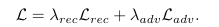
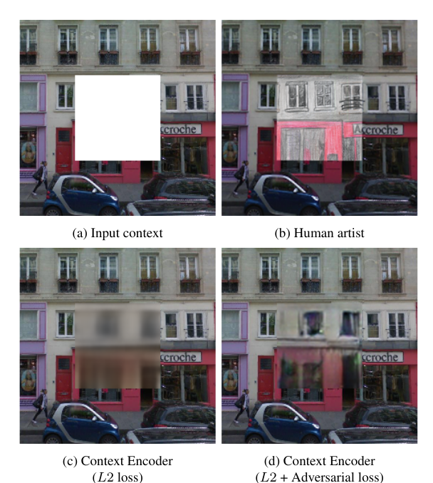
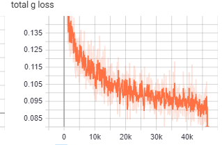
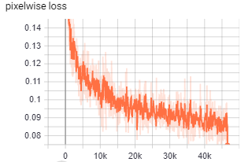
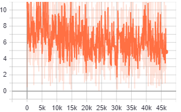
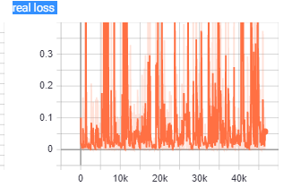
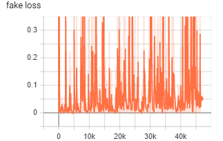
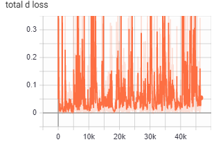
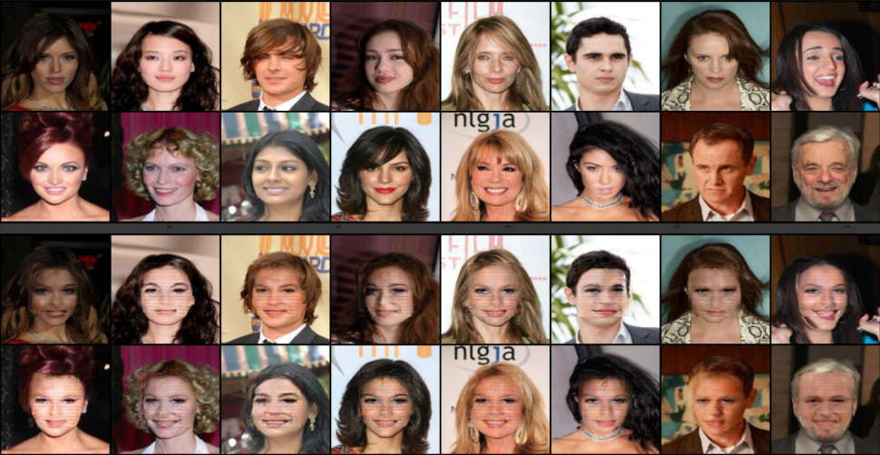
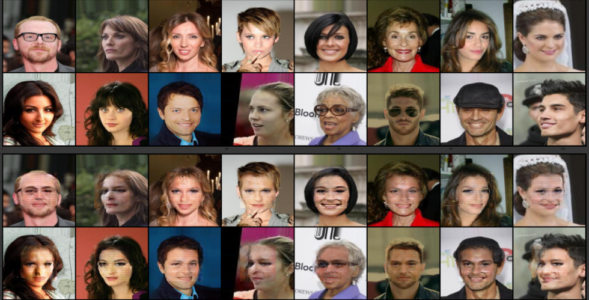

# PyTorch Implementaion of Context Encoder (CelebA) dataset

## Usage


### NOTE: if you are using the celeba dataset,follow these instructions to install the dataset.

```python
!mkdir data && wget https://s3-us-west-1.amazonaws.com/udacity-dlnfd/datasets/celeba.zip 
with zipfile.ZipFile("celeba.zip","r") as zip_ref:
  zip_ref.extractall("data/")
```
Start tensor board with :
```python
tensorboard --logdir=summaries
```
Clone the repo with :
 ```git clone link-to-repo```

```python
python3 main.py [-h] [--in_channels IN_CHANNELS] [--epochs EPOCHS] [--train_batch_size TRAIN_BATCH_SIZE] [--base_g_lr BASE_G_LR]
               [--base_d_lr BASE_D_LR] [--beta_1 BETA_1] [--beta_2 BETA_2] [--dataset_name DATASET_NAME] [--mask_size MASK_SIZE]
               [--device DEVICE] [--num_workers NUM_WORKERS] [--test_batch_size TEST_BATCH_SIZE] [--writer_directory WRITER_DIRECTORY]
               [--label_smoothing LABEL_SMOOTHING] [--save_frequency SAVE_FREQUENCY]
               [--lamda_adv LAMDA_ADV]
```
```
optional arguments:
  -h, --help            show this help message and exit
  --in_channels IN_CHANNELS
                        number of channels in input image
  --epochs EPOCHS       nmber of epochs to train for
  --train_batch_size TRAIN_BATCH_SIZE
                        batch size of train set
  --base_g_lr BASE_G_LR
                        learning rate for generator
  --base_d_lr BASE_D_LR
                        learning rate for discriminator
  --beta_1 BETA_1       beta-1 for optmizers
  --beta_2 BETA_2       beta-2 for optmizers
  --dataset_name DATASET_NAME
                        dataset name
  --mask_size MASK_SIZE
                        size of mask applied to images
  --device DEVICE       device on which model is to be run on
  --num_workers NUM_WORKERS
                        standard num_workers argument in dataloader
  --test_batch_size TEST_BATCH_SIZE
                        batch size of test set
  --writer_directory WRITER_DIRECTORY
                        writing directory for tensorboard
  --label_smoothing LABEL_SMOOTHING
                        implements label smoothing if set as "True"
  --save_frequency SAVE_FREQUENCY
                        interval for logging images in tensorboard
  --lamda_adv LAMDA_ADV
                       lamda_adv in the loss function                    
                        
```
In a Colab Notebook, use 
```python
!git clone link-to-repo
%load_ext tensorboard
%tensorboard --logdir #insert writer_directory argument (default is runs)
%run main.py #Insert arguments here 
```
## References 

- Context Encoders: Feature Learning by Inpainting : [Pathak et. al.](https://arxiv.org/abs/1604.07379)

## Contributed by :

-[ Pramodh Gopalan ](https://github.com/learnedfool)

## Summary 

Feature inpainting in simple words,means that you are using some "entity" to fill in images which have empty spaces in them.This field has been around for a long time,and it used computer vision to solve the problem. In this paper,we attempt to do the same using convolutional neural networks,and involve some concepts taken from GANs to make the results better.

The concept of using a convolutional network to model inpainting in the form of a generator and discriminator has been taken from [DCGAN](https://arxiv.org/abs/1511.06434),and using a encoder-decoder network as a part of the generator from the [VAE](https://arxiv.org/abs/1312.6114).Lets take a dive into the finer aspects of this paper.

## Basic architecture :

Like most GAN architectures,it contains a Generator and a Discriminator,Let's divide them into two seperate parts:

### Generator :

The generator itself consists of two parts,which are similiar to the encoder and decoder network as mentioned in the VAE paper linked above. An input image consisting of a blank part(we use slicing to split the image into two parts,a complete image except for a blank space in the picture,and the corresponding smaller picture,that would perfectly fill that gap)(The aim of the network is to fill this blank part with a comprehensible image) is fed into the "encoder",which uses convolutional downsampling(No Maxpool layers,all reductions in dimensions are provided by taking stride > 1 ).This encoding converts the image into a compressed representation of itself. This encoded output is then fed into the "decoder" which reconstructs the blank part of the image.The image is reconstructed using upsampling layers,drawing inspiration from the DCGAN paper linked above.


### Discriminator : 

The discriminator is a standard discriminator mentioned in the DCGAN paper,it takes in the predicted image from the generator,and classifies it as real(1) or fake (0),using a convolutional net involving downsampling using striding(Once again,no pooling layers are used).


## The loss function :

The loss functon used in the network looks somewhat like this : 



Let's take it step by step.There are 2 losses involved here,L_adv and L_rec.L_rec is a standard MSE loss,in which the arguments are :

- The predicted image by the generator
- The ground truth image which we get after processing the Dataset.

This loss penalizes the network if the output is not approximately close enough to the real picture(Pixelwise loss is calcaulted).

L_adv is the BCE loss function commonly used in GANs to discriminate between real and fake generators.

L_adv ensures the sharpness and relevance of the image. As an example,take a look at this:




## Model Specifications and training :

- The neural nets were trained on the CelebA dataset,with the following specifications : 

  - train batch size : 64
  - Test batch size  : 16
  - dataset split : (5000(Test)/195000(Train))

- Model Specifications : 
  
  - inputs were reshaped to (128,128) pixels,and the mask size(length and width of the blank space) used was 64.
  - The model architecture can be found in the code.The architecture adheres to the rules set in the DCGAN paper.

- Optimizer specifications :

  - `optim.Adam` rules!.Both the discriminator and the generator used adam optimizers,with learning rates of 1e-4 and 2.5e-4 respectively.Both shared a common 
     beta initialization of (.5,.99)

- Runtime specifications : 

  - The model trained for 12 epochs or so, and it took about a good 2 hours for that to happen (The models were trained on Colab GPU's).We used a tensorboard logger to display the losses and the results on the test data as it trained.

## Loss graphs : 

The losses were mapped as follows :

total generator loss(Combines both pixelwise and adversarial loss ) :



Pixel Wise loss for generator : 



Adversarial loss for generator: 



Fake loss (How well the discriminator classifies fake samples as fake): 



Fake loss (How well the discriminator classifies real samples as real): 



Total discriminator loss : 



## Results :

the first two rows in each image correspond to the real images,while the next two rows correspond to generated images.
(You can tell I'm not cheating because the generator made Zac Efron a woman, and I don't have the imagination to pull that off)




