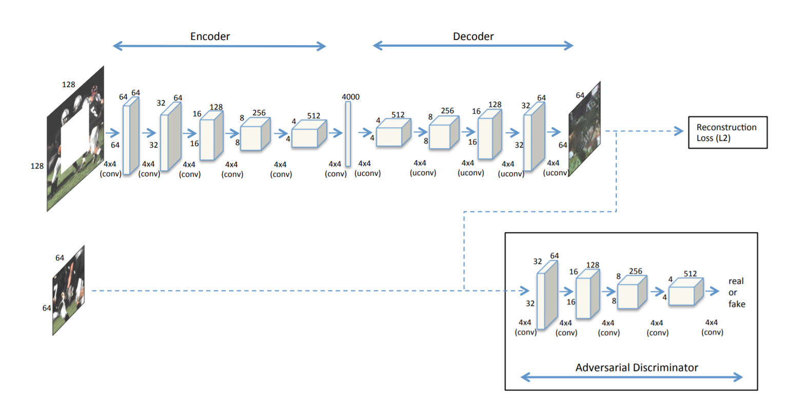
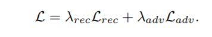
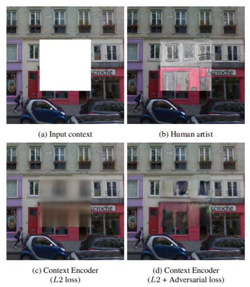
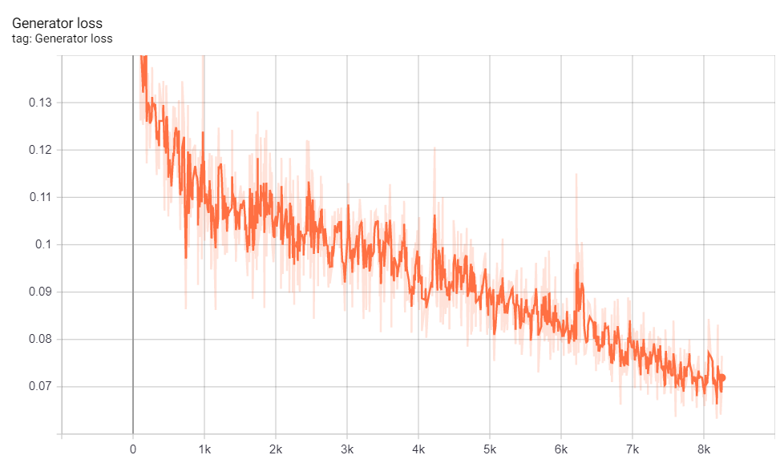
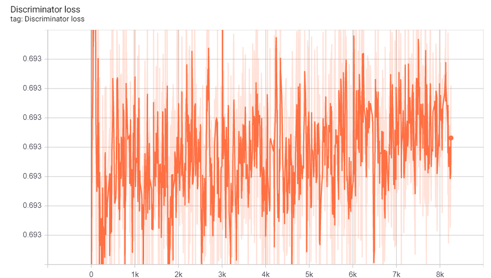
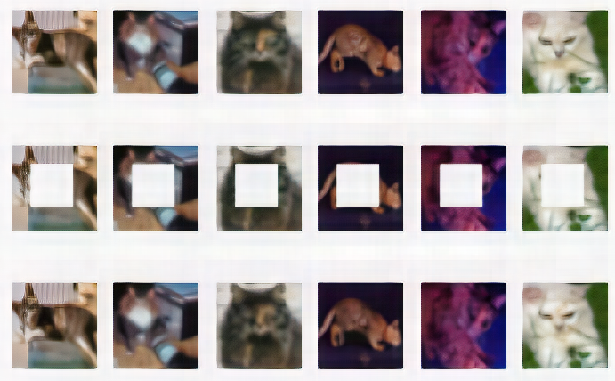

# TENSORFLOW IMPLEMENTATION OF Context Encoders

## Usage:
```bash
$ python3 train.py
```
>**_NOTE_** On Notebook use :
```python
!git clone link-to-repo
%run train.py
```

## Help Log:
```
usage: train.py [-h] [--learning_rate_g LEARNING_RATE_G]
                [--learning_rate_d LEARNING_RATE_D] [--n_epoch N_EPOCH]
                [--batch_size BATCH_SIZE] [--num_img NUM_IMG]
                [--lambda_adv LAMBDA_ADV] [--mask_height MASK_HEIGHT]
                [--mask_width MASK_WIDTH] [--samples_dir SAMPLES_DIR]
                [--save_dir SAVE_DIR]

optional arguments:
  -h, --help            show this help message and exit
  --learning_rate_g LEARNING_RATE_G
                        learning rate for generator
  --learning_rate_d LEARNING_RATE_D
                        learning rate for discriminator
  --n_epoch N_EPOCH     max # of epoch
  --batch_size BATCH_SIZE
                        # of batch size
  --num_img NUM_IMG     # Number of images to be generated
  --lambda_adv LAMBDA_ADV
                        Weightage for Adversarial loss
  --mask_height MASK_HEIGHT
                        Masked portion height
  --mask_width MASK_WIDTH
                        Masked portion width
  --samples_dir SAMPLES_DIR
                        directory for sample output
  --save_dir SAVE_DIR   directory for checkpoint models

```

## Contributed by:
* [Akshay Gupta](https://github.com/akshay-gupta123)

## Refrence :
* **Title** : Context Encoders: Feature Learning by Inpainting
* **Link** : https://arxiv.org/abs/1604.07379v1.pdf
* **Author** : Deepak Pathak, Phillip Krahenbulh, Jeff Donahue, Trevor Darell, Alexie A. Efros
* **Tags** : Neural Network,Genreative Adversirial Network,Inpainting
* **Published** : 25 April, 2016

# Summary:

## Introduction:

Image inpainting is the art of reconstructing damaged/missing parts of an image and can be extended to videos easily. Producing images where the missing parts have been filled with bothvisually and semantically plausible appeal  is the main objective of an artificial image inpainter.<br> 
Before Deep learning , computer vision is used for that purpose. It’s worth noting that these techniques are good at inpainting backgrounds in an image but fail to generalize.<br>
In modern approach, we train a neural network to predict missing parts of an image such that the predictions are both visually and semantically consistent.

## Architecture:

The whole architecture comprises of two parts Generator and Discriminator like a GAN model, where Generator tries to generate the missing part which looks real and sementically consistent whereas Disriminator tries to distinguish between a real image and fake image.<br>
Generator itself consist of two parts an Encoder and a Decoder. Encoder capturing the context of
an image into a compact latent feature representation and a decoder which uses that representation to produce the missing image content. 

**Encoder:** 

Encoder acrhitecture is derived from AlexNet architecture . Paper was designed for image size 227x227 but I used 32x32 image of Cifar10 . Moreover, If architecture is limited only to Convolutional layer , their is no way for imformation to directly propagate from one corner of feature to another.This is so because convolutional layers connect all the feature maps together, but never directly connect all locations within a specific feature map. In the present architectures, this information propagation is handled by fullyconnected or inner product layers, where all the activations are directly connected to each otherThis is so because convolutional layers connect all the feature maps together, but never directly connect all locations within a specific feature map. In the present architectures, this information propagation is handled by fullyconnected or inner product layers, where all the activations
are directly connected to each other. 

**Decoder:** 

Now comes Decoder, that generate the missing part using Encoder. The <strong>Encoder features</strong>
are connected to <strong>Decoder features</strong> using a chanell wise fully connected layer.
Decoder consist of up-convolution layers with learned filters each with a ReLu activation function.



## Loss Function:

The loss function used in paper is actually a combination of two losses Mean Square loss and Adversarial loss.



-Reconstruction loss or Mean Square loss calculates the L2 distance between the original masked portion and portion generated by the model.It is used to penalize the model if generated image not seems to be close the original one.<br>
- Adversarial loss is actually binary_crossentropy loss which takes generated masked portion and determine how much it look likes the original one.It used to give sharpness to generated images where MSE is lacking.<br>
Lambda_adv and Lamba_rec are hyperparameters to decide weightage to each loss.


 
## Results

**Default values used in Training Model**

* Learinig rate for Generator - 5e-4
* Learning rate for Discriminator - 1e-4
* Number of epochs - 20
* Mask size - 16x16
* Lamda_adv - 1e-3
* Batch_size - 64

**Loss Graph For whole Dataset**





**Image Generated after 25 epochs on Cat Pictures**




First row is of Real images , second represent masked image and last one represent generates image<br>
<em> These result are generated by taking cat images only from Cifar10 and using centre cropping</em><br> 
<em>Similiar result can be obtained for whole dataset using random cropping requiring more number of epochs as seen from graph model is learning.</em>
