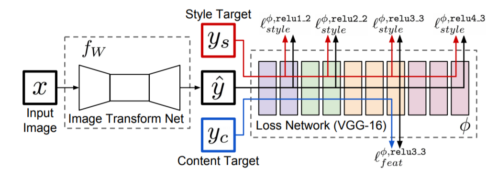
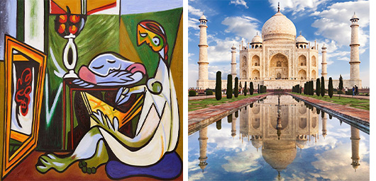
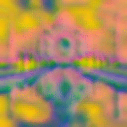
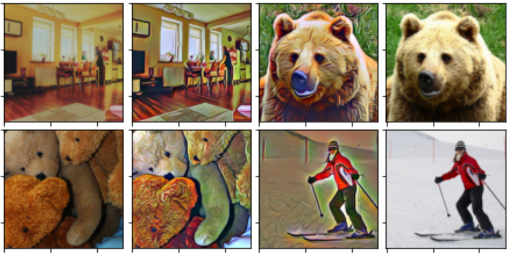
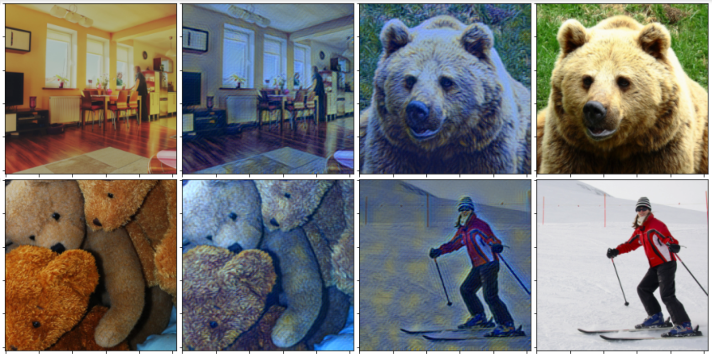
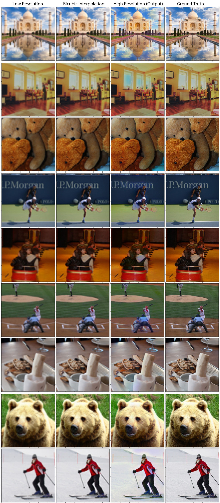

# PyTorch Implementation of Perceptual Losses for Real-Time Style Transfer and Super Resolution

### Usage
```bash
$ python3 main.py
```
The arguments are as follows:
```python
usage: main.py [-h] [--mode {style_transfer,super_resolution}] [--batch_size BATCH_SIZE] [--image_size IMAGE_SIZE]
               [--split {train,validation,test}] [--in_channels IN_CHANNELS] [--init_features INIT_FEATURES]
               [--num_residuals NUM_RESIDUALS] [--upscale_factor {4,8}] [--style_image STYLE_IMAGE] [--content_image CONTENT_IMAGE]    
               [--content_weight CONTENT_WEIGHT] [--style_weights STYLE_WEIGHTS [STYLE_WEIGHTS ...]] [--reg_weight REG_WEIGHT]
               [--iterations ITERATIONS] [--lr LR] [--log_step LOG_STEP] [--save_step SAVE_STEP] [--samples SAMPLES]
               [--sample_path SAMPLE_PATH] [--model_path MODEL_PATH] [--device DEVICE] [--num_workers NUM_WORKERS]

optional arguments:
  -h, --help            show this help message and exit
  --mode {style_transfer,super_resolution}
  --batch_size BATCH_SIZE
  --image_size IMAGE_SIZE
  --split {train,validation,test}
  --in_channels IN_CHANNELS
  --init_features INIT_FEATURES
  --num_residuals NUM_RESIDUALS
  --upscale_factor {4,8}
  --style_image STYLE_IMAGE
  --content_image CONTENT_IMAGE
  --content_weight CONTENT_WEIGHT
  --style_weights STYLE_WEIGHTS [STYLE_WEIGHTS ...]
  --reg_weight REG_WEIGHT
  --iterations ITERATIONS
  --lr LR
  --log_step LOG_STEP
  --save_step SAVE_STEP
  --samples SAMPLES
  --sample_path SAMPLE_PATH
  --model_path MODEL_PATH
  --device DEVICE
  --num_workers NUM_WORKERS
```

### Contributed by:
* [Rishav Bikarwar](https://github.com/ris27hav)

### References
* **Title**: Perceptual Losses for Real-Time Style Transfer and Super-Resolution
* **Authors**: Justin Johnson et. al.
* **Link**: https://arxiv.org/abs/1603.08155
* **Tags**: Style tranfer, super-resolution, deep learning
* **Year**: 2016
<p>&nbsp;</p>

# Summary

## Introduction

In image transformation problems, an input image is transformed into an output image. Recent methods for such problems typically train feed-forward convolutional neural networks using a per-pixel loss between the output and ground-truth images.

This paper proposes the use of perceptual loss functions for training feed-forward networks for image transformation tasks, instead of using per-pixel loss functions.
>**Per-pixel loss functions:**
>Comparing two images based on their individual pixel values.
>So, if two images, that are perceptually the same, but different from each other based on even one pixel, then based on per-pixel loss functions they will be very different from each other.

>**Perceptual loss functions:**
>Comparing two images based on high-level representations from pretrained Convolutional Neural Networks (trained on Image Classification tasks) such as VGG-16.

The authors evaluate this approach on two image transformation tasks:

* **Style Transfer** - they train feed-forward networks that try to solve the optimization problem proposed by Gatys et al. 2015. Compared to the optimization-based method, their network gives similar qualitative results but is three orders of magnitude faster. 
* **Single-Image Super Resolution** - they experiment with using perceptual losses, and show that it gives more visually pleasing results than using per-pixel loss functions.

<p>&nbsp;</p>

## Method
<p align="center"><br>(Fig.1) System overview.</p>

The system consists of two components: an *image transformation network fW* and a *loss network φ* that is used to define several *loss functions l1, ..., lk*. The image transformation network is a deep residual convolutional neural network parameterized by weights W; it transforms input images x into output images y_hat via the mapping y_hat = fW(x). Each loss function computes a scalar value li(y_hat, yi) measuring the difference between the output image y_hat and a target image yi. The image transformation network is trained using stochastic gradient descent to minimize a weighted combination of loss functions:
<p align="center"></p>

### Image Transform Networks
<p align="center"><br>(Fig.2) Image Tranformation Network Architecture for Style Transfer (<i>left</i>) and Super Resolution (<i>right</i>).</p>

### Perceptual Loss Functions
1. **Feature Reconstruction Loss** : penalizes the output image y_hat when it deviates in content from the target y. It is the (squared, normalized) Euclidean distance between feature representations:
<p align="center"></p>

2. **Style Reconstruction Loss** : penalize differences in style: colors, textures, common patterns, etc. It is the squared Frobenius norm of the difference between the Gram matrices(shown below) of the output and target images:
<p align="center"><br></p>

<p>&nbsp;</p>

## Implementation

### Style Transfer

The goal of style transfer is to generate an image y_hat that combines the content of a target content image yc with the the style of a target style image ys. One image transformation network is trained per style target for several hand-picked style targets.
For training, the MS COCO dataset is used which contains ~80k images. The images are resized to 256x256 pixels and are used as target content image.
The feature reconstruction loss is computed at layer relu2_2 and the style reconstruction loss is computed at layers relu1_2, relu2_2, relu3_3, and relu4_3 of the VGG-16 loss network.


### Super Resolution

In single-image super-resolution, the task is to generate a high-resolution output image from a low-resolution input. The network is trained by minimizing the feature reconstruction at layer relu2_2 of the VGG-16 loss network φ. Training is done with 288x288 patches from 5k images from the MS-COCO validation set. The low-resolution inputs are prepared by downsampling with bicubic interpolation.
For x4 upscaling, images of size 72x72 is prepared and for x8 upscaling, images of size 36x36 is prepared for input.
As a post-processing step, histogram matching is performed between the network output and the low-resolution input.

<p>&nbsp;</p>

## Results

### Style Transfer

The model was trained for 15k iterations each with "*edtaonisl*", "*the_muse*" and "*the_starry_night*" images as style image. The gif shows the evolution of the generated image during the training.

<p align="center">
  Style Image : EDTAONISL<br>
  <br>
  
</p>

---

<p align="center"> 
  Style Image : THE MUSE<br>
  <br>
  
</p>

---

<p align="center"> 
  Style Image : THE STARRY NIGHT<br>
  <br>
  
</p>

The perceptual loss functions have done the job they were intended to do. The style transfer model is able to reproduce the style of the target image faster with visually pleasing results.

Giving more weight to style loss for "*the_muse*" would give better styling results. Moreover training for more iterations would give higher quality images. One drawback of this method is that we have to train one network per style, i.e. cannot perform arbitrary style transfer with just one network.

<p>&nbsp;</p>

### Super Resolution

The Super Resolution model gives following results on training for 40k iteration with x4 upscaling.
> Note : The low resolution image is resized to 288x288 pixels using bilinear interpolation to fit with other images. So, it is poorer in quality than it is shown in the figure.

<p align="center">

</p>

The authors trained the model for 200k iterations. So the above results would be significantly improved if trained for more iterations. Also I used just 5k training images whereas the authors used 10k selected images from the training set. But the results are still promising.