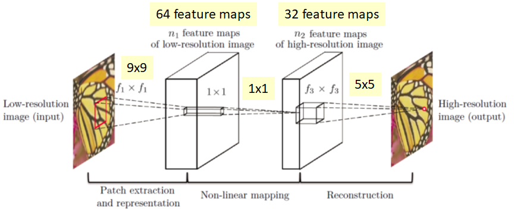
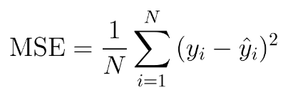
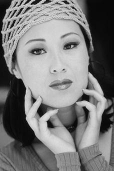
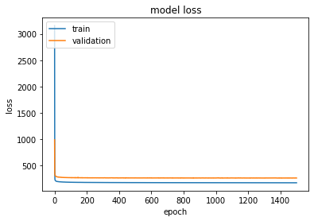

# Tensorflow implementation of SRCNN
## Usage
```bash
$ python3 main.py --Epochs 1500 --Image_patch_size 33
```
> ***NOTE***: on Colab Notebook use following command:
```python
!git clone link-to-repo
%run main.py --Epochs 1500 --Image_patch_size 33
```
## Help Log
```
usage: main.py [-h] [--Epochs Epochs]
               [--Image_patch_size Image_patch_size] 
               [--BATCH_SIZE BATCH_SIZE] [--Stride stride]
               [--lr learning_rate][--Scale scale]
               [--is_training is_training][--dirname_train dirname_train]
               [--dirname_test dirname_test]

optional arguments:
  -h, --help                                         show this help message and exit  
  --Epochs Epochs                                    No of epochs: default 1500
  --Image_patch_size Image_patch_size                size of the patch to be used for training: default 33  
  --BATCH_SIZE BATCH_SIZE                            Batch size, default 128 
  --Stride stride                                    Stride used when selecting patches of image_patch_size from
                                                     a image:default 14                                                    
  --lr learning_rate                                 learning rate of the optimizer: default 0.0001 
  --Scale scale                                      Scale by which a HR image is downscaled to low spatial 
                                                     resolution image and then by  the same scale it is upscaled
                                                     using inter-cubic interpolation: default 3                                  
  --is_training is_training                          decide whether to train the model on a dataset or test the
                                                     pre-trained model: default True
  --dirname_train dirname_train                      name of the directory where training dataset is stored 
  --dirname_test dirname_test                        name of the directory where testing dataset is stored 
   ```
  
 ## Contributed by:
* [Shivamshree Gupta](https://github.com/shvmshri)
 
 ## References:
 * **Title** : Image Super-Resolution Using Deep Convolutional Networks
 * **Authors** : Chao Dong, Chen Change Loy, Kaiming He and Xiaoou Tang
 * **Link** : [https://arxiv.org/pdf/1501.00092.pdf](https://arxiv.org/pdf/1501.00092.pdf)
 * **Tags** : Super Resolution,CNN
 * **Year** : 2014
 
 ## Summary:

### *Super Resolution Convolutional Neural Network*

#### Introduction

Single image super resolution is one of the classical problem in computer vision ,where we have to predict a high resolution(HR) image out of a low resolution(LR) image. We can prepare our dataset of  low resolution images with the help of HR images using various means:

*	Can add random noise to the high resolution (HR) image data.
*	Can take images of lower spatial resolution and upscale them using classic upsampling method such as Bilinear or Bicubic                 interpolation.

SRCNN involves  predicting  HR images from LR images making use of a CNN architecture.

#### Model Architecture

SRCNN network is actually not much deep. It uses a standard CNN architecture. We take HR images, then downsampl them to images of low-spatial resolution. 

*	The low-resolution input is then first upscaled to the desired size using inter-cubic interpolation before inputting it to the SRCNN     network.
*	We take patches of a particular size from the image and pass them through the network.
*	Then, standard convolution layers using an activation function are applied which predict the HR version of that patch.
     
     
#### Hyper-Parameters
* Image_patch _size =33 
* Learning  rate = 0.0001
* Scale = 3 
* Batch_size = 128
* Epochs = 1500
* Stride = 14 

#### Loss 
For super resolution ,the loss function L is the average of mean square error (MSE),taken pixel-wise,for the n training examples.   
     
where yi is the actual pixel while yi^ is the predicted pixel of an image.
 
#### Result
All the test results are present in the results folder.
The following shows some of the LR images (input) ,HR images predicted by the network and the original HR images:

#####  HR image(original)  ,    LR image(input)   ,     HR image(predicted)
         
 
#####   HR image(original)  ,    LR image(input)   ,     HR image(predicted)
      
 

#### Plot of loss during training

   
   
### Sources
 1. [Review: SRCNN (Super Resolution)](https://medium.com/coinmonks/review-srcnn-super-resolution-3cb3a4f67a7c)
 