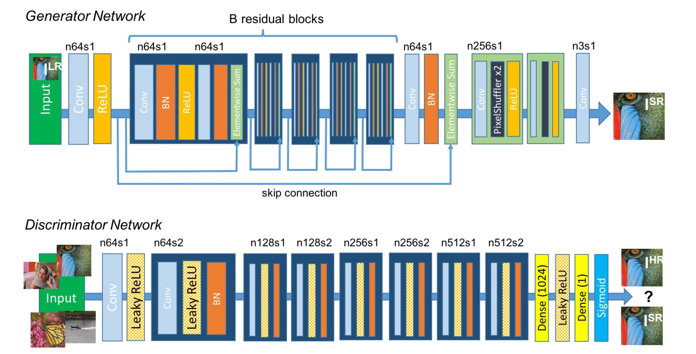
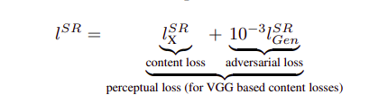
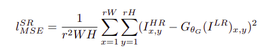
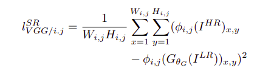
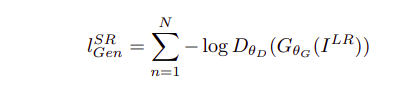
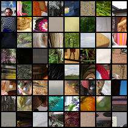
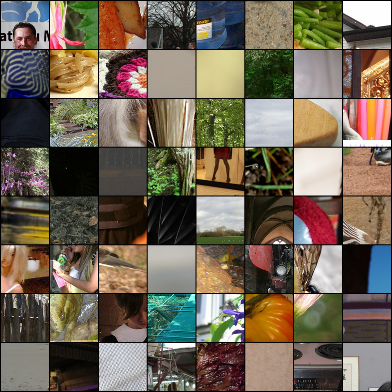
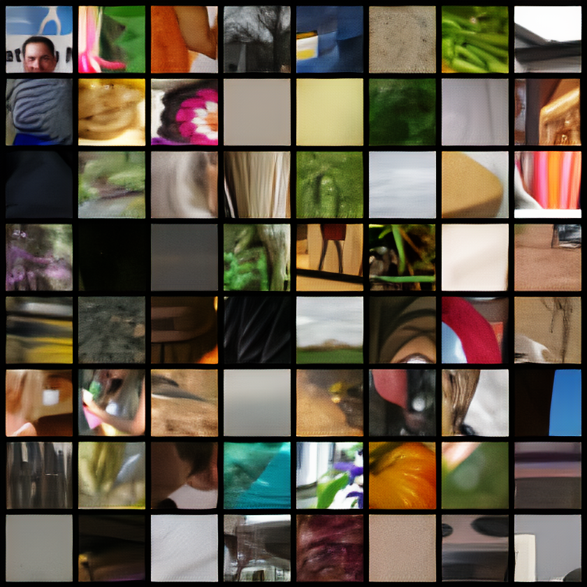

# PyTorch Implementation of SRGAN

## Usage
```bash
$ python3 main.py
```
following are the arguments:
```
usage: main.py [-h] [--root_dir ROOT_DIR] [--num_workers NUM_WORKERS] [--batch_size BATCH_SIZE] [--num_epochs NUM_EPOCHS] [--lr LR]
               [--pre_num_epochs PRE_NUM_EPOCHS] [--outdir OUTDIR] [--load_checkpoint LOAD_CHECKPOINT] [--b B]

optional arguments:
  -h, --help            show this help message and exit
  --root_dir ROOT_DIR   path to dataset
  --num_workers NUM_WORKERS
                        number of data loading workers
  --batch_size BATCH_SIZE
                        input batch size
  --num_epochs NUM_EPOCHS
                        number of epochs to train for
  --lr LR               learning rate
  --pre_num_epochs PRE_NUM_EPOCHS
                        number of pre-training epochs
  --outdir OUTDIR       directory to output model checkpoints
  --load_checkpoint LOAD_CHECKPOINT
                        Pass 1 to load checkpoint
  --b B                 number of residual blocks in generator
```
## Contributed by:
[Naman Gupta](https://github.com/namangup)

## References
* **Title**: Photo-Realistic Single Image Super-Resolution Using a Generative Adversarial Network
* **Authors**: Christian Ledig et. al.
* **Link**: https://arxiv.org/abs/1609.04802
* **Tags**: Super Resolution, Generative Adversarial Networks
* **Year**: 2017

## What's New?
Super Resolution received substantial attention from within the computer
vision research community and has a wide range of
applications. The optimization target of supervised
SR algorithms is commonly the minimization of the mean
squared error (MSE) between the recovered HR image
and the ground truth. This is convenient as minimizing
MSE also maximizes the peak signal-to-noise ratio (PSNR),
which is a common measure used to evaluate and compare
SR algorithms. However, the ability of MSE (and
PSNR) to capture perceptually relevant differences, such
as high texture detail, is very limited as they are defined
based on pixel-wise image difference. Hence, to capure those details, SRGAN define a novel perceptual loss using high-level feature maps of the VGG network
combined with a discriminator that encourages solutions
perceptually hard to distinguish from the HR reference
images.
## Architecture

## Loss Functions
we have the following loss functions:\
**Perceptual Loss**\
\
**PixelWise MSE Loss**\
\
**Content Loss**\
\
**Adversarial Loss**\
\

## Implementation
Following the paper the SRResNet(Generator) is pre-trained first on MSE Loss, followed by adversarial training of both the Generator and Discriminator alternately (k=1).
For the perceptual loss, VGG(5,4) is used by default.

The dataset consists of ~40k images randomly sampled from the Imagenet Dataset, and 96\*96 patches are cropped randomly from each image. 
These 96\*96 images are downsampled and fed into the generator as images of size 24\*24, which in turn generates back Super Resolution images of size 96\*96.

## Results

On pre-training the Generator for 100 epochs followed by adversarial training for 200 epochs, the following results are obtained.

>***NOTE*** : Go to the assets folder to view full sized images. They have been resized for better readability.

>*x4 refers to image upscaled four times*.

**Low Resolution (Original)** 
<p float="left">

</p>

**x4 Bicubic Interpolation, High Resolution (Original)**
<p float="left">


</p>

**x4 *Online Image Enhancer*, x4 SRGAN**
<p>


</p>

>I used [letsenhance.io](https://letsenhance.io/) which claims to use a "*Powerful AI to increase image resolution without quality loss*".

The SRGAN generated image clearly retains more features, and produces better images.

The current model can definitely achieve far better results given more data and training epochs . 
I used 40k images whereas, the authors used 350k images, trained for 10^5 steps.