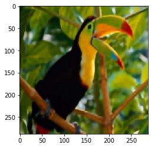

# Pytorch Implementation of VDSR 
## Usage

We are using the dataset given in the official implementation [page](https://cv.snu.ac.kr/research/VDSR/) which you need to extact and give as an argument for dataset generation for use. 

```bash
$ python3 dataset.py --dir /train_data/291/ --out_dir train.h5
$ python3 main.py --train_data train.h5 --cuda 
```
> **_NOTE:_** on Colab Notebook use following command:
```python
!git clone link-to-repo
%run dataset.py --dir /train_data/291/ --out_dir train.h5
%run main.py --train_data train.h5 --cuda 
```
**Arguments for dataset.py**
```
usage: dataset.py [-h] [--dir DIR] --out_dir OUT_DIR

optional arguments:
  -h, --help         show this help message and exit
  --dir DIR          path to the dataset directory
  --out_dir OUT_DIR  path for the output directory to produce
```
**Arguments for main.py**
```
usage: main.py [-h] [--batchSize BATCHSIZE] [--Epochs EPOCHS] [--lr LR]
               [--step STEP] [--start-epoch START_EPOCH] [--cuda]
               [--clip CLIP] [--threads THREADS] [--momentum MOMENTUM]
               [--weight-decay WEIGHT_DECAY] [--pretrained PRETRAINED]
               --train_data TRAIN_DATA [--test_data TEST_DATA]

optional arguments:
  -h, --help            show this help message and exit
  --batchSize BATCHSIZE
                        Training batch size, Default=128
  --Epochs EPOCHS       Number of epochs to train for
  --lr LR               Learning Rate. Default=0.1
  --step STEP           Sets the learning rate to the initial LR decayed by
                        momentum every n epochs, Default: n=10
  --start-epoch START_EPOCH
                        Manual epoch number
  --cuda                Use cuda?
  --clip CLIP           Clipping Gradients. Default=0.4
  --threads THREADS     Number of threads for data loader to use, Default: 1
  --momentum MOMENTUM   Momentum, Default: 0.9
  --weight-decay WEIGHT_DECAY
                        Weight decay, Default: 1e-4
  --pretrained PRETRAINED
                        Path to pretrained model
  --train_data TRAIN_DATA
                        Path to preprocessed train dataset
  --test_data TEST_DATA
                        Path to file containing test images
```
## Contributed by:
* [Ayush Gupta](https://github.com/ayush12gupta)

## References

* **Title**: Accurate Image Super-Resolution Using Very Deep Convolutional Networks
* **Authors**: Jiwon Kim, Jung Kwon Lee and Kyoung Mu Lee
* **Link**: https://arxiv.org/pdf/1511.04587.pdf
* **Tags**: Neural Network, Super Resolution
* **Year**: 2016

# Summary

## Drawbacks of SRCNN

SRCNN has demonstrated that a CNN can be used to learn a mapping from LR to HR in an end-to-end manner. Their method, termed SRCNN, does
not require any engineered features that are typically necessary in other methods and shows the stateof-the-art performance.

Drawbacks of SRCNN are :-
  * It relies on the context of small image regions.
  * Training converges very slowly due to very small learning rate.
  * Network can manage to handle only single scale images.

## Introduction

To address the issues of SRCNN, VDSR is proposed. VDSR presents a highly accurate Single Image Super Resolution method using very deep 
convolutions. We speed up our model by using high learning rates, and since high learning rates leads to exploding gradients we use residual learning and gradient clipping. We train our network to handle multi scale SR problems through a single network.

## Key Feathures

### Context 

We utilize contextual information spread over very large image regions. Our very deep network using large receptive field takes a large image context
into account.

### Fast Convergence

We use residual learning and extremely high learning rates. As LR and HR images share same information to a large extend, thus using residual learning will be very advantageous. 
Moreover our initial learning rate is 10000 times higher than that of SRCNN, which is enabled by residual learning and gradient clipping.

### Supports Multi-Scale Super Resolution

Training and storing many scale-dependent models in preparation for all possible scenarios is impractical.
We find a single convolutional network is sufficient for multi-scalefactor super-resolution.

## Model Architecture

For SR image reconstruction, we use a very deep convolutional network we use 20 layers
where, layers except the first and the last are of the same type: 64 filter of the size 3 × 3 × 64, where a filter operates
on 3 × 3 spatial region across 64 channels (feature maps). The last layer,
used for image reconstruction, consists of a single filter of size 3 × 3 × 64.


The network takes an interpolated low-resolution image as input and predicts image details.
One problem with using a very deep network to predict dense outputs is that the size of the feature map gets reduced every time convolution operations are applied.
This is in accordance with other super-resolution methods since many require surrounding pixels to infer center pixels correctly. This center-surround relation is useful since the surrounding region provides more constraints to this ill-posed problem (SR).
To resolve this issue, we pad zeros before convolutions to keep the sizes of all feature maps the same.

## Implementation

We first preprocess the dataset 291I so as to produce data argumented images by ratating, flipping and producing images of different scales(x2 , x3, x4) so as to support multi scale SR, and produce images of 41x41 dimension. 
We train our model using  MSE Loss for 50 epochs and appling gradient clipping and evaluate out model on some images extraced from Set5.

## Result

**Ground Truth Image**


**4x scaled Input Image**


**Super Resolution Output Image**


